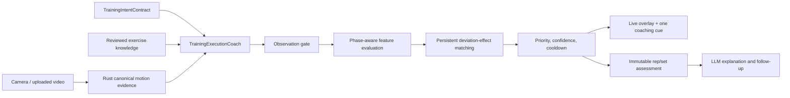

# PRD: 实时 AI 健身教练与训练执行评估

**Status:** Definition / no implementation in this feature yet  
**Date:** 2026-08-09  
**Depends on:** Android client V1, Rust canonical motion output, exercise registry, reviewed coaching knowledge  
**Elaborates:** MaxPower client MVP 的实时训练监控与 AI 教练能力；不改变 `mobile-home-workout-recognition` 的技术验证边界

## 1. Problem

当前系统能够围绕骨架、动作阶段和次数积累证据，但“识别了一次动作”不等于“能够像教练一样判断这次动作”。用户真正需要的是：在当前训练目的和动作变式下，系统能看出动作是否完成、关键行程是否达到、躯干与支撑是否保持、左右是否同步、是否出现借力或节奏失控，以及这些偏差通常会怎样改变动作效果，并及时给出一条能立刻执行的提示。

产品不追求单目手机摄像头无法直接测量的实验室结论。它追求的是线上教练通过视频可以做出的、证据明确且可复核的实用判断。

## 2. Product outcome

训练中，用户在摄像头 UI 看到同一条 canonical lineage 产生的骨架、轨迹、关键角度、阶段、完成情况和当前最高优先级提示。每个完整 rep 形成不可变的分维度评估；组结束后，系统汇总持续偏差与变化趋势。LLM 只负责把结构化证据解释成自然语言或用于后续教练对话，不重新计算骨架、阶段、次数或偏差。

成功不是“支持 70 个动作”本身，而是建立一套可扩展的教练判断系统，并让每个具体动作只有在知识映射、观测条件和验证证据都满足后才开放相应提示。

## 3. Product definition

### 3.1 Training execution assessment

一次训练执行评估由五层组成：

1. **动作任务完成**：是否形成可确认的完整周期，是否到达该动作的关键端点并返回。
2. **技术遵循**：定义动作的主动特征与应相对稳定的支撑特征是否符合所选变式。
3. **可见运动策略**：用户用怎样的关节、躯干、左右节奏和器械路径完成任务。
4. **刺激兼容性**：该策略是否仍与当前训练目的及标准变式一致，或更可能把机械需求转移到其他关节动作/肌群。
5. **努力与剂量背景**：速度衰减、停顿、失败方式、用户 RPE/RIR 与负重等如何影响解释；视频本身不等于主观努力或肌肉发力测量。

产品不输出一个掩盖原因的“标准度总分”。它输出任务、行程、阶段控制、支撑稳定、双侧协调、轨迹控制、刺激兼容性和观测可信度等维度。

### 3.2 Default intent

每个动作必须有一个审核过的默认 `standard_variant`。未选择特殊训练方法时，UI 明示“按标准变式分析”。用户或训练计划可以显式选择部分行程、停顿、爆发、允许借力等变式；这些选择改变判断契约，不能被当作错误。

## 4. Core real-time loop



The loop is:

1. Receive a canonical live snapshot containing tracked landmarks, confidence/unknown semantics, active phase, current rep lineage and runtime provenance.
2. Resolve the exact `TrainingIntentContract`: exercise, variation, equipment, side, view, purpose, intended ROM/tempo and allowed variation.
3. Gate observability per candidate judgment. A visible skeleton is not enough; every judgment declares required landmarks, view, temporal span and equipment evidence.
4. Evaluate phase-aware active, stable, endpoint, bilateral and equipment-path features.
5. Match only exercise-enabled `DeviationEffectPattern`s. A match requires persistent multi-feature evidence, not one noisy frame.
6. Rank candidates by observability, confidence, consequence, actionability and recent cue history.
7. Emit at most one cue. Preserve all supporting evidence for the sealed rep.
8. On rep seal, create an immutable assessment tied to the same canonical rep ID. On set finish, aggregate persistence and trend without changing rep facts.

### Cue priority

1. Camera/visibility prevents judgment.
2. Exercise, setup or selected variant does not match the contract.
3. The movement task or defining ROM is incomplete.
4. A persistent deviation materially changes the intended movement strategy or stimulus compatibility.
5. Bilateral timing, return control or tempo can be improved.

The system should remain silent when a cue would be redundant, unobservable, low confidence, transient, or less useful than the cue already active.

## 5. Deep module and seams

### 5.1 Module

`TrainingExecutionCoach` is the deep Module that hides feature windows, phase normalization, pattern matching, persistence, cue arbitration and refusal logic behind a compact Interface.

Conceptual Interface:

```ts
interface TrainingExecutionCoach {
  beginSet(input: {
    intent: TrainingIntentContract;
    knowledgeVersion: string;
    runtime: RuntimeDescriptor;
  }): BeginSetDecision;

  observe(snapshot: CanonicalMotionSnapshot): LiveCoachDecision;
  sealRep(rep: CanonicalSealedRep): TrainingExecutionAssessment;
  finishSet(finalPacket: CanonicalFinalPacket): SetExecutionAssessment;
}
```

This is a future contract, not authorization to change current Android/Rust code.

### 5.2 Required seams

- **Upstream seam:** canonical Rust evidence. The coach never owns pose inference, subject tracking, phase transitions, rep boundaries or rep IDs.
- **Knowledge seam:** reviewed, versioned exercise-to-pattern mappings. Simulated priors and catalog metadata cannot silently become coaching standards.
- **Product seam:** typed live decision and sealed assessment. UI renders it; LLM explains it.
- **Data seam:** every output carries evidence IDs, knowledge version, model/runtime provenance and observation confidence so it can be replayed and audited.

### 5.3 Locality and ownership

- Android/iOS own camera setup, model-tier selection, preview and rendering.
- Rust canonical motion owns the single skeleton/phase/rep evidence lineage.
- `TrainingExecutionCoach` owns assessment and cue arbitration.
- Product UI owns display and user override of training intent.
- LLM owns phrasing and conversation, never the underlying verdict.

No layer may reconstruct a parallel counter or silently reinterpret missing landmarks.

## 6. Output contract

Every live or sealed decision must be structured:

```ts
type JudgmentState = "observed" | "inferred" | "cannot_judge" | "not_applicable";

interface TrainingExecutionAssessment {
  assessmentId: string;
  canonicalRepId: string;
  intentId: string;
  exerciseKnowledgeVersion: string;
  observationConfidence: number;
  taskCompletion: DimensionAssessment;
  rangeOfMotion: DimensionAssessment;
  phaseControl: DimensionAssessment;
  supportAndTrunk: DimensionAssessment;
  bilateralCoordination: DimensionAssessment;
  trajectoryControl: DimensionAssessment;
  stimulusCompatibility: DimensionAssessment;
  observations: ObservationEvidence[];
  coachInferences: CoachInference[];
  activeCue: CoachingCue | null;
}
```

A `CoachInference` must include:

- matched pattern and exact exercise context;
- persistent supporting observations and phases;
- likely practical effect stated conditionally;
- plausible alternative explanations;
- confidence and refusal reason;
- one actionable cue family, not a diagnosis.

Allowed: “回程中躯干连续抬起，同时肘部行程缩短；按标准俯身划船分析，这更像用躯干摆动完成拉起，可能增加上背/斜方参与。保持俯身角度，再把肘向后拉。”

Not allowed: “斜方肌激活 72%”“右侧力量弱 18%”“腰椎受伤风险高”。

## 7. Knowledge model

The runtime knowledge graph is:

`training purpose × standard execution features × common deviation pattern × likely stimulus effect × coaching cue`

It is implemented conceptually through:

- `TrainingIntentContract`
- `ExerciseCoachingProfile`
- `DeviationEffectPattern`
- `ExercisePatternMapping`
- `ObservationRequirement`
- `CuePolicy`

Cross-exercise patterns are reusable, but thresholds, phase applicability and cue wording are enabled per exact exercise context. A row pattern cannot inherit bench-press thresholds into push-ups merely because both are horizontal pushes.

## 8. User stories

1. As a user, I can see which standard variant and camera position the coach is using before the set.
2. As a user, I can select a special ROM, tempo or allowed-cheat variant so intentional technique is not marked wrong.
3. As a user, I see the skeleton, tracked path, relevant angles and one actionable cue during the set.
4. As a user, I receive “cannot judge” guidance when the view or occlusion cannot support the requested conclusion.
5. As a user, I can inspect why a cue appeared: the visible features, phase and duration that supported it.
6. As a user, I receive rep-level dimensions and a set summary rather than an unexplained universal score.
7. As a user, I can upload a video and run the same assessment lineage after recording.
8. As a coach/reviewer, I can correct phase boundaries, visible deviations, likely effect, cue or cannot-judge state without rewriting the source evidence.
9. As a developer, I can replay a canonical packet against a versioned knowledge package and reproduce the same decision.

## 9. Acceptance criteria for a supported coaching claim

A claim is not product-enabled until all are true:

- Exact exercise variation, equipment, training intent and supported view are declared.
- Required features are observable with the effective pose/equipment model and pass quality gates.
- The standard feature envelope and deviation pattern were reviewed by qualified annotators.
- Standard, intended-variant, common-deviation, negative and cannot-judge examples exist.
- Subject/session/device holdout validation meets a declared metric for both detection and false cues.
- Live latency, persistence and cooldown behavior are measured on the target Android tier.
- Copy states a practical conditional inference rather than an unmeasured physiological fact.
- The sealed rep and final set lifecycle are available in canonical output before reports are finalized.

## 10. Validation metrics

Report per exact claim and context, not a blended “AI accuracy”:

- landmark/feature usable-frame rate;
- phase boundary error and completed-rep recall;
- deviation event precision/recall and false cues per clean set;
- cue onset latency and duplicate-cue rate;
- cannot-judge precision (does the system refuse when it should?);
- inter-rater agreement and expert adjudication rate;
- calibration of confidence against observed precision;
- subgroup results by subject, device tier, camera view, clothing, occlusion and equipment;
- end-to-end FPS, thermal behavior and dropped-frame/backlog rate.

## 11. Delivery sequence

1. Finish Android client V1 and freeze its current camera/native seams.
2. Review and approve the knowledge matrix, exercise mappings and data standard in this feature.
3. Choose a small set of high-observability claims for validation; breadth of the 70-action catalog is not the release gate.
4. Collect/reprocess MM-Fit, own video and human annotations according to the evidence requirements.
5. After Android V1, create a separate implementation spec for additive Rust SDK and packet changes. Do not extend the current positional recognition-profile ABI for coach evidence.
6. Shadow-run live assessment, validate false-cue behavior, then enable user-facing cues claim by claim.

## 12. Out of scope

- Changing Android or Rust SDK in this definition slice.
- Treating MM-Fit labels, simulated priors or a successful rep counter as standard-form evidence.
- Direct measurement of muscle activation, force, joint torque, fatigue cause, pain or injury risk from monocular video.
- One opaque whole-body correctness score.
- Medical, rehabilitation or diagnostic advice.
- Enabling all 70 catalog actions before the underlying claims are validated.

## 13. Supporting documents

- [训练执行评估标准](../../docs/design/ai-coach-training-execution-assessment-standard-v0.1.md)
- [教练偏差—影响知识矩阵](../../docs/design/ai-coach-deviation-effect-pattern-matrix-v0.1.md)
- [70 个动作的教练模式映射](../../docs/design/exercise-coaching-pattern-mapping-v0.1.md)
- [证据与训练数据需求](../../docs/design/ai-coach-evidence-and-training-data-requirements-v0.1.md)
- [Motion profile 数据消费与优化 workflow](../../docs/design/motion-profile-data-consumption-workflow-v0.1.md)
- [数据训练 agent handoff](./HANDOFF-data-training-agent.md)
- [运动科学与 AI 教练调研](../../docs/research/2026-08-09-training-purpose-biomechanics-ai-coach-completion.md)
