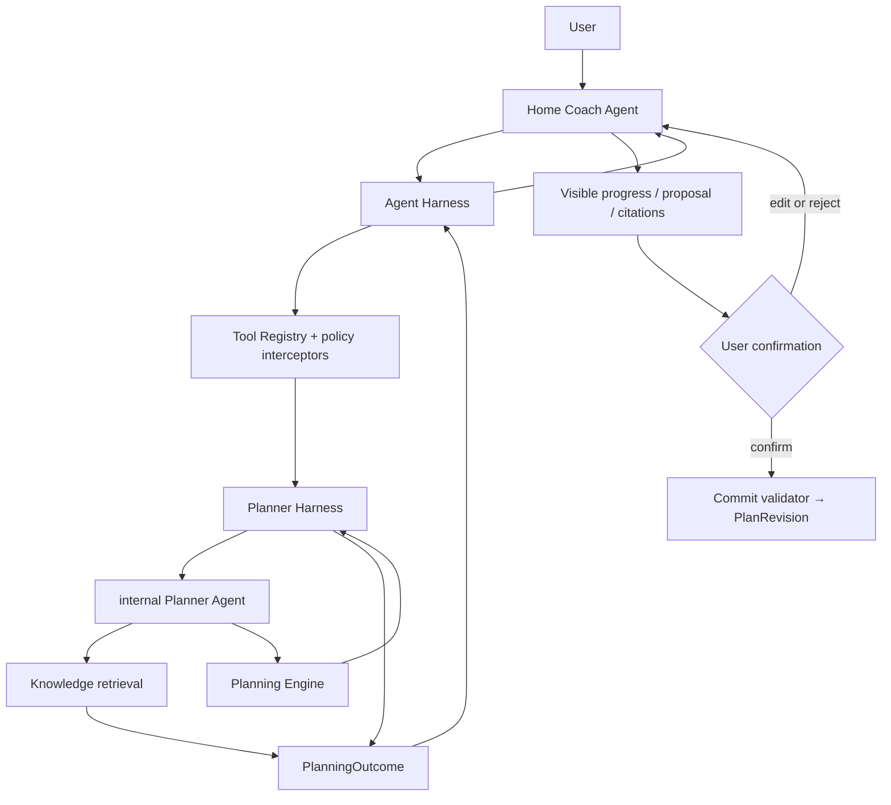

# Agent Harness architecture facts

> Status: accepted target architecture, 2026-08-13.
>
> Scope: the Coach conversation, planning, knowledge retrieval, tool execution,
> human confirmation, validation and observability. This document states the
> intended architecture. It does **not** claim that every part has already
> been implemented.

## Product facts

- The Home Coach is the user's only persistent conversational Agent. Dedicated
  onboarding and workout surfaces may present the same Agent in a task-scoped
  interaction, but they do not create another identity, conversation owner or
  long-term memory. The Home Coach owns ordinary visible conversation,
  explains results and presents confirmations.
- All language-enabled scenarios share one versioned product Soul. Onboarding,
  Home conversation, planning, workout observation and risk review obtain
  different capabilities from their scenario Prompt and local Harness rather
  than from separate personalities. The target contracts and transitions are
  defined in [`../design/agent-scenario-harness-v0.1.md`](../design/agent-scenario-harness-v0.1.md).
- Scenario selection is grounded in a trusted product trigger: onboarding
  lifecycle, Home message, active WorkoutSession, Timeline change or scheduled
  tick. User wording may select a visible tool inside the active scenario, but
  does not grant another scenario's capabilities.
- Scheduled checks and ordinary motion observations are deterministic-first.
  They invoke a language model only when a material typed outcome needs a
  question, explanation or user-visible proposal.
- A Planner is a professional planning work mode, analogous to a coding
  agent's plan mode. It reasons about goals, constraints, alternatives,
  trade-offs and the next validation point. It is not a keyword router and it
  is not synonymous with the deterministic Planning Engine.
- A plan is never silently changed. A candidate plan is previewed, may be
  edited or rejected, and is committed only after the user confirms a still
  current proposal.
- An event does not need an explicit "please adjust" request to receive a
  planning impact assessment. When it can affect a plan's on-time success
  probability, the Home Coach must obtain a non-writing Planner assessment.
- The system has no product notion of a medical or nutritional "prescription".
  It provides plans, actions, assumptions, monitoring signals and safety
  boundaries.
- LLMs may select from constrained capabilities, but may not directly write a
  ledger, create a `PlanRevision`, invent user facts, bypass confirmation or
  make an unsupported knowledge citation.

## Four-quadrant working agreement

### Shared known

Every meaningful planning turn begins from already confirmed profile, goals,
active plan, timeline, constraints, preferences and prior decisions. The
Agent must not repeat questions whose answers are in that snapshot.

The successful outcome is one of: a precise answer, a fact record, a request
for material missing input, a verified plan proposal, a no-change decision or
a safety hold. Changes to future plans require explicit confirmation.

### User-known, system-unknown

The Agent identifies personal context, aesthetic priorities, practical limits
and preferences that materially alter a plan. It asks at most three such
questions in one planning turn. When the missing fact is not material, it
declares a conservative assumption and provides an exploratory version.

### User-unknown, system-known

The Agent must proactively explain relevant trade-offs, risks, evidence
limits, alternatives and monitoring signals. It must challenge an incorrect
premise rather than mechanically comply with it.

### Shared unknown

An unresolvable question becomes an explicit hypothesis. The plan names the
one variable to change, the success/failure signal, the observation window and
the data needed for the next decision.

## Module map and ownership



| Module | Interface and responsibility | Explicit non-responsibility |
| --- | --- | --- |
| `AgentHarness` | Runs one top-level turn: assembles factual context and capability-aware tool availability; limits rounds/time; invokes tools; returns typed tool results to the LLM; validates output/citations; records trace. | Does not infer intent from regex and does not write plans. |
| Home Coach Agent | Interprets natural language, chooses a visible tool, asks questions, interprets typed results and speaks with the user. | Does not directly query storage, calculate training rules or commit a plan. |
| `PlannerHarness.propose()` | Runs a bounded planning task and returns `needs_input`, `no_change`, `proposal` or `safety_hold`. Its internal Planner Agent may retrieve knowledge, compare strategies and call simulation/validation capabilities. | Does not own a user-visible session and cannot write Ledger/PlanRevision. |
| `PlanningEngine.evaluate()` | Deterministically composes and validates candidate sessions: split quality, muscle interaction/fatigue, recovery, energy, cardio, equipment, time and safety invariants. | Does not interpret user language or choose product strategy by itself. |
| `ToolRegistry` | Defines the closed, versioned tool catalog; validates schema, authorization, provenance, risk and idempotency; executes approved tools. | Does not trust an LLM merely because it selected a tool. |
| Commit validator | Confirms proposal identity, user decision, fact frontier, rule/knowledge versions and plan invariants before materializing a plan. | Does not accept a text-only confirmation or stale proposal. |

The Planner Agent is an internal implementation of `PlannerHarness`, not a
second persistent user Agent. Therefore it has no separate conversation,
long-term memory, commit tool or independent authority.

## Goal path protection and success probability

A Goal Contract contains the target outcome **and** target date. Together they
define the required pace and therefore the expected training, nutrition and
recovery execution burden. Four weeks to lose 4% body fat and eight weeks to
lose 4% body fat are different plans, not interchangeable presentations of one
goal.

The Goal Contract also records the user's execution tier—such as
`protect_deadline`, `balanced` or `protect_sustainability`. It controls the
allowed correction envelope and trade-off weights; it never permits the Agent
to silently change the target. The default is `protect_original_path`: the
Agent must not silently slow the target date, reduce the target outcome or
accept lower execution intensity. Only an explicit user decision creates
`slowdown_consent`, which states what may change: date, target outcome, pace
or allowed execution burden. It may be withdrawn at any time.

The contract stores the goal pace implied by outcome/date, its internal risk
acceptance policy, forecast horizon and permitted correction envelope. Until
the product has outcome-calibrated forecasts, that policy is expressed through
the versioned states `on_path`, `at_risk`,
`infeasible_under_guardrails` and `insufficient_evidence`, rather than a
pretend numeric probability. An aggressive four-week target will generally
have a smaller deviation buffer than the same result over eight weeks, while
still forbidding unsafe training volume, starvation, punitive cardio or
automatic commit.

`planner.assess_deviation` is a non-writing, low-cost planning capability. It
returns its achievability state, the event's estimated directional impact, and
one of `monitor`, `review_due`, `proposal_warranted` or `safety_hold`.
Without `slowdown_consent`, `proposal_warranted` starts full
`planner.propose`; the Planner must attempt the least disruptive safe,
future-only correction that improves the original-path forecast. With explicit
slowdown consent, it may instead return a no-change/slowdown alternative that
states the revised date or probability. Neither path changes the current plan
until user confirmation.

For every accepted proposal, the Planner compares the original-path
achievability state and uncertainty before and after the proposed correction.
Once outcome calibration exists it may additionally compare the internal
probability estimate. A plan that adds burden without materially improving the
forecast must be rejected as an invalid correction, even if it looks more
"disciplined".

## Planning-mode entry: the Home Coach decides semantically

The Harness exposes tools based on the current factual snapshot, not by
matching the user's sentence. The Home Coach chooses whether to call
`planner.propose` using its tool guide and the full conversation context.

Use `planner.propose` when one of these is true:

- the user asks to create, compare, revise or explain a plan;
- a goal, availability, equipment, training capacity or preference changes;
- repeated recovery/attendance/progress signals may change the strategy rather
  than only a single record;
- `planner.assess_deviation` finds the original path `at_risk` or
  `infeasible_under_guardrails` and no explicit slowdown consent applies;
- the user asks what a reported event means for the future plan.

Do not enter full planning mode merely because an event is mentioned. First
record only what the user said. If it is a plan-driver fact (for example,
energy deviation, missed training, recovery degradation, availability loss or
unexpected high load), the Agent also calls `planner.assess_deviation` when an
active plan exists. The assessment, not a keyword or the user's familiarity
with planning language, determines whether a full proposal is warranted.

Example: "I indulged today" is first a nutrition report. The Home Coach records
only what was explicitly said, responds without shame, and, when an active
plan makes the report material, calls `planner.assess_deviation`. If a known
large deviation puts the original outcome/date path `at_risk`, the result is
`proposal_warranted` even if the user did not know to
ask. Full Planner work may return `no_change` only when that forecast remains
acceptable, the correction cannot improve it, or the user has explicitly
accepted a slower path.

For a four-week 4% fat-loss goal, a large excess is therefore a mandatory
planning signal: after recording it, the Agent promptly assesses the remaining
energy/attendance path and proactively presents the least disruptive
future-only correction that improves the achievability of **4% in four weeks**.
The card states the affected goal condition, added training/activity burden,
uncertainty and the consequence of retaining the current plan. If safe
correction cannot restore the original path, it explicitly offers the real
trade-off—change the target date, change the target, or accept a less certain
outcome—rather than silently turning it into an eight-week plan. The user
confirms any proposal.

Example: "I slept poorly and my legs are still sore; can I train shoulders?"
is a planning request. The Home Coach may call `planner.propose` with the
original user statement and confirmed history; the Planner determines whether
one clarification is needed, a one-session change is enough, or a broader
replan is necessary. Neither the Home Coach nor a regex converts this sentence
directly into a shoulder-session decision.

## Tool loop and tool guide

Every tool available to the LLM includes:

- purpose;
- when to use it;
- when not to use it;
- which fields must come from the current user statement or confirmed facts;
- output type and whether it can change anything;
- confirmation, safety and evidence conditions.

The runtime follows a bounded loop:

```text
LLM selects a visible tool
→ ToolRegistry validates schema, authority and fact provenance
→ local tool executes
→ typed ToolResult is appended to the same run
→ LLM reads the real result and either explains, retrieves more evidence,
  asks a material question, produces a proposal or finishes
```

No business tool is selected by an execution-time regex router. Hard policy may
hide or reject a capability, but it must never synthesize a business tool call.

## Cloud boundary: LLM API transport only

The cloud is an authenticated, quota-controlled LLM API gateway and stream
relay. It has no Coach Harness, Timeline, RiskEvaluator, PlannerHarness,
PlanningEngine, ToolRegistry, fact store or plan-writing authority. The local
`AgentHarness` assembles the model input, tool capability manifest and all
fact-aware policy before an API call. A remote Provider only serializes that
already-assembled model input and declared tool schemas, streams model output,
and maps the provider wire format back to local `ProviderEvent`s.

The boundary is intentionally testable: for the same local model input and
tool manifest, every transport forwards the same capability set. It may not
add a hidden system prompt, inspect user text to filter tools, execute a local
business route, or reinterpret a tool call. Tool execution, result validation
and the subsequent Agent loop remain local. Cloud authentication, quota,
idempotency, cancellation and temporary stream resumption are transport
responsibilities, not Harness behavior.

## Planner outcome and confirmation

```ts
type PlanningOutcome =
  | { kind: "needs_input"; questions: readonly PlannerQuestion[]; reasonCodes: readonly string[] }
  | {
      kind: "no_change";
      rationale: readonly Reason[];
      monitoring: readonly Signal[];
      successForecast?: SuccessForecast;
    }
  | {
      kind: "proposal";
      proposal: VerifiedPlan;
      rationale: readonly Reason[];
      tradeoffs: readonly Tradeoff[];
      assumptions: readonly Assumption[];
      citations: readonly PassageRef[];
      validation: ValidationReport;
      successForecast: SuccessForecast;
      confirmationRequired: true;
    }
  | { kind: "safety_hold"; rationale: readonly Reason[]; nextStep: string };
```

The Planner always returns a result, never a direct write. Confirmation binds
`proposalId`, `toolCallId`, fact frontier, rule versions and the user decision.
An edit becomes a new user input and creates a new candidate; it does not
mutate the Engine output in place.

## Internal goal-achievability forecast

The user does not see a fabricated "success percentage". The Planner uses an
internal, versioned forecast to decide whether a material fact requires an
assessment or a proposal. The visible result is the decision, its reason, the
trade-off and the next measurement—not an unjustifiably precise probability.

### General formula

Each goal defines a target predicate `G` at its original deadline and safety /
maintenance predicates `S`. The internal on-time estimate is:

```text
P(on-time success) = P(G at deadline AND S throughout the path | confirmed facts,
                       planned actions, adherence evidence, uncertainty model)
```

It is evaluated by Monte Carlo paths, not by a universal additive score:

```text
for path i in 1..N:
  sample baseline measurement error and missing-data uncertainty
  sample future adherence from this person's recent observed adherence
  simulate goal-relevant progress using the selected goal model
  simulate recovery / safety / maintenance constraints
P = count(paths satisfying G and S) / N
```

The model records `forecastVersion`, data window, evidence coverage, sampled
assumptions and uncertainty interval. A numeric probability may be used for an
internal decision only after calibration criteria are met. Before then, it
produces an `on_path`, `at_risk`, `infeasible_under_guardrails` or
`insufficient_evidence` state; the Agent maps that state to a visible action
such as `monitor`, `review_due`, `proposal_warranted` or `safety_hold`, rather
than using a fake percentage.

The decision compares two counterfactuals: continue the confirmed plan versus
the least-disruptive allowed correction. A correction is valid only if it
materially improves the original-path forecast and passes every guardrail.

### Shared forecast inputs

| Input family | Uses | Never infer from |
| --- | --- | --- |
| Target contract | outcome, deadline, pace implied by both, hard floors, explicit slowdown consent | a vague aesthetic description alone |
| Baseline / trend | repeated body mass, circumference/body-composition method, validated strength tests, training history | one noisy weigh-in or an LLM estimate |
| Plan dose | planned/actual training exposure, session completion, activity, intake/energy observations | declared intention as completion |
| Response | personal weekly trend and residual error; population prior only until enough personal observations exist | a fixed `7700 kcal = 1 kg` promise |
| Constraints | recovery, safety, schedule, equipment and user-declared unacceptable costs | absence of a report |

The energy model may use energy-balance arithmetic as an initial prior, but the
personal trend replaces it as observations accumulate. TDEE uncertainty,
unlogged intake, activity compensation, body-composition measurement error and
water/glycogen variation widen the distribution; they must not be hidden by a
single predicted kilogram value.

### Execution evidence is a forecast input, not a moral score

The Planner must measure execution separately from outcome. A plan can be
executed faithfully yet need revision because the personal response differs
from its initial model; conversely a target can remain `on_path` after a missed
workout because the remaining buffer is sufficient. The actual rolling energy
path is therefore compared with the planned path:

```text
energyPathRatio = observed cumulative net deficit / planned cumulative net deficit
```

Both terms are ranges, not asserted single calories. The ratio is evidence for
the body-mass / fat-loss state transition; it is never a command to "repay" an
uncertain meal with a precise amount of cardio.

The future-execution part of the forecast keeps three distinct, recency- and
confidence-weighted quantities:

```text
q_diet  = E[future days within the agreed intake tolerance]
q_train = E[future required training dose completed to the required quality]
coverage = E[how much of the required observation was actually recorded]
```

For a rolling window, each confirmed day or planned session receives a
`0..1` adherence contribution (`z`) and a weight (`w`) for recency,
data-confidence and plan criticality. The provisional estimator is:

```text
q = (alpha + Σ(w × z)) / (alpha + beta + Σw)
```

`alpha` and `beta` are deliberately broad priors until personal evidence
accumulates. For nutrition, `z` reflects the reported intake range against the
plan tolerance; for training it reflects completion of the **required** session
and its minimum effective dose, not merely opening a check-in. A confirmed
missed key session contributes `0`; an unrecorded session does not silently
contribute `0`—it reduces `coverage` and widens uncertainty. Extra optional
activity cannot erase a missed strength exposure when that exposure is a hard
guardrail for the target mode.

The deviation assessment consumes `energyPathRatio`, `q_diet`, `q_train` and
`coverage` together with measured trend and recovery. It asks: under this
user's demonstrated execution pattern, does the remaining plan still satisfy
the original Goal Contract? Repeated excess intake, missed key sessions or a
falling completion rate can move the path to `at_risk` before the scale trend
has fully shown it. Low coverage instead produces `insufficient_evidence` or a
small measurement request; it must not be treated as non-compliance.

### Continuity and high failure rate are separate planning signals

The same number of failures can have different meaning depending on their
sequence. A missed key session after six consistently completed weeks is not
equivalent to two consecutive missed key sessions at the start of a short
deadline. In addition to the rolling estimates above, the forecast retains:

```text
recentFailureRun      = consecutive confirmed failures of a critical action
weightedFailureRate   = recency- and criticality-weighted failures in the window
executionSlope        = whether diet / training completion is deteriorating
remainingSlots        = remaining critical days or sessions before deadline
```

The model uses the pattern to update the future-execution distribution. An
implementation may express its continuity pressure as:

```text
failurePressure = weightedFailureRate
                  + modeWeight × recentFailureRun × criticality
                  + deteriorationWeight × max(0, -executionSlope)
```

This is an input to the goal-mode forecast, not a universal pass/fail rule.
Its threshold is determined by remaining slack, deadline and the target's
guardrails: an extreme-lean or strength-retention cut has little recovery room;
a longer higher-body-mass fat-loss goal may absorb the same pattern. The system
must trigger `planner.assess_deviation` when either a continuous failure run or
a high/deteriorating weighted failure rate materially changes the forecast,
even before a body measurement has moved. A full proposal occurs only if a
safe, future-only correction improves the original-path state; otherwise the
Agent explains that the observed execution pattern cannot support the original
deadline without a user-approved trade-off.

### Stagnation assessment distinguishes a plateau from inadequate execution

Flat scale weight is not a plateau by itself. The Planner evaluates a
mode-specific evidence window of same-protocol body-mass trend, circumference
trend and—where applicable—performance, body-composition and recovery. It
first asks whether the apparent zero change is distinguishable from the
measurement and water/glycogen noise for those measures. A compact internal
test is:

```text
stagnationEvidence = P(|bodyMassTrend| < meaningfulChangeThreshold
                       AND |circumferenceTrend| < meaningfulChangeThreshold
                       | comparable observations, measurement error model)
```

Only sufficiently strong `stagnationEvidence` begins diagnosis. The next branch
uses execution evidence rather than guesswork:

| Evidence pattern | Interpretation | Agent action |
| --- | --- | --- |
| Weight is flat but waist/target circumference is changing | Not a joint plateau; possible body-composition or fluid masking | Keep the plan, explain the conflicting measures and continue the measurement protocol. |
| Low `coverage`, uncertain intake, falling `q_diet`/`q_train`, or an energy path outside tolerance | Execution or observation is insufficient to diagnose a physiological plateau | Record the known facts, request the smallest high-value measurement/logging improvement, and do not punish uncertainty with extra cardio or a sharper deficit. |
| High coverage, sustained acceptable diet/training execution, comparable measurements, and joint flat trend | Candidate response plateau or unmodelled activity/energy adaptation | Reforecast the remaining path; if `at_risk`, propose one least-disruptive, future-only, safe experiment or correction for confirmation. |
| Joint flat trend plus declining recovery/performance | The old plan may be unsustainable, not merely ineffective | Do not automatically intensify; reassess recovery, training dose and guardrails before proposing any change. |

The meaningful-change threshold and required window vary by goal, measurement
method and remaining deadline; no global "two weeks means plateau" rule is
valid. The diagnostic result is versioned (`not_enough_evidence`,
`execution_uncertain`, `candidate_response_plateau`, `sustainability_risk`) and
becomes another input to `planner.assess_deviation`. A plateau correction is a
single-variable, time-bounded hypothesis test with predeclared signal: for
example, hold training and measurement conditions steady while changing only
one agreed activity or intake lever, then reassess the multi-measure trend.

## Risk evaluation: Timeline is the factual trigger seam

Risk is not a conversational intuition and must not differ between the chat
and a background job. The Timeline is the append-only, provenance-carrying
record of what happened to the user. Conversation, manual logging, real-time
execution and imports are **fact collectors**, not independent risk systems:
they all submit a validated Timeline command. A correction appends a
superseding event; it never silently rewrites history. The Timeline projection
resolves the current effective facts and exposes a monotonically increasing
`factFrontier`.

`RiskEvaluator.evaluate(snapshot, trigger)` is a deep, deterministic Module
that reads one projected Timeline snapshot and returns a typed
`RiskAssessment`. It owns target-achievability, execution-continuity,
stagnation, recovery/safety and evidence-quality assessment. The Home Coach
Agent and background workers only supply a trigger; neither reimplements the
decision.

```text
conversation ─┐
manual record ├→ Timeline.append(command, provenance) → TimelineChanged(frontier)
real-time ────┤                                      → RiskEvaluationCoordinator
sync/import ──┘                                      → projected factual snapshot
                                                        → RiskEvaluator

scheduler ──────────────────────────────────────────→ RiskEvaluationDue(frontier)
                                                        → same projected snapshot
```

```text
RiskEvaluationCoordinator coalesces idempotently by user + fact frontier
→ load ActivePlan + GoalContract + Timeline projection
→ RiskEvaluator.evaluate(snapshot, trigger)
→ persist RiskAssessment + trace
→ no action | request evidence | PlannerHarness proposal | safety hold
```

### Fact collectors and Timeline commands

| Collector | Timeline command it may submit | Admission rule |
| --- | --- | --- |
| Home Coach Agent in conversation | `fact.reported`, `fact.corrected`, `availability.changed` | Every field must trace to the current statement or an existing confirmed fact; language alone does not create a hidden inference. |
| Manual record UI | `nutrition.logged`, `body_measurement.logged`, `recovery.logged`, `workout.logged` | The user chooses/edits the values and measurement method; command carries source and timestamp. |
| Training Timeline UI | `workout.completed`, `workout.missed`, `workout.rescheduled`, `workout.corrected` | Only a semantic state/dose change emits an event; visual reorder and drafts do not. |
| Real-time recognition | `workout_execution.finalized` or `workout_execution.corrected` | First works in ephemeral `Observation` and `LiveSessionState`; only finalized, provenance-carrying actual dose/outcomes enter Timeline. |
| Import/sync | `external_observation.imported` | Deduplicate and preserve source/confidence; do not overwrite a more trustworthy explicit correction. |
| Plan lifecycle | `goal_contract.changed`, `plan_revision.committed`, `plan_revision.superseded` | Bind to revision and confirmation identity so stale assessment baselines cannot survive. |

Every accepted material Timeline command creates durable `TimelineChanged` via
an outbox. `RiskEvaluationCoordinator` classifies its factual delta and may
coalesce several commands from the same turn/session before evaluating. It
does **not** run expensive simulation for a cosmetic or non-material change;
it does evaluate a relevant delta such as a changed intake, missed critical
session, finalized lower-than-planned dose, recovery signal, measurement,
availability loss or correction.

The user-facing Agent may explicitly call `risk.evaluate` when the user asks
what a fact means, but normal flow is Timeline-first. This makes direct
records, chat records and execution changes identical downstream without a
regex-based route. A scheduled wake-up emits `RiskEvaluationDue`, contains no
invented fact, and only asks the same evaluator to inspect the latest Timeline
projection.

The real-time pipeline has an explicit seam between **observation** and
**planning fact**. Frame-level pose/rep estimates remain provisional. A
`WorkoutExecutionObserved` event is eligible only after the recognition
confidence, temporal completion, source provenance and any required user
correction satisfy the execution contract. It may prompt an in-session action
(for example, stop/modify the current exercise on an immediate safety signal),
but a future-plan re-evaluation waits for a finalized or materially corrected
set/session. This prevents a transient recognition error from reshuffling a
week of training.

### Real-time execution coaching is a separate, low-latency loop

The Timeline must not be the only destination for real-time understanding.
During a workout, `RealtimeExecutionCoach` consumes the provisional observation
stream and keeps an ephemeral `LiveSessionState`. It may issue a visible,
time-bounded cue or adjust the **current** exercise/set recommendation without
claiming that the long-term plan has changed:

```text
pose / equipment / repetition observations
→ confidence + temporal-stability gate
→ exercise-specific execution assessment
→ LiveSessionState
→ cue | rest/technique change | next-set load/rep adjustment | stop/seek help
```

Examples include: "brace before the next rep", "your depth has become
inconsistent; reduce the next-set load", or "stop this movement today because
the observed safety signal requires it". A cue is an intervention for the
current action, not a Timeline fact, and it does not trigger `RiskEvaluator`.
The live loop is rate-limited, has a confidence display/fallback and never
pretends a pose estimate is a medical or injury diagnosis.

There are three deliberately distinct persistence levels:

| Level | Examples | Lifetime / downstream effect |
| --- | --- | --- |
| `Observation` | landmarks, tentative reps, momentary depth/form estimate | transient; may be discarded; never changes the plan or risk forecast |
| `LiveSessionState` | the current set is stopped early, next-set load reduced, cue acknowledged, session temporarily paused | lasts for the active workout; supports immediate coaching and the workout UI, but does not by itself revise the long-term plan |
| Timeline fact | finalized exercise/set dose, user-confirmed correction, completed/missed session, sustained technical limitation that changed actual dose | append-only history; updates fatigue/recovery/execution inputs and can trigger risk/planning assessment |

At set/session finalization, an `ExecutionFinalizer` converts eligible live
state into a compact, provenance-carrying Timeline command. It records actual
dose and only those execution-quality outcomes that have a defined downstream
meaning. A discarded cue, one low-confidence form warning, or a visual UI
adjustment never becomes history. If a current-session adjustment materially
changes the planned dose, the final Timeline fact causes the normal risk loop
to assess its recovery and target-path consequence; any **future** plan change
still requires a Planner proposal and user confirmation.

### Cadence, priority and action policy

Immediate evaluation is reserved for a confirmed material delta: a known large
energy deviation relative to remaining buffer, a missed or changed critical
session, a recovery/safety signal, a new comparable measurement, loss of
availability, or a correction to an earlier fact. Multiple writes in one user
turn are debounced into one evaluation after the fact frontier settles.

The scheduler performs a light daily reconciliation for active goals, a fuller
weekly trend/stagnation assessment, and deadline-sensitive look-ahead for the
next few critical actions. Exact timing belongs to the goal-mode policy; it is
not a universal daily "you failed" check. Low logging coverage creates an
evidence request or silent `insufficient_evidence`, subject to notification
preferences, rather than a failure alert.

`RiskAssessment` has two independent outputs:

```ts
type RiskAssessment = {
  snapshotVersion: string;
  trigger: "conversation" | "fact_recorded" | "scheduled" | "explicit_request";
  urgency: "none" | "review" | "soon" | "safety";
  achievability: "on_path" | "at_risk" | "infeasible_under_guardrails" | "insufficient_evidence";
  drivers: readonly RiskDriver[];
  nextAction: "none" | "request_evidence" | "propose_plan_change" | "safety_hold";
};
```

Urgency governs presentation and notification; `nextAction` governs workflow.
For `at_risk`, the worker can start a bounded, non-writing PlannerHarness job
to prepare a proposal. The result is a review card, never an automatic plan
change. `safety_hold` is immediate and blocks automated intensification;
`infeasible_under_guardrails` presents the explicit contract trade-off.

Every assessment and proposal is bound to `snapshotVersion`. If a new fact
arrives while planning, the in-flight proposal is marked stale and must be
re-evaluated before presentation or confirmation. The trace records trigger,
input frontier, state transition, notification decision and proposal outcome,
which makes scheduled and conversational judgments auditable and replayable.

### Goal-specific success predicates

Different goals do not merely receive different coefficients. They have
different target predicates, hard floors, measurement requirements and allowed
correction envelopes.

| Goal class | `G`: target at deadline | `S`: hard maintenance / safety gates | Corrective priority |
| --- | --- | --- | --- |
| Higher-body-mass fat loss | target body mass/fat mass/waist trend by deadline | recovery and low-impact/safety limits | restore the remaining energy path with diet adherence and sustainable low-impact activity first |
| Lean or small-body-mass fat loss | target fat/waist outcome by deadline | strength exposure, recovery and lean-mass protection must remain above floors | use a narrower deficit/activity envelope; if it cannot restore the path safely, surface the date/target trade-off |
| Strength-priority cut ("heavy lifting while cutting") | fat/weight target **and** each selected lift's validated performance floor/target | no reduction that makes strength-retention forecast fail | protect strength training quality, recovery and carbohydrate/fueling fit before adding cardio or more deficit |
| Lean-mass-preserving cut | fat/waist target | lean-mass/circumference trend where measurable, selected strength floors and effective resistance exposure | preserve protein/strength/recovery and remove optional burden before increasing energy pressure |
| Hypertrophy | an explicit lean-mass, circumference or validated performance target | waist/fat/recovery limits selected by the user | protect progressive exposure, recovery and sustainable surplus; avoid predicting muscle gain from scale weight alone |
| Physique / shaping | conjunction such as waist at/below target **and** shoulder/priority-muscle measure or performance proxy at/above target | proportionality preferences and recovery constraints | use phased or dual-track plans; never treat scale loss alone as success |

For strength, performance must be compared on a comparable exercise, load/reps
and RIR context; an arbitrary free-text lift is not a valid strength trend. For
hypertrophy and shaping, if no repeatable measurement or agreed proxy exists,
the Planner may forecast execution coverage but must return
`insufficient_evidence` for physical-outcome probability. It then asks at most
three high-value questions or establishes a measurement baseline.

### Deviation assessment and proactive correction

After a plan-driver fact is recorded, the internal sequence is:

```text
record explicit fact
→ assess forecast of confirmed plan to original deadline
→ if forecast remains inside the mode-specific risk acceptance policy: monitor
→ otherwise simulate allowed correction candidates
→ if a safe candidate materially improves the forecast: proposal_warranted
→ if none can: explain the unavoidable target/date/execution-burden trade-off
```

Thus a large extra intake during a short, aggressive cut may proactively create
a proposal even if the user only reported it. For the same event in a longer
path, the forecast may remain inside its acceptance region and the Planner can
monitor without changing anything. This is a consequence of the stated
outcome/date and evidence, not a subjective "strictness" label.

## User-visible progress, not hidden chain of thought

Planner work must not look like a stalled chat. The UI receives durable,
human-readable stage events, for example:

```text
planning.started             "正在核对当前计划与最近记录"
planning.retrieving_evidence "正在查找本次需要的训练依据"
planning.evaluating          "正在比较恢复、动作联动和可用时间"
planning.needs_input         "还需要 1 项信息才能避免猜测"
planning.proposal_ready      "已生成可确认的未来计划调整"
planning.paused              "等待你确认、编辑或拒绝"
planning.failed              "未能完成；当前计划没有被改动"
```

These events reveal operational status and the visible rationale, not private
model reasoning or chain of thought. Each stage has a timeout, cancellation
path and stable failure state. A tool result or proposal remains viewable even
if a later language-generation step fails.

## Accuracy and evidence invariants

Four independent validators are required:

1. `ToolInputProvenanceValidator`: every user fact in tool input traces to the
   current statement or a confirmed fact reference.
2. `PlanInvariantValidator`: a candidate passes recovery, muscle interaction,
   energy, cardio, safety, equipment and time checks.
3. `CitationValidator`: a visible knowledge claim cites only `PassageRef`s
   returned in the current run, including applicability and evidence limits.
4. `CommitValidator`: a plan cannot commit without a current approved proposal.

The output filter is a last-resort safety net, not evidence or correctness
validation.

## Observability and evaluation facts

The trace stores identifiers, versions, hashes and reason codes, never hidden
reasoning text. Required spans include:

```text
agent.turn.started
agent.tool_visibility.computed
llm.response
agent.tool_selected
guardrail.tool_input_provenance
tool.executed
knowledge.retrieved
planner.outcome
plan.invariants_checked
citation.validated
human.approval.requested / resolved
plan.commit.accepted / rejected
evaluator.case_scored
```

Evaluation has four layers: deterministic Module tests; Provider/tool-loop
contracts; real-model scenario suites with paraphrase, negation and ambiguity;
and replayable planning snapshots for regression comparison. Humans evaluate
the visible reason, trade-off and follow-up signal, never hidden chain of
thought.

## Implementation status and migration facts

Already useful foundations: closed `CoachToolRegistry`, plan preview/confirm
flow, fact-frontier recheck, Planner trace, tool audit and human-action state.

P0 migration order:

1. Remove `CoachExecutionHarness.route()` and transport-level text regex tool
   selection; preserve their scenarios as tool-guide examples and eval cases.
2. Add the bounded typed ToolResult loop to `AgentRuntime`.
3. Compute tool availability from the factual snapshot and add provenance,
   plan-invariant, citation and commit validators.
4. Add `planner.propose` and `PlannerHarness`; keep the existing deterministic
   planning code behind `PlanningEngine`.
5. Add stage events, trace spans and real-model regression suites before
   broadening Planner capability.

## External design references

- OpenAI Agents SDK: [running agents](https://openai.github.io/openai-agents-js/guides/running-agents/), [tools](https://openai.github.io/openai-agents-js/guides/tools/), [human-in-the-loop](https://openai.github.io/openai-agents-js/guides/human-in-the-loop/), and [tracing](https://openai.github.io/openai-agents-js/guides/tracing/).
- LangGraph: [interrupts](https://langchain-ai.github.io/langgraph/how-tos/human_in_the_loop/breakpoints/) and [tool-call review](https://langchain-ai.github.io/langgraph/how-tos/human_in_the_loop/review-tool-calls/).
- AutoGen: [ToolAgent](https://microsoft.github.io/autogen/stable/reference/python/autogen_core.tool_agent.html) and [tool intervention / approval](https://microsoft.github.io/autogen/0.4.9/user-guide/core-user-guide/cookbook/tool-use-with-intervention.html).
