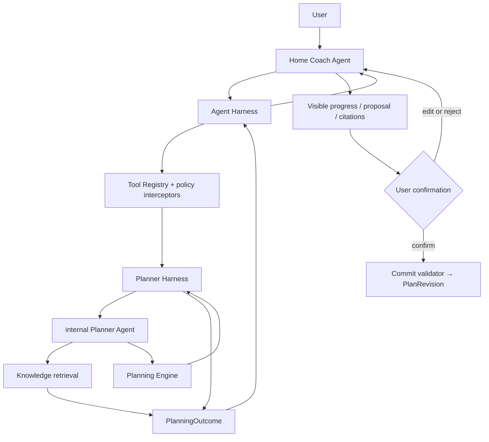

# Agent Harness architecture facts

> Status: accepted target architecture, 2026-08-13.
>
> Scope: the Coach conversation, planning, knowledge retrieval, tool execution,
> human confirmation, validation and observability. This document states the
> intended architecture. It does **not** claim that every part has already
> been implemented.

## Product facts

- The Home Coach is the user's only conversational Agent. It owns the visible
  conversation, asks for missing information, explains results and presents
  confirmations.
- A Planner is a professional planning work mode, analogous to a coding
  agent's plan mode. It reasons about goals, constraints, alternatives,
  trade-offs and the next validation point. It is not a keyword router and it
  is not synonymous with the deterministic Planning Engine.
- A plan is never silently changed. A candidate plan is previewed, may be
  edited or rejected, and is committed only after the user confirms a still
  current proposal.
- An event does not need an explicit "please adjust" request to receive a
  planning impact assessment. When it can affect a plan's on-time success
  probability, the Home Coach must obtain a non-writing Planner assessment.
- The system has no product notion of a medical or nutritional "prescription".
  It provides plans, actions, assumptions, monitoring signals and safety
  boundaries.
- LLMs may select from constrained capabilities, but may not directly write a
  ledger, create a `PlanRevision`, invent user facts, bypass confirmation or
  make an unsupported knowledge citation.

## Four-quadrant working agreement

### Shared known

Every meaningful planning turn begins from already confirmed profile, goals,
active plan, timeline, constraints, preferences and prior decisions. The
Agent must not repeat questions whose answers are in that snapshot.

The successful outcome is one of: a precise answer, a fact record, a request
for material missing input, a verified plan proposal, a no-change decision or
a safety hold. Changes to future plans require explicit confirmation.

### User-known, system-unknown

The Agent identifies personal context, aesthetic priorities, practical limits
and preferences that materially alter a plan. It asks at most three such
questions in one planning turn. When the missing fact is not material, it
declares a conservative assumption and provides an exploratory version.

### User-unknown, system-known

The Agent must proactively explain relevant trade-offs, risks, evidence
limits, alternatives and monitoring signals. It must challenge an incorrect
premise rather than mechanically comply with it.

### Shared unknown

An unresolvable question becomes an explicit hypothesis. The plan names the
one variable to change, the success/failure signal, the observation window and
the data needed for the next decision.

## Module map and ownership



| Module | Interface and responsibility | Explicit non-responsibility |
| --- | --- | --- |
| `AgentHarness` | Runs one top-level turn: assembles factual context and capability-aware tool availability; limits rounds/time; invokes tools; returns typed tool results to the LLM; validates output/citations; records trace. | Does not infer intent from regex and does not write plans. |
| Home Coach Agent | Interprets natural language, chooses a visible tool, asks questions, interprets typed results and speaks with the user. | Does not directly query storage, calculate training rules or commit a plan. |
| `PlannerHarness.propose()` | Runs a bounded planning task and returns `needs_input`, `no_change`, `proposal` or `safety_hold`. Its internal Planner Agent may retrieve knowledge, compare strategies and call simulation/validation capabilities. | Does not own a user-visible session and cannot write Ledger/PlanRevision. |
| `PlanningEngine.evaluate()` | Deterministically composes and validates candidate sessions: split quality, muscle interaction/fatigue, recovery, energy, cardio, equipment, time and safety invariants. | Does not interpret user language or choose product strategy by itself. |
| `ToolRegistry` | Defines the closed, versioned tool catalog; validates schema, authorization, provenance, risk and idempotency; executes approved tools. | Does not trust an LLM merely because it selected a tool. |
| Commit validator | Confirms proposal identity, user decision, fact frontier, rule/knowledge versions and plan invariants before materializing a plan. | Does not accept a text-only confirmation or stale proposal. |

The Planner Agent is an internal implementation of `PlannerHarness`, not a
second persistent user Agent. Therefore it has no separate conversation,
long-term memory, commit tool or independent authority.

## Goal path protection and success probability

A Goal Contract contains the target outcome **and** target date. Together they
define the required pace and therefore the expected training, nutrition and
recovery execution burden. Four weeks to lose 4% body fat and eight weeks to
lose 4% body fat are different plans, not interchangeable presentations of one
goal.

The default is `protect_original_path`: the Agent must not silently slow the
target date, reduce the target outcome or accept lower execution intensity.
Only an explicit user decision creates `slowdown_consent`, which states what
may change: date, target outcome, pace, or the acceptable probability target.
It may be withdrawn at any time.

The contract stores the goal pace implied by outcome/date, a minimum on-time
success-probability target, forecast horizon and permitted correction envelope.
For example, an aggressive four-week target may require the Planner to protect
a 75% minimum on-time probability, while still forbidding unsafe training
volume, starvation, punitive cardio or automatic commit. The Planner estimates
probability as a versioned forecast with an uncertainty band and evidence
coverage; it is never represented as a promise.

`planner.assess_deviation` is a non-writing, low-cost planning capability. It
returns the event's estimated impact on the current plan's on-time probability
and one of `monitor`, `review_due`, `proposal_warranted` or `safety_hold`.
Without `slowdown_consent`, `proposal_warranted` starts full
`planner.propose`; the Planner must attempt the least disruptive safe,
future-only correction that improves the original-path forecast. With explicit
slowdown consent, it may instead return a no-change/slowdown alternative that
states the revised date or probability. Neither path changes the current plan
until user confirmation.

For every accepted proposal, the Planner compares the estimated on-time
probability before and after the proposed correction. A plan that adds burden
without materially improving the forecast must be rejected as an invalid
correction, even if it looks more "disciplined".

## Planning-mode entry: the Home Coach decides semantically

The Harness exposes tools based on the current factual snapshot, not by
matching the user's sentence. The Home Coach chooses whether to call
`planner.propose` using its tool guide and the full conversation context.

Use `planner.propose` when one of these is true:

- the user asks to create, compare, revise or explain a plan;
- a goal, availability, equipment, training capacity or preference changes;
- repeated recovery/attendance/progress signals may change the strategy rather
  than only a single record;
- `planner.assess_deviation` finds that the plan's on-time success probability
  is below the original-path target and no explicit slowdown consent applies;
- the user asks what a reported event means for the future plan.

Do not enter full planning mode merely because an event is mentioned. First
record only what the user said. If it is a plan-driver fact (for example,
energy deviation, missed training, recovery degradation, availability loss or
unexpected high load), the Agent also calls `planner.assess_deviation` when an
active plan exists. The assessment, not a keyword or the user's familiarity
with planning language, determines whether a full proposal is warranted.

Example: "I indulged today" is first a nutrition report. The Home Coach records
only what was explicitly said, responds without shame, and, when an active
plan makes the report material, calls `planner.assess_deviation`. If a known
large deviation puts the original outcome/date path below its probability
target, the result is `proposal_warranted` even if the user did not know to
ask. Full Planner work may return `no_change` only when that forecast remains
acceptable, the correction cannot improve it, or the user has explicitly
accepted a slower path.

For a four-week 4% fat-loss goal, a large excess is therefore a mandatory
planning signal: after recording it, the Agent promptly assesses the remaining
energy/attendance path and proactively presents the least disruptive
future-only correction that improves the probability of achieving **4% in four
weeks**. The card states the before/after probability, added training/activity
burden, uncertainty and the consequence of retaining the current plan. If safe
correction cannot restore the original path, it explicitly offers the real
trade-off—change the target date, change the target, or accept the lower
probability—rather than silently turning it into an eight-week plan. The user
confirms any proposal.

Example: "I slept poorly and my legs are still sore; can I train shoulders?"
is a planning request. The Home Coach may call `planner.propose` with the
original user statement and confirmed history; the Planner determines whether
one clarification is needed, a one-session change is enough, or a broader
replan is necessary. Neither the Home Coach nor a regex converts this sentence
directly into a shoulder-session decision.

## Tool loop and tool guide

Every tool available to the LLM includes:

- purpose;
- when to use it;
- when not to use it;
- which fields must come from the current user statement or confirmed facts;
- output type and whether it can change anything;
- confirmation, safety and evidence conditions.

The runtime follows a bounded loop:

```text
LLM selects a visible tool
→ ToolRegistry validates schema, authority and fact provenance
→ local tool executes
→ typed ToolResult is appended to the same run
→ LLM reads the real result and either explains, retrieves more evidence,
  asks a material question, produces a proposal or finishes
```

No business tool is selected by an execution-time regex router. Hard policy may
hide or reject a capability, but it must never synthesize a business tool call.

## Planner outcome and confirmation

```ts
type PlanningOutcome =
  | { kind: "needs_input"; questions: readonly PlannerQuestion[]; reasonCodes: readonly string[] }
  | {
      kind: "no_change";
      rationale: readonly Reason[];
      monitoring: readonly Signal[];
      successForecast?: SuccessForecast;
    }
  | {
      kind: "proposal";
      proposal: VerifiedPlan;
      rationale: readonly Reason[];
      tradeoffs: readonly Tradeoff[];
      assumptions: readonly Assumption[];
      citations: readonly PassageRef[];
      validation: ValidationReport;
      successForecast: SuccessForecast;
      confirmationRequired: true;
    }
  | { kind: "safety_hold"; rationale: readonly Reason[]; nextStep: string };
```

The Planner always returns a result, never a direct write. Confirmation binds
`proposalId`, `toolCallId`, fact frontier, rule versions and the user decision.
An edit becomes a new user input and creates a new candidate; it does not
mutate the Engine output in place.

## User-visible progress, not hidden chain of thought

Planner work must not look like a stalled chat. The UI receives durable,
human-readable stage events, for example:

```text
planning.started             "正在核对当前计划与最近记录"
planning.retrieving_evidence "正在查找本次需要的训练依据"
planning.evaluating          "正在比较恢复、动作联动和可用时间"
planning.needs_input         "还需要 1 项信息才能避免猜测"
planning.proposal_ready      "已生成可确认的未来计划调整"
planning.paused              "等待你确认、编辑或拒绝"
planning.failed              "未能完成；当前计划没有被改动"
```

These events reveal operational status and the visible rationale, not private
model reasoning or chain of thought. Each stage has a timeout, cancellation
path and stable failure state. A tool result or proposal remains viewable even
if a later language-generation step fails.

## Accuracy and evidence invariants

Four independent validators are required:

1. `ToolInputProvenanceValidator`: every user fact in tool input traces to the
   current statement or a confirmed fact reference.
2. `PlanInvariantValidator`: a candidate passes recovery, muscle interaction,
   energy, cardio, safety, equipment and time checks.
3. `CitationValidator`: a visible knowledge claim cites only `PassageRef`s
   returned in the current run, including applicability and evidence limits.
4. `CommitValidator`: a plan cannot commit without a current approved proposal.

The output filter is a last-resort safety net, not evidence or correctness
validation.

## Observability and evaluation facts

The trace stores identifiers, versions, hashes and reason codes, never hidden
reasoning text. Required spans include:

```text
agent.turn.started
agent.tool_visibility.computed
llm.response
agent.tool_selected
guardrail.tool_input_provenance
tool.executed
knowledge.retrieved
planner.outcome
plan.invariants_checked
citation.validated
human.approval.requested / resolved
plan.commit.accepted / rejected
evaluator.case_scored
```

Evaluation has four layers: deterministic Module tests; Provider/tool-loop
contracts; real-model scenario suites with paraphrase, negation and ambiguity;
and replayable planning snapshots for regression comparison. Humans evaluate
the visible reason, trade-off and follow-up signal, never hidden chain of
thought.

## Implementation status and migration facts

Already useful foundations: closed `CoachToolRegistry`, plan preview/confirm
flow, fact-frontier recheck, Planner trace, tool audit and human-action state.

P0 migration order:

1. Remove `CoachExecutionHarness.route()` and transport-level text regex tool
   selection; preserve their scenarios as tool-guide examples and eval cases.
2. Add the bounded typed ToolResult loop to `AgentRuntime`.
3. Compute tool availability from the factual snapshot and add provenance,
   plan-invariant, citation and commit validators.
4. Add `planner.propose` and `PlannerHarness`; keep the existing deterministic
   planning code behind `PlanningEngine`.
5. Add stage events, trace spans and real-model regression suites before
   broadening Planner capability.

## External design references

- OpenAI Agents SDK: [running agents](https://openai.github.io/openai-agents-js/guides/running-agents/), [tools](https://openai.github.io/openai-agents-js/guides/tools/), [human-in-the-loop](https://openai.github.io/openai-agents-js/guides/human-in-the-loop/), and [tracing](https://openai.github.io/openai-agents-js/guides/tracing/).
- LangGraph: [interrupts](https://langchain-ai.github.io/langgraph/how-tos/human_in_the_loop/breakpoints/) and [tool-call review](https://langchain-ai.github.io/langgraph/how-tos/human_in_the_loop/review-tool-calls/).
- AutoGen: [ToolAgent](https://microsoft.github.io/autogen/stable/reference/python/autogen_core.tool_agent.html) and [tool intervention / approval](https://microsoft.github.io/autogen/0.4.9/user-guide/core-user-guide/cookbook/tool-use-with-intervention.html).
