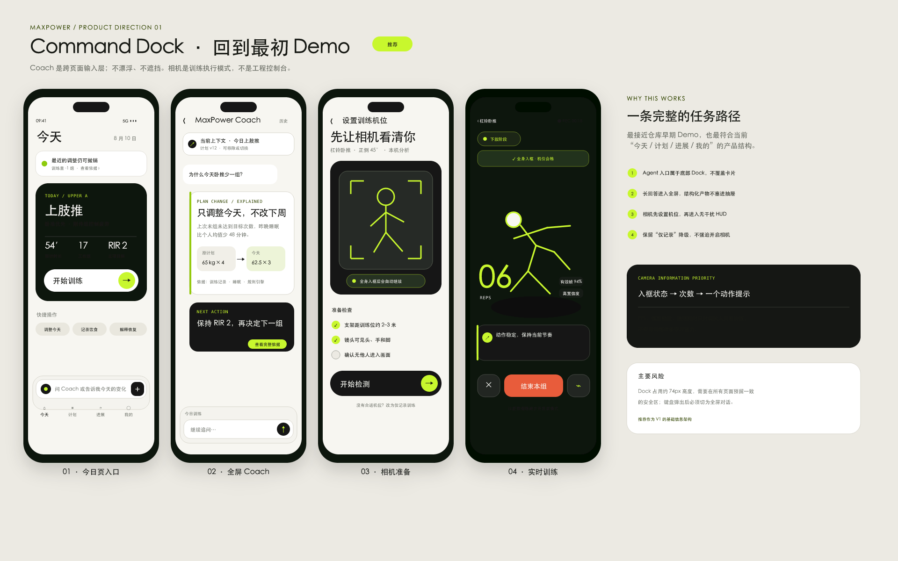
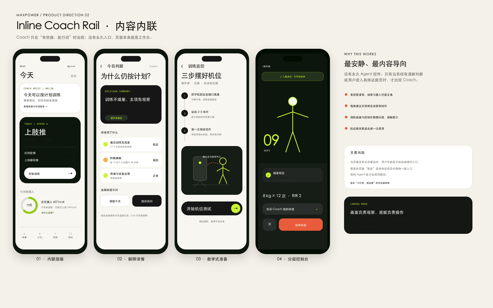
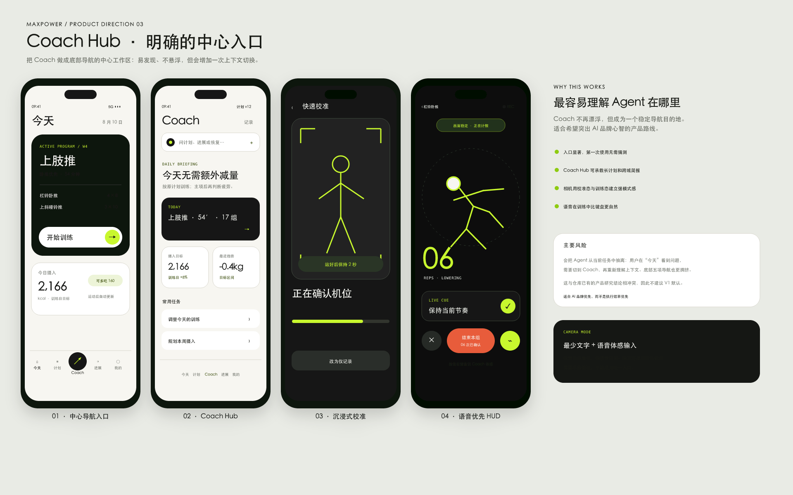
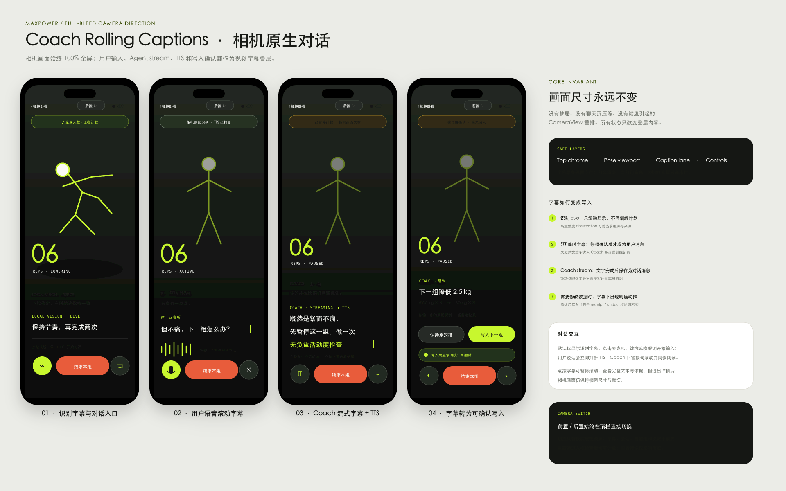
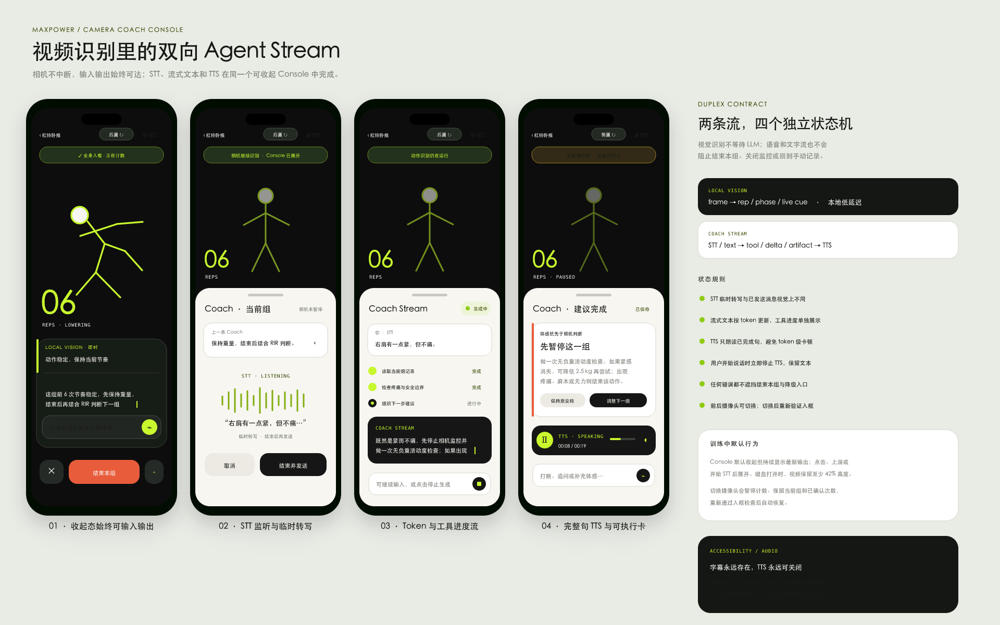

# MaxPower Agent 入口与相机训练页设计方向

日期：2026-08-10  
状态：设计评审稿，尚未实现到客户端

## 结论先行

推荐 **方向 A：Command Dock**。

它恢复了早期 Demo 已经验证过的信息架构：Coach 输入框属于底部 Dock，点击后进入全屏对话；训练开始后，相机是一个独立的执行模式。它既不会像当前 48 px 悬浮球那样覆盖摄入卡或导航，也不会把 Coach 从当前任务上下文里剥离。

相机页建议优先采用方向 A 的全屏 HUD；如果后续真机发现组间记录较多，可吸收方向 B 的底部控制台，而不需要改变 Agent 的整体入口。

## 设计稿

### A · Command Dock（推荐）



### B · Inline Coach Rail



### C · Coach Hub



### 视频识别页 · Rolling Captions（推荐）

最新方向不再使用会压缩相机画面的聊天抽屉。CameraView 在识别、STT、Agent streaming、TTS 和写入确认期间始终保持 100% 全屏与相同裁切。



交互采用视频 lower-third 滚动字幕：

- 本地识别、用户 STT 和 Coach 输出使用同一字幕轨，但通过来源标签和颜色区分。
- 最多显示三行：前一句淡出、当前完整句正常显示、正在生成的末句带 token 光标。
- 用户开始说话时立即打断 TTS；Coach 以完整句为单位同步朗读和滚动。
- 字幕本身不直接改写训练数据。只有生成结构化动作时，字幕下方才出现 `保持原安排 / 写入下一组` 等确认。
- 写入完成后原地显示 receipt 与 undo，不打开新页面，也不缩放 CameraView。

### 视频识别页 · Camera Coach Console（已否决探索）

这版验证了 STT、stream 和 TTS 所需状态，但底部 Console 会缩小视频主体，因此不再作为实现方向。



双流数据合同仍然保留：

- `LOCAL VISION`：本地低延迟的入框、次数、阶段和经过验证的 live cue，不等待 LLM。
- `COACH STREAM`：文字或 STT 输入、工具进度、`text-delta`、结构化产物和 TTS。

正式实现改为全屏相机上的字幕叠层，且“结束本组”与退出能力不得被网络、键盘或 TTS 遮挡。

## 全屏相机不变量

- CameraView 在所有对话状态下使用同一布局边界、aspect ratio、crop 和坐标映射。
- STT、键盘、Agent stream、TTS、工具进度、写入确认与错误只改变 overlay，不触发相机重排。
- 字幕位于 lower-third 安全区，最多三行；不能覆盖关键入框边界、次数或“结束本组”。
- 点击字幕可以查看完整文本与依据，但详情也应作为覆盖层；关闭后回到完全相同的相机画面。

## 字幕到数据写入的语义

| 字幕来源 | 默认持久化 | 何时写入训练数据 |
|---|---|---|
| `LOCAL VISION` live cue | 临时字幕 | 高置信度 observation 可随当前组保存，但 cue 文案不改计划 |
| 用户 STT 临时转写 | 不保存 | 停顿确认或手动发送后成为用户消息；结构化体感需显示确认结果 |
| Coach `text-delta` | 完成后保存为对话消息 | token 本身永不直接写当前组或计划 |
| 结构化建议 / artifact | 保存为建议 | 用户确认或满足已有授权规则后才写入，并生成 receipt / undo |
| TTS | 不单独保存 | 只朗读已经完成的 Coach 文本，不产生额外业务写入 |

## 当前问题

1. `CoachDrawer` 的收起态是绝对定位的圆形悬浮入口，普通页面固定在底部导航之上。它会覆盖页面内容，也让核心教练能力看起来像客服插件。
2. 早期 `agent-coach-home-prototype.html` 并不是这种结构：它使用底部一体化 composer，点击后进入完整对话空间。
3. 当前 Android 相机界面仍是工程调试面板：模型档位、动作枚举、FPS、推理耗时与有效帧同时暴露。训练者真正需要的是入框状态、确认次数、当前阶段、一个可执行提示和明确的结束按钮。
4. 相机权限、机位教学、实时训练和组后确认没有形成清晰的分段流程。

## 三个方向

| 方向 | Agent 入口 | 相机模式 | 优点 | 主要代价 |
|---|---|---|---|---|
| A · Command Dock | 底部 Dock composer，点击进入全屏 Coach | 全屏极简 HUD | 与早期 Demo 一致；上下文连续；入口稳定且不遮挡 | 所有主页面必须统一预留 Dock 安全区 |
| B · Inline Coach Rail | 建议和解释作为页面内容内联 | 画面与底部控制台分层 | 最安静；每条建议天然绑定证据；组间操作清晰 | 没有主动建议时，自由提问入口不够明显 |
| C · Coach Hub | 底部导航中心 Coach 项 | 沉浸校准 + 语音优先 HUD | AI 能力最容易发现；可承载跨域简报 | 增加上下文切换；五项导航拥挤；偏离现有产品研究结论 |

## 推荐交互流程

```text
今天 / 计划 / 进展页面
  → 点击底部 Coach composer
  → 全屏对话，自动携带当前卡片或日期上下文
  → 结构化计划、解释或变更预览
  → 返回原页面，结果以正式计划卡或变更卡持续存在

开始训练
  → 选择“直接记录”或“开启相机监控”
  → 相机准备：动作支持范围、机位、隐私与入框测试
  → 实时训练：入框状态、次数、阶段、一个提示、结束本组
  → 组后确认：实际重量 / 次数 / RIR / 不适，再决定下一组
```

## 相机页信息优先级

实时画面只保留以下层级：

1. 安全和可用性：全身是否入框、机位是否支持、相机是否正在录制。
2. 训练任务：动作、当前组、已确认次数、当前阶段。
3. 单一提示：只展示当前最重要且证据足够的可执行 cue。
4. 控制：结束本组、关闭监控、体感输入。

FPS、模型档位、delegate、推理耗时、landmark 数量和原始置信度进入开发者诊断层，不出现在消费者默认界面。

## STT / Streaming / TTS 状态合同

建议把音频和文本状态与相机状态完全解耦：

```ts
type ConsoleMode = "compact" | "expanded";
type SttState = "idle" | "listening" | "transcribing" | "submitted" | "error";
type AgentStreamState = "idle" | "connecting" | "streaming" | "completed" | "error";
type TtsState = "off" | "queued" | "speaking" | "paused" | "error";
```

- STT 临时转写不能提前显示成已发送用户消息。
- Agent token 可以持续更新文本，但工具状态、结构化卡片和 human action 保持独立 UI part。
- TTS 只朗读已经完成的句子，不逐 token 发声；用户重新开始说话时立即停止 TTS，但保留已生成文字。
- 字幕始终存在，TTS 始终可以关闭，播放状态不能只靠动画表达。
- Agent stream 失败不能暂停相机、计数、结束本组或手动记录降级。

## 前置 / 后置摄像头切换

- 实时识别页顶栏直接显示当前镜头，例如 `后置 ↻` 或 `前置 ↻`，不放进更多菜单。
- 训练中允许切换；切换期间暂停识别计数，但保留当前组、已确认次数、Agent 会话和输入内容。
- 新镜头打开后重新执行主体连续性、机位与入框检查，通过后自动恢复识别。
- 前置镜头可以使用镜像预览，但镜像只能影响显示，不能修改交给 canonical motion pipeline 的坐标语义。
- 切换失败时继续使用原镜头并给出可恢复提示，不能让训练页卡在黑屏。

## LLM 输出在新界面中的验收

Coach 的长回答不能只停留在聊天气泡中。验收至少包括：

- 用户要求完整计划时，同时给出本周训练与每日摄入，而不是只给原则。
- 每日摄入明确区分训练日、休息日和已记录运动增量，并解释为什么运动后可以多吃。
- 所有数值来自确定性预算或已保存计划；LLM 不自行发明热量、组数或阈值。
- 未知身高、体重、年龄、性别或饮食记录时，明确保持未知，不伪造精确值。
- 计划变化以结构化卡片呈现 before / after、依据、权限、是否已执行和撤销入口。
- 相机结论只描述画面可见的运动学与经过审核的条件化推断，不声称测得疼痛、肌肉激活或受伤风险。

## 真机验收门槛

- 360×800 至 412×915 Android 屏幕、系统字体 1.0× 和 1.3× 下，Agent 入口不能覆盖内容或导航。
- 从 Today、Plan、Progress 的具体卡片进入 Coach 时，上下文标题必须可见且可移除。
- 相机权限被拒绝、动作不支持或机位不合格时，都能无损降级为直接记录。
- “结束本组”在任何实时状态下始终可见、可点击；断流不阻止退出。
- 实时页面默认不显示工程诊断指标；开发者模式可单独开启。
- 不测试相机算法准确率时，仍可用模拟 packet 验证 UI 的 ready / framing / active / low-confidence / error / set-complete 六种状态。
