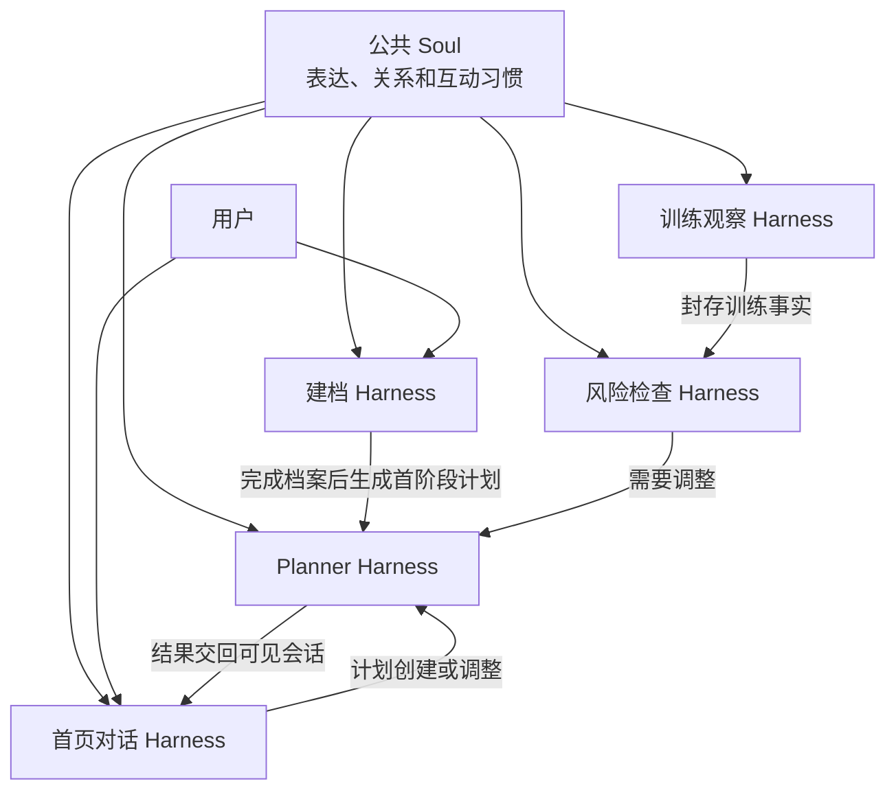
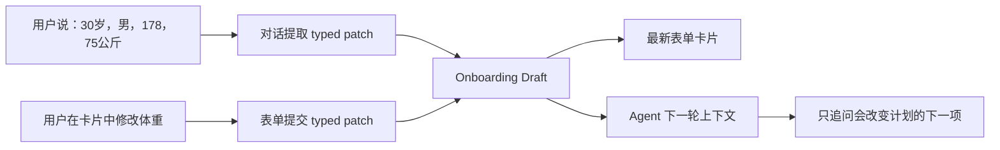
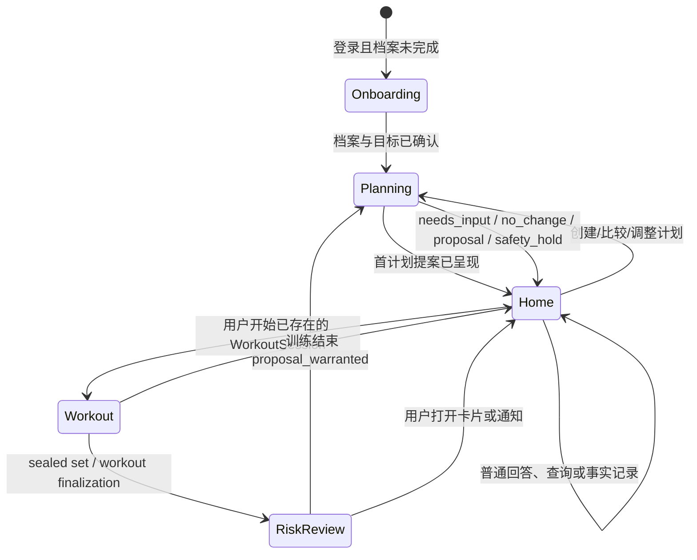

# 公共 Soul 与多场景 Agent Harness

> 版本：v0.1
> 日期：2026-08-13
> 状态：target design
> 适用范围：首次建档、首页日常对话、Planner、训练观察、Timeline 风险检查与定时检查

## 1. 结论

MaxPower 只有一个面向用户的 Agent 人格。它在所有需要语言交互的场景中共享同一份公共 Soul；建立档案、日常对话、规划、训练观察和定时检查的能力差异，由各自的场景 Prompt、能力合同、Harness、输入输出契约和写入权限产生。

首页是主要对话入口，不是一个固定的业务场景。用户可以在首页谈训练、记录饮食、询问知识或请求调整计划；首页 Agent 通过可见工具进入相应能力，但不会更换人格，也不会直接取得其他 Harness 的写入权限。

定时检查和大部分训练观察不需要先调用 LLM。确定性模块先判断是否有结果值得处理；只有需要向用户解释、追问或呈现提案时，语言层才加载公共 Soul 和对应场景 Prompt。



## 2. 不变量

1. 公共 Soul 只有一个版本化来源；页面和场景不得复制或局部改写它。
2. Prompt 只能指导模型如何理解和表达，不能授予权限。真实权限由本地 capability manifest、ToolRegistry 和提交校验器决定。
3. 场景由可信触发源和生命周期状态选择，不通过用户文本正则路由。
4. 用户文本可以让首页 Agent 选择一个当前可见工具，但不能让它伪造另一个场景、扩大工具集合或绕过确认。
5. LLM 不直接写 Profile、Timeline、PlanRevision、训练次数或通知状态；所有变更通过 typed tool 和本地领域命令完成。
6. Planner、训练观察和风险检查返回 typed outcome；公共 Agent 只负责解释、追问和呈现。
7. 没有材料性变化时，定时检查不产生消息；没有稳定证据时，训练观察不生成动作纠正。
8. 每次计划变更均为只影响未来的提案，用户确认且 fact frontier 未过期后才提交。
9. 所有场景共享同一事实来源，但读取的是适合当前任务的投影，不把整个 Ledger 暴露给模型。
10. 不保存模型思考链。可观测性保存输入引用、工具选择、规则结果、提案、验证、用户决定和最终结果。

## 3. 两层选择：场景选择与场景内意图

### 3.1 场景选择是确定性的

| 可信触发源 | 场景 | 说明 |
| --- | --- | --- |
| 登录后发现没有完整档案 | `onboarding` | App 进入专门建档页面；不能先进入首页闲聊再补档案 |
| 首页输入框提交消息 | `home_conversation` | 无论用户谈记录、知识还是计划，外层始终是首页会话 |
| 正在进行的 WorkoutSession 收到 canonical motion packet | `workout_observation` | 由训练生命周期进入，不由一句“我在训练”冒充 |
| Timeline confirmed change、训练封存或 scheduler tick | `risk_review` | 先执行确定性材料性和风险判断 |
| 首页工具、建档完成或风险结果请求规划 | `planning` | 内部短生命周期工作模式，没有独立用户会话 |

### 3.2 场景内意图由 Agent 选择工具

首页 Agent 可以根据完整对话和工具说明选择：读取今日计划、查询知识、记录用户陈述、评估计划影响或请求 Planner。Harness 不使用关键词把“聚餐”“睡不好”“调整”直接映射成业务命令。

场景内的工具选择仍需经过三层校验：

```text
当前场景允许该能力
→ 当前事实、授权和 mandate 允许该能力
→ ToolRegistry 校验 schema、provenance、幂等与确认要求
```

## 4. 公共 Prompt 装配

所有需要 LLM 的调用使用同一个装配接口：

```text
系统安全与真实性边界
→ 公共 Soul
→ 场景 Prompt
→ 当前场景的工具说明
→ 版本固定的知识与规则引用
→ 任务投影和 fact frontier
→ 当前消息、事件或 typed tool result
```

公共 Soul 只负责以下跨场景行为：

- 使用“我”自然交流，不设固定名字；
- 先回应具体事情，再给判断、理由和取舍；
- 记住用户已经说过的内容，只问会改变下一步的问题；
- 使用日常训练语言，把内部架构和字段术语留在后台；
- 不羞辱、不惩罚、不用空洞鼓励；
- 不确定时说明需要校准什么，能继续时先完成安全部分。

场景 Prompt 不重复 Soul，而只定义当前任务：要解决什么、什么输入可信、允许产生哪些结果、何时完成、何时转交其他 Harness。

## 5. 场景合同

### 5.1 建立档案 `onboarding`

**要解决的问题**

在进入主页前，先取得四项Baseline intake，再由Agent根据目标和自然对话补充真正影响首次规划的信息。让用户感觉是在接受一次简洁的教练咨询，而不是完成固定问卷。

**进入条件**

- 已登录；
- 本地没有 `completed` 的档案和 Goal Contract；
- 或用户主动选择重新建立档案，而不是普通字段纠错。

**输入投影**

- 当前 onboarding draft；
- 已回答内容和来源；
- 结构化健康边界；
- App 已获得的权限状态；
- 还会实质影响首次规划的最小问题集合。

**交互方式**

- 用户唯一必须主动提供的四项是年龄、身高、当前体重和自由语言目标；第一张卡片只包含这四项；
- 一次处理一个连贯主题，例如目标、训练背景、时间场地、恢复与安全；
- 用户一次回答多个事实时全部吸收，不按问题逐个重问；
- 除Baseline intake外没有全局必填字段；其他信息未知时保留未知，只有会改变下一步判断时才追问；
- Agent先从目标原话和后续对话中捕获可映射字段，并形成可复核的水平/状态判断，不要求用户填写固定的训练等级问卷；
- 对话和表单是同一份 onboarding draft 的两个编辑界面：Agent 根据用户原话更新草稿，卡片实时显示；用户在卡片中的修改也立即成为下一轮对话的上下文；
- Agent 可以主动展示当前主题的表单卡片，但只能选择产品注册的表单和字段，不能临时生成任意 schema；
- 完成前用自然语言复述目标、现实限制和第一阶段方向。

**允许的能力**

- 创建和保存 onboarding draft；
- 请求结构化选择或补充说明；
- 读取已确认的账号级权限；
- 运行本地安全筛查；
- 完成时原子生成 Profile、Goal Contract、Coaching Mandate；
- 完成后请求 Planner 生成首阶段计划提案。

**禁止直接产生**

- 用聊天文字绕过 draft 直接写正式档案；
- 在 Goal Contract 未确认前生成正式计划；
- 把模型推测的体脂、疾病、活动量或力量水平写成用户事实；
- 因可选字段为空而阻塞全部建档。

**完成结果**

`needs_input | draft_saved | ready_for_confirmation | completed | safety_hold`

这里的“需要输入”分两种：四项Baseline intake缺失会阻止基础建档；其他字段只在某个具体动作声明了 `requiredFor` 时阻止该动作。例如，日常活动未知可以完成档案，但可能阻止生成可信的能量目标；安全状态未知可以完成基础资料，但在执行相关训练前必须完成对应安全门控。

### 5.1.1 对话驱动表单

建档的产品模型不是聊天记录旁边附带一张独立问卷，而是：

```text
同一个 OnboardingSession
├── 对话投影：Agent 提问、解释和复述
└── DraftForm 投影：当前结构化值、来源、状态和校验结果
```

两种输入形成同一条 append-only 草稿事件流：



#### 字段状态

每个字段必须保留自身状态，不能只在 section 层记录 `form` 或 `conversation`：

```ts
type DraftFieldState =
  | "empty"
  | "captured_explicit"
  | "normalized_needs_review"
  | "estimated_needs_review"
  | "confirmed"
  | "invalid"
  | "conflicted";

interface DraftFieldValue<T> {
  fieldId: string;
  value?: T;
  state: DraftFieldState;
  source:
    | { kind: "user_message"; messageId: string }
    | { kind: "user_form"; submissionId: string }
    | { kind: "import"; factRef: string }
    | { kind: "calculator"; calculatorId: string; inputRefs: readonly string[] };
  normalizerId?: string;
  supersedesFieldEventId?: string;
  validationCodes: readonly string[];
}
```

- `captured_explicit`：用户明确说出的值。可以自动显示在草稿，不必逐字段确认；正式建档仍需最后一次整体确认。
- `normalized_needs_review`：Agent 将自然语言映射为产品枚举或单位，例如把“稳定练了两三年”映射为 `intermediate`。卡片显示自然标签并允许修改。
- `estimated_needs_review`：来自计算器或不精确估计，例如体脂范围。必须与用户自报值分开显示，不能覆盖用户值。
- `confirmed`：用户在表单中保存，或在阶段摘要中明确确认。
- `invalid`：单位、范围或必需组合不通过本地校验；Agent 用自然语言说明最小修正。
- `conflicted`：新陈述与当前草稿冲突。保留旧事件，卡片突出两者并要求用户选择，不能静默覆盖。

#### 卡片不是任意 JSON 表单

定义一个产品拥有的 `FormRegistry`。Agent 只能请求已注册的 `formId`，选择当前主题和焦点字段；字段类型、标签、选项、单位、校验、可写目标和提交命令都由本地 registry 决定。

```ts
interface FormDefinition {
  id: "onboarding.goal" | "onboarding.profile" | "onboarding.schedule" | "onboarding.safety" | "onboarding.professional";
  version: number;
  allowedScenario: "onboarding";
  section: OnboardingSection;
  fieldIds: readonly string[];
  validatorId: string;
  submitCommand: "onboarding.save_progress";
}

interface ConversationFormCard {
  formId: FormDefinition["id"];
  formVersion: number;
  draftId: string;
  draftRevision: number;
  focusFieldIds: readonly string[];
  fields: readonly DraftFieldValue<unknown>[];
  primaryAction: "save_section" | "confirm_onboarding";
}
```

LLM 可以调用类似 `onboarding.present_form({ formId, focusFieldIds })` 的能力，但不能提供字段 schema、校验规则或提交目标。渲染器只消费 registry 和当前 draft projection。

#### 一轮对话如何工作

```text
1. Agent 读取当前 draft projection 和本轮可改变计划的缺口。
2. 用户自由回答，可以一次说多个事实。
3. Agent 选择 onboarding.capture_user_input，提交严格 schema 的 typed patch 和 messageId。
4. 本地 normalizer 校验单位、枚举和字段关系，写入 draft event；不写正式 Profile。
5. 同一轮返回更新后的 ConversationFormCard。
6. Agent 简短确认已理解的内容，只追问下一个材料性问题。
7. 用户可以继续说，也可以直接改卡片并保存；两条路径更新同一 draft。
8. 所需主题完成后显示完整摘要，用户一次确认后才创建正式 Profile、Goal Contract 和 Mandate。
```

`capture_user_input` 的工具参数必须引用当前 `messageId`，执行层只接受本轮消息可以支持的字段。模型不能把旧推测、知识库结论或计算结果伪装成用户陈述。

#### 交互表现

- 建档页面保留对话作为主流程，当前主题卡片以内联或固定底卡形式出现；
- Agent 主动提问时可以同时展开相关字段，用户不必寻找对应页面；
- 用户说完后，卡片中的相应值立即更新；只有标准化、估算、冲突和无效值需要明显的核对提示；
- 不展示 `captured_explicit`、`normalizerId` 等内部词，用户看到的是“已填写”“请核对”“还需要确认”；
- 用户选择“我不知道”时字段保持空白并记录为 deliberately unknown，Agent 不再重复追问，除非它后来成为计划阻塞项；
- 退出和重进恢复同一 draft、对话位置和当前主题，不恢复未保存的任意输入文本。

#### 不使用通用 PendingHumanAction 承载整张表单

现有 `ui.request_choice` 适合一次性的阻塞选择，会暂停 Agent run；完整建档可能跨多轮甚至跨进程，不应把整份表单塞进一个 24 小时 pending action。

- DraftForm 是持久、可多次修改的领域草稿；
- PendingHumanAction 只用于一个真正阻塞的选择或最终确认；
- 表单保存产生 draft event 后，Agent 可以继续下一轮；
- 最终确认使用 draft revision + fact frontier 做 CAS，过期时重新展示差异。

#### 可扩展到日常场景

同一 FormRegistry 和卡片 renderer 可以用于日常记录，但表单定义和提交命令仍按场景隔离：

- 用户说“昨晚睡了五个半小时，状态一般”后，Agent 预填恢复记录卡；
- 用户说“刚做完卧推 80×5，RIR 1”后，Agent 预填训练记录卡；
- 外食照片或含混描述只能生成待确认的营养草稿；
- Planner 需要补充某个限制时，可以展示一个小型 constraint form，但 Planner 自身仍不能提交正式计划。

对单一、明确且当前 mandate 允许直接记录的事实，不强制弹出表单；Agent 可以记录后给出可撤销结果。表单用于多字段收集、估算核对、冲突处理和高影响确认，避免让所有对话都退化为点卡片。

### 5.2 首页日常对话 `home_conversation`

**要解决的问题**

理解用户当前想做什么，读取已有事实，完成记录、解释、状态查看、轻量评估或进入 Planner，并把 typed result 用统一人格交回用户。

**进入条件**

- 用户档案已完成；
- 用户从首页或全局对话入口提交消息；
- 从通知或计划卡片进入时携带对应 causation ref，但仍回到同一个首页 Agent。

**输入投影**

- 当前 Profile、Goal Contract、Mandate；
- 当前计划和今日任务；
- 近期 Timeline、恢复和执行趋势；
- 当前会话与工作记忆；
- 当前场景可用的知识和工具清单。

**允许的能力**

- 展示计划、报告、恢复和目标状态；
- 查询 Agent Knowledge 并引用；
- 记录当前对话中用户明确陈述的 Timeline / nutrition 事实；
- 对估算或含混信息生成草稿并确认；
- 调用低成本计划影响评估；
- 在需要创建、比较或改变计划时请求 Planner；
- 向用户呈现提案、代价、维持原计划的后果和确认操作。

**禁止直接产生**

- 自己计算并提交新计划；
- 把“用户提到了一件事”机械等同于需要重排计划；
- 在没有 tool result 时声称已经记录或修改；
- 让页面路由决定用户只能谈某一种问题。

**完成结果**

`answer | fact_recorded | draft_needs_confirmation | needs_input | no_change | planning_requested | proposal_presented | safety_hold`

### 5.3 内部规划 `planning`

**要解决的问题**

基于 Goal Contract、事实、知识和规则，比较可行候选，给出可验证的首阶段计划或未来调整提案。它类似 coding agent 的 Plan mode，不是一个普通工具，也不是第二个长期对话 Agent。

**进入条件**

- 建档完成后需要第一份计划；
- 用户请求创建、比较、解释或实质修改计划；
- 日程、场地、目标、恢复能力或偏好发生材料性变化；
- 风险检查输出 `proposal_warranted`；
- 用户询问一项事件对未来计划的影响。

**输入投影**

- 固定 fact frontier；
- Goal Contract 和 execution tier；
- 当前计划与未来可改范围；
- 训练、营养、恢复、活动和执行趋势；
- 检索生成的 DecisionPack；
- PlanningEngine 的候选、约束和验证结果。

**允许的能力**

- 查询知识和规则；
- 请求会改变候选的最小缺失信息；
- 生成、比较和验证候选；
- 运行目标可达性、训练冲突、恢复、时间、器械和安全检查；
- 返回带理由、取舍、假设、引用和监测点的提案。

**禁止直接产生**

- 写 Timeline；
- 提升未确认事实；
- 直接写 PlanRevision；
- 给用户维护第二套独立对话和记忆；
- 输出不可追溯的“成功率百分比”或隐藏安全约束的高分方案。

**完成结果**

`needs_input | no_change | proposal | infeasible_under_guardrails | safety_hold`

提案交回发起场景。首页 Agent 或建档页面负责可见解释，用户确认后由 Commit Validator 写入。

### 5.4 训练观察 `workout_observation`

**要解决的问题**

帮助用户完成当前训练，解释 canonical 计次和观察结果，提供受证据支持、稳定且不过载的即时反馈，并在 set / workout 封存后生成正式训练事实。

**进入条件**

- 已存在 active WorkoutSession；
- 当前动作、机位和识别 profile 已明确；
- 数据来自受支持的 Rust / native canonical packet 或用户主动报组。

**两条处理路径**

1. `live`：临时状态。安全信号可立即提示；其他提示必须稳定、限频且每次最多一个，不写 Timeline。
2. `sealed`：set 或 workout 封存。只有 confirmed canonical dose 才成为 Timeline 训练事实；`needs_review` 和 unsupported 不得冒充完成量。

**允许的能力**

- 展示当前动作、目标组次和已确认进度；
- 记录用户明确口述的重量、次数和 RIR；
- 描述 canonical finding、观测质量和不能推出什么；
- 按已验证规则给出一个当前可执行提示；
- 在恢复、安全或执行条件改变时生成当前训练的 future-only 调整提案；
- 训练结束后触发 TimelineChanged 风险检查。

**禁止直接产生**

- 从原始画面自由推断动作错误、受伤或肌肉刺激；
- 修改 Rust 封存的 rep、phase 或 actual values；
- 把个人基线偏离说成通用标准动作错误；
- 将 live finding 写入长期 Timeline；
- 因一次普通波动重写长期计划。

**完成结果**

`live_cue | no_cue | needs_review | set_recorded | workout_finalized | current_session_proposal | safety_stop`

### 5.5 Timeline 与定时风险检查 `risk_review`

**要解决的问题**

在没有用户主动要求“重新规划”的情况下，持续检查已确认事实是否正在影响目标按时达成、恢复保护或计划可执行性，并只在值得行动时打扰用户。

**触发源**

- confirmed Timeline change；
- workout sealed；
- 体重、围度、执行或恢复趋势形成新的可比窗口；
- scheduler 到达版本化复盘点；
- App 恢复后执行 catch-up。

**执行顺序**

```text
触发事件
→ 幂等 / 去重 / coalesce
→ 材料性判断
→ 目标模式和 guardrail 风险评估
→ no_action / monitor / review_due / proposal_warranted / safety_hold
→ 必要时调用 Planner
→ PolicyGate、免打扰和频率限制
→ 卡片或通知
```

**LLM 使用原则**

- `skipped`、`coalesced`、`no_action` 和普通 `monitor` 不调用 LLM；
- 规则已有完整模板时优先使用确定性文本；
- 只有需要结合上下文解释、提出一个关键问题或呈现 Planner 结果时，才加载公共 Soul 和 `risk_review` Prompt；
- 定时器不拥有通用对话工具，也不能因为运行频繁而扩大事实访问范围。

**允许的能力**

- 读取固定时间窗内的 confirmed facts 和 comparable trend；
- 区分缺失记录与执行失败；
- 判断连续漏训、饮食执行偏差、恢复恶化和联合平台期；
- 产生不写计划的风险结果；
- 对 `proposal_warranted` 请求 Planner；
- 生成受 mandate、频率和免打扰控制的通知候选。

**禁止直接产生**

- 创建用户没有上报的事实；
- 把体重短期波动自动判为脂肪变化或平台期；
- 每次 tick 都发消息；
- 在后台直接修改计划；
- 用“多运动惩罚饮食”作为默认补偿。

**完成结果**

`skipped | coalesced | no_action | monitor | review_due | proposal_warranted | safety_hold`

## 6. 场景装配模块

场景差异集中在一个深模块，不由 React 页面、Provider 或每个工具调用点分别拼接。

```ts
type AgentScenarioId =
  | "onboarding"
  | "home_conversation"
  | "planning"
  | "workout_observation"
  | "risk_review";

type AgentTrigger =
  | { kind: "onboarding_required"; draftId?: string }
  | { kind: "user_message"; sessionId: string; contextRef: string }
  | { kind: "planner_requested"; causationRef: string }
  | { kind: "motion_packet"; workoutId: string; packetRef: string; phase: "live" | "sealed" }
  | { kind: "timeline_changed"; factRefs: readonly string[] }
  | { kind: "scheduled_tick"; recipeId: string; scheduledAt: string };

interface AgentScenarioAssembly {
  scenarioId: AgentScenarioId;
  scenarioVersion: string;
  interactionMode: "conversation" | "bounded_task" | "event_driven" | "silent";
  prompt?: string;
  capabilityPolicyId: string;
  inputProjectionId: string;
  outputContractId: string;
  limits: {
    maxToolRounds: number;
    maxQuestions: number;
    requiresUserConfirmationForWrites: boolean;
  };
}

interface AgentScenarioAssembler {
  assemble(input: {
    trigger: AgentTrigger;
    lifecycle: ProductLifecycleSnapshot;
    factFrontier: readonly string[];
  }): AgentScenarioAssembly;
}
```

该 interface 隐藏 Prompt 选择、能力策略、输入投影、输出合同和限制装配。调用者只提供可信触发与当前生命周期，不需要知道每个场景有哪些工具。

## 7. 能力矩阵

`R` 表示可读，`D` 表示只能写草稿，`P` 表示只能生成提案，`W` 表示经领域命令写 confirmed fact，`—` 表示场景不可见。

| 能力 | 建档 | 首页 | Planner | 训练观察 | 风险检查 |
| --- | ---: | ---: | ---: | ---: | ---: |
| 读取 Profile / Goal | D/R | R | R | R | R |
| 保存 onboarding draft | D | — | — | — | — |
| 完成正式档案 | W，需确认 | — | — | — | — |
| 查询 Agent Knowledge | 有限 R | R | R | 动作相关 R | 规则固定 R |
| 记录用户当前陈述 | D/W | D/W | — | D/W | — |
| 消费 canonical motion | — | 只读结果 | — | R/W sealed | 只读 sealed |
| 评估风险 | 初始边界 | 可请求 | 可读取 | 可触发 | R |
| 生成计划候选 | 首计划请求 | 可请求 | P | 当前训练 P | 可请求 |
| 提交 PlanRevision | — | 确认后 validator | — | 确认后 validator | — |
| 发送主动通知 | — | — | — | 安全即时提示 | PolicyGate 后 W |
| 通用对话 | 建档范围 | 是 | 否，结果回传 | 当前训练范围 | 否 |

## 8. 场景转换



Planner 和 RiskReview 不是新的长期会话。用户看到的上下文始终回到建档页面、首页会话或当前训练界面。

## 9. 用户可见反馈

| 场景 | 用户应该看到什么 | 不应该看到什么 |
| --- | --- | --- |
| 建档 | 当前咨询主题、自然问题、完成进度、确认摘要 | schema 名、必填字段报错堆栈、内部 Goal Contract 结构 |
| 首页 | 对当前事情的直接回应、记录结果、下一步或提案 | 工具调用流水、模型意图分类、无意义的“分析中” |
| Planner | 稳定阶段状态、需要补充的关键信息、理由和最终提案 | 思考链、候选搜索细节、伪成功率 |
| 训练观察 | 当前动作、确认次数、一个稳定提示、观测限制 | 每帧抖动、未经验证的姿势评分、重复轰炸 |
| 风险检查 | 有事才出现的风险原因、建议、取舍和确认入口 | 每次定时 tick、内部风险分数、静默检查日志 |

Planner 运行时间较长时，首页展示稳定状态，例如“正在核对最近训练和恢复”“正在验证后续安排”“调整建议已准备好”。这些是生命周期投影，不是思考链。

## 10. 可观测性

每次场景执行记录以下字段：

```ts
interface AgentScenarioTrace {
  soulVersion: string;
  scenarioId: AgentScenarioId;
  scenarioVersion: string;
  triggerKind: AgentTrigger["kind"];
  triggerRefs: readonly string[];
  factFrontier: readonly string[];
  inputProjectionId: string;
  promptBundleHash?: string;
  capabilityPolicyId: string;
  capabilityManifestHash: string;
  visibleToolNames: readonly string[];
  selectedToolCalls: readonly string[];
  decisionRecordRefs: readonly string[];
  outputKind: string;
  transition?: { from: AgentScenarioId; to: AgentScenarioId; reasonCode: string };
  userVisible: boolean;
  notificationDisposition?: "not_considered" | "suppressed" | "scheduled" | "delivered";
}
```

Trace 不保存隐藏思考，只保存可以重放和验证的行为证据。场景选择、工具隐藏和拒绝、Planner 进入、通知抑制都必须同时记录接受与拒绝结果。

## 11. 验收场景

### 11.1 公共 Soul

- 所有 LLM 场景只出现一次相同 `soulVersion`；
- 场景 Prompt 不复制 Soul 文本；
- 用户自定义称呼后，事实、权限和工具集合不发生变化。

### 11.2 建档

- 未完成档案的登录用户不能直接落到首页；
- 用户一次提供多个字段时不会重复询问；
- 可选信息为空仍可继续；
- 未确认前只有 draft，没有 Profile / Goal 正式事实；
- 完成后首计划仍是待确认提案。

### 11.3 首页

- “今天吃多了”先记录事实，再根据 Goal Contract 判断是否需要风险评估；
- 普通知识问题只查询知识，不进入 Planner；
- “帮我重新安排四天训练”进入 Planner，但首页会话和 Soul 不改变；
- 模型调用当前场景隐藏工具时，执行层拒绝并留下行为记录。

### 11.4 训练观察

- live finding 不写 Timeline；
- safety finding 可立即出现，普通提示必须稳定且限频；
- sealed confirmed dose 只写一次 Timeline，并触发一次风险检查；
- needs_review / unsupported 不计入正式训练量；
- 原始视觉不产生未经规则支持的纠正话术。

### 11.5 风险与定时检查

- 无新材料事实时不调用 LLM、不通知；
- 同一 fact frontier 的重复触发会 coalesce；
- 缺失记录不等于执行失败；
- 体重和围度都在可比窗口内不变，且执行证据充分时，才允许进入平台期判断；
- `proposal_warranted` 只能生成 future-only 提案，不能后台提交；
- quiet hours、频率限制或 manual mandate 会留下 suppressed 结果。

### 11.6 跨场景闭环

```text
建档完成
→ Planner 产生首阶段提案
→ 用户确认
→ 首页查看今日计划
→ 训练观察封存训练量
→ TimelineChanged 风险检查
→ 连续执行偏差触发 Planner
→ 首页呈现未来调整
→ 用户确认或保留原计划
```

该回放必须证明：一个公共 Soul、不同能力清单、无隐藏直接写入、事实与提案引用连续、每次场景转换可追溯。

## 12. 当前实现与目标差距

| 设计项 | 当前状态 | 需要的改变 |
| --- | --- | --- |
| 公共 Soul | 已由 `agentSoul.ts` 单一装配，并钉入 context manifest | 保持单一来源，禁止场景复制 |
| 首页对话入口 | `ProductShell` 通过 `CoachApplication.sendCoachTurn` 进入本地 AgentRuntime | 保持为主要可见会话 |
| 场景身份 | 已有 `ContextRef` 和 `taskKind`，主要跟随页面路由 | 升级为基于可信 trigger 的正式 `AgentScenarioId`；页面路由仅是一个输入 |
| Prompt | 所有场景仍同时加载一份全局 `COACH_PLAYBOOK` | 拆成公共原则和排他的场景 Prompt |
| 工具装配 | `resolveCoachCapabilities` 主要按事实、权限和 mandate 过滤 | 同时应用场景 capability policy，并在执行前复查同一策略 |
| 建档 | 已有 typed draft、`form | conversation` section 来源、保存、完成和原子领域写入 | 增加 field-level provenance/state、注册式 FormCard 与 task-scoped Agent 交互投影；不能绕过现有 OnboardingService |
| Planner | 已有 PlanningPreview、确认和本地 PlanningEngine seam | 收敛为 `planning` bounded task，并从发起场景接收/返回 typed outcome |
| 训练观察 | 已有 live 临时状态、sealed finalization 和 Timeline trigger | 把提示 Prompt、能力和限频归入 `workout_observation` 场景合同 |
| 风险检查 | 已有 Timeline change、scheduled evaluation 和风险产物 | 统一为 deterministic-first `risk_review`，明确何时禁止调用 LLM |
| 可观测性 | 已记录 Soul 版本、fact frontier、tool audit 和部分行为决定 | 补齐 scenario/version、capability hash、场景转换和通知抑制结果 |

## 13. 实施顺序

1. 新建 `AgentScenarioAssembler`，先只返回场景 ID、版本、Prompt 和 capability policy；保留现有 Provider seam。
2. 将全局 `COACH_PLAYBOOK` 拆为公共 tool-selection 原则与五份场景 Prompt；删除页面级 Prompt 拼接可能性。
3. `resolveCoachCapabilities` 增加场景能力策略，并在模型可见和执行前使用同一结果。
4. 将 `scenarioId`、版本和 capability hash 钉入 `ContextManifest` 与行为 trace。
5. 接入建档、首页和训练观察三类前台触发；Planner 继续作为内部 bounded task。
6. 将 TimelineChanged 与 scheduler 统一接入 RiskReviewCoordinator；无材料变化时禁止调用 LLM。
7. 按第 11 节建立排他能力和跨场景 E2E，之后再移除旧的全局 playbook 装配路径。

迁移采用替换而不是兼容：新场景装配通过验收后，运行时只加载新路径；旧 `COACH_PLAYBOOK` 可以留作历史制品，但不得与新场景 Prompt 同时生效。
