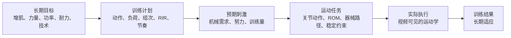

# AI 教练训练执行评估标准 v0.1

日期：2026-08-09  
状态：已确认的产品领域标准；动作级阈值与发布资格仍需真实数据验证。  
范围：一般健康成人的健身与阻力训练。本文先定义 AI 教练要判断什么、依据什么、不能声称什么；动作目录、数据采集和模型训练是后续映射，不是本文起点。

## 1. 结论

MaxPower 真正要做的不是单一“动作完成度评分”，而是**训练执行评估**：

1. **运动任务完成**：用户是否完成了计划动作的起点、阶段、行程、极值与返回。
2. **技术策略符合**：用户的躯干、关节路径、双侧关系、节奏和器械轨迹，是否仍符合所选动作变式和训练意图。
3. **刺激一致性**：观察到的动作策略是否仍与目标关节动作和预计肌群贡献相一致，或已经出现可能改变机械需求分配的策略变化。
4. **努力与训练剂量**：负荷、次数、组数、RPE/RIR、速度表现和组内衰减是否符合本次训练目标。

单目骨架可以较强地支持第 1 层，并像真人教练一样，结合动作知识对第 2、3 层给出实用的概率性判断；第 4 层仍需结合用户输入、训练计划、器械/负荷跟踪或其他传感器。

产品可以说“这种轨迹通常会增加上背或斜方肌参与，使动作偏离标准俯身划船”，但不能把它写成仪器测量结果，例如“斜方肌激活 72%”或“背阔肌只发力 28%”。

## 2. 健身动作为什么存在

一个健身动作不是孤立姿势，而是训练适应链中的执行手段：



相机主要观察 E，并在已知或采用默认的 B、C、D 时对执行进行教练级解释。它可以判断动作轨迹通常意味着什么，但不能只凭 E 量化证明 C 或 F。

同一个外观动作在不同目的下可能有不同标准：

- 增肌训练重视计划 ROM、目标动作策略、足够训练量和接近力竭程度；一个 rep 外观完整并不证明刺激充分。
- 力量训练重视规定技术下完成负荷与协议端点；重负荷向心变慢不自动代表动作不合格。
- 功率训练重视快速意图和负荷速度；只有身体点位速度时不能等同器械功率。
- 技术练习重视重复一致性和预设技术约束，负荷与接近力竭可能不是主要目标。
- 刻意 partial ROM、停顿、慢离心或允许身体摆动都可能是计划内容，不能被通用“标准动作”规则误判。

所以任何用户级判断都必须先知道**这次训练想完成什么**。

## 3. 必须统一的领域概念

### 3.1 运动任务完成 `movement_task_completion`

用户是否完成了该动作规定的运动周期：准备位、目标运动、实际极值、返回和结束条件。它是骨架最直接、最可靠的判断对象。

### 3.2 技术策略符合 `technique_adherence`

实际执行是否处于所选动作、变式和训练意图允许的技术边界内。技术边界可能包括躯干角、关节路径、ROM、器械终点、稳定段和节奏，但必须事先定义。

技术策略不等于“身体越不动越好”，也不等于“与某个教练逐帧一样”。

### 3.3 观测到的动作策略 `observed_movement_strategy`

视频直接支持的运动学描述，例如：

- 躯干在拉起阶段抬起 12°；
- 左侧手腕端点比右侧低；
- 髋部比膝部更早反转；
- 回程阶段比本组稳定重复快 24%；
- 杠铃路径向身体靠近或远离（只有器械被可靠跟踪时）。

它不包含原因判断。

### 3.4 机械需求倾向 `mechanical_demand_tendency`

在动作身份、外部阻力方向和观测可靠时，对动作策略可能如何改变关节机械需求的条件化解释。例如躯干角变化可能改变髋、膝或肩部的外部力矩臂。

它不是净关节力矩实测值，也不是肌肉激活百分比。

### 3.5 刺激一致性 `stimulus_compatibility`

观察到的动作策略是否仍与本次训练的目标关节动作、预计肌群贡献和技术意图相一致。

推荐状态：

```text
consistent
likely_consistent_with_observed_deviation
possible_strategy_shift
inconsistent_with_selected_variant
insufficient_evidence
```

刺激一致性回答“执行是否仍像本次计划要做的事情，以及这种动作策略通常会带来怎样的肌群参与倾向”，不回答“目标肌群已经获得了多少增肌刺激”。

### 3.6 教练级推断 `coach_inference`

教练级推断位于“直接观测”和“仪器测量”之间：系统根据已知动作目的、常见关节动作、目标肌群知识和用户轨迹，解释该执行通常产生的训练效果。

允许的推断包括：

- 更可能保持目标肌群主导；
- 更可能增加辅助肌群参与；
- 可能减少目标关节的有效行程或拉长位暴露；
- 可能把动作变成另一个常见策略；
- 可能通过躯干、髋部或惯性帮助完成动作；
- 可能降低双侧同步或稳定控制。

教练级推断至少需要：

1. 动作/变式已知；
2. 机位能看见相关特征；
3. 一个动作定义特征，或两个相互独立的支持特征持续出现；
4. 对应的动作知识与常见偏差解释经过审核；
5. 文案使用“通常、可能、更偏向”，并保留替代解释。

没有必要要求力台、EMG 或严格动力学模型后才能给出这种日常教练判断；那些工具只在需要量化实际力、功率或肌肉激活时才必要。

### 3.7 努力与剂量充分性 `effort_and_dose_adequacy`

需要结合重量/阻力、组数、次数、RPE/RIR、训练目标、休息和长期历史，判断本次训练是否提供了计划剂量。视频不能读取主观 RPE/RIR，也不能从表情或速度直接补齐。

### 3.8 “发力程度”不是可用字段

“发力程度”混合了至少四件不同的事，产品必须拆开：

| 用户可能表达的含义 | 合适变量 | 单目骨架能力 |
| --- | --- | --- |
| 动作处在哪个阶段 | phase / direction | 可以较可靠判断 |
| 外部输出多大 | force / torque / power | 不能仅靠骨架；至少需要负荷与物体轨迹，严格估计还需动力学数据 |
| 主观有多用力 | RPE / RIR | 必须由用户报告或个体化估计，不能当视觉事实 |
| 哪块肌肉贡献更多 | activation / muscle force / contribution | 不能由骨架直接测量；只能给预计关联和机械需求倾向 |

因此数据结构中禁止使用一个无单位的 `force_level` 或 `effort_score` 代表这些概念。

## 4. 判断所需的 Training Intent Contract

每个动作知识条目应提供一个经过审核的**默认教练意图**，例如“严格俯身杠铃划船”“标准双侧侧平举”。用户没有额外设置时，AI 可以按默认意图判断，并在 UI 明示“按标准变式分析”；用户选择借力、partial ROM、特殊节奏或其他变式时，再覆盖默认值。

每组训练应尽量知道：

```ts
interface TrainingIntentContract {
  goal: "hypertrophy" | "strength" | "power" | "endurance" | "technique";
  exerciseVariant: string;
  equipmentAndResistanceMode: string;
  targetMuscles: readonly string[];
  expectedJointActions: readonly string[];
  plannedRom: "protocol" | "full_available" | "partial_intent" | "personal";
  tempoIntent?: string;
  velocityIntent?: "maximal_intent" | "controlled" | "not_specified";
  allowedStrategyEnvelope: readonly string[];
  load?: { value: number; unit: "kg" | "lb" };
  targetReps?: readonly [number, number];
  targetRir?: readonly [number, number];
}
```

未知字段必须保持 unknown，但不需要因为重量或 RIR 未知而停止常规轨迹指导。AI 教练可以先按默认变式判断，再追问“这组是在做严格划船还是允许借力？”、“你是否刻意做半程？”、“重量是多少？”，用回答提升解释精度。

## 5. 科学证据分层

### E0：动作知识

已知动作通常涉及的关节运动、外部阻力方向、预计主要/辅助/稳定肌群。它来自知识库，不是当前用户实测。

### E1：直接运动学观测

位置、投影角度、相对距离、ROM、方向、时长、端点、躯干轨迹、左右时序和点位可信度。

### E2：个人相对证据

与同一用户、动作变式、机位、负荷和训练意图下的稳定历史比较。适合判断组内表现漂移，但个人历史不自动等于标准动作。

### E3：动作参考与教练推断证据

与 exact exercise context 下经过教练审核和独立验证的可接受 envelope 比较，并把多特征偏差映射为经过审核的常见训练效果解释。可以支持“更可能增加辅助肌群参与、减少目标行程或偏离标准变式”等教练级判断。

### E4：物体与负荷证据

用户确认负荷，加上可靠的杠铃、哑铃、配重或身体质心轨迹，可估外部位移、速度、部分机械功和机械需求代理。仍不是单肌肉力。

### E5：动力学/生理证据

多视角 3D、IMU/编码器、力台/双侧力传感器、经校准人体模型或 EMG。不同传感器回答不同问题，EMG 幅值也不能简单等同肌肉力。

模型置信度与科学证据等级必须分开：模型很确信某个腕点位置，不代表系统有证据声称“右侧无力”。

## 6. AI 教练评估层级

### 6.1 观测准备 `observation_readiness`

先判断主体、机位、相机 roll/pitch、身体/器械入镜、required landmarks、遮挡、帧率和连续性。每个后续维度都有独立 `cannot_judge`，不能用其他关节补造缺失证据。

### 6.2 运动任务完成

判断：

- 是否进入该任务的准备位；
- 是否发生正确方向的目标运动；
- 是否到达实际极值与计划端点；
- 是否完成去程、返回、停顿或交替顺序；
- 是否形成闭合 rep；
- 是否漏掉动作组成部分。

这是“完成了没有”的核心。

### 6.3 技术策略符合

根据动作和意图选择适用约束：

- 主动运动关节的 ROM 与端点；
- 应相对稳定身体段的角度和漂移；
- 躯干、骨盆和支撑基底关系；
- 左右/交替的幅度、端点、时序与路径；
- 器械或负荷路径；
- 阶段时长、停顿与速度意图；
- 允许和不允许的策略变化。

“稳定”必须按任务定义。例如严格弯举限制躯干摆动；有计划的借力弯举允许不同技术边界。深蹲需要躯干随动作协调运动，不能要求完全不动。

### 6.4 动作策略分类

系统先描述策略，再解释其可能意义：

```text
观察：躯干更直立 + 肘部路径更高 + 肩部上提增加
知识：所选为俯身杠铃划船，目标策略要求保持已定义俯身区间
结论：inconsistent_with_selected_variant
解释：动作策略更接近直立提拉/肩胛上提主导模式，机械需求可能发生偏移
边界：未测量背阔肌或斜方肌实际激活
```

不能由一个变量直接跳到肌群结论。躯干角、肘部路径、肩线、器械轨迹、负荷方向和动作变式应共同形成证据。

### 6.5 教练经验如何产品化

线上教练通常使用的是“标准执行特征 + 可见偏差组合 + 常见训练效果”的经验模型。MaxPower 应将它显式建模为 `DeviationEffectPattern`，而不是让 LLM 临场猜测：

```ts
interface DeviationEffectPattern {
  id: string;
  applicableExerciseContexts: readonly string[];
  coachingIntent: string;
  observedFeaturePattern: readonly string[];
  persistenceRequirement: string;
  likelyEffects: readonly {
    effect: string;
    confidence: "high" | "medium" | "low";
    rationale: string;
  }[];
  alternativeExplanations: readonly string[];
  primaryCue: string;
  requiredView: string;
  requiredEvidence: readonly string[];
  prohibitedClaims: readonly string[];
}
```

需要建立的通用偏差模式至少包括：

| 偏差模式 | 可见证据组合 | 常见教练解释 |
| --- | --- | --- |
| 动量借力 | 目标关节尚未充分运动，髋/膝/躯干先加速，随后末端快速完成 | 辅助身体段与惯性参与增加，目标关节在起始段的主动完成减少 |
| 目标关节行程缩短 | primary ROM 变小，同时其他身体段位移增加 | 动作虽然完成，但目标关节/肌群的计划行程与特定位置暴露减少 |
| 躯干策略改变 | ready 角度不符或运动中持续抬起、侧倾、旋转 | 动作可能偏离所选变式，机械需求更偏向其他关节动作或辅助肌群 |
| 肩部上提代偿 | 手臂上举同时肩线明显上移、肘腕路径改变 | 更可能增加肩胛上提/上背辅助，降低原定肩外展或肩伸策略的针对性 |
| 提前反转/反弹 | 未进入目标端点即反向，或端点无控制地快速反弹 | ROM/停顿意图未完成，弹性与惯性对下一阶段帮助增加 |
| 返回失控 | 回程显著快于意图、路径偏离、未回到起始位 | 离心对应的运动阶段完成不足或控制策略改变；不量化离心肌力 |
| 双侧不同步 | 左右端点、ROM、峰值时间和回程顺序持续不同 | 一侧完成较少或时序不同，可能改变双侧训练的一致性 |
| 支撑/稳定段漂移 | 应稳定身体段超出允许 envelope，同时主要动作仍继续 | 通过额外自由度帮助完成动作，可能降低所选 strict 变式的针对性 |
| 器械路径偏移 | 杠铃/哑铃/握把相对身体的路径持续偏离目标走廊 | 力线和关节需求可能改变；必须真实跟踪器械，不能只用腕点代替 |
| 组内表现漂移 | 连续 reps 变慢、ROM 缩小、借力增加、停顿增加 | 可能与疲劳、负荷过高或意图变化有关，应结合 RPE/RIR 询问 |

单个偏差不总是错误。模式必须绑定 coaching intent：strict curl 的躯干摆动属于借力，计划 cheat curl 中可能允许；全 ROM 组的提前反转属于未完成，计划 partial ROM 中可能符合安排。

### 6.6 刺激一致性

建议规则：

```text
预计肌群与关节动作知识
+ exact exercise/variation/equipment
+ 训练目标与允许技术
+ 可见的多特征动作策略
+ 外部阻力方向（已知时）
= stimulus_compatibility
```

如果只有骨架但动作身份、默认教练意图和关键轨迹都可靠，可以输出经过审核的 `coach_inference`，例如“动作更偏向上背/斜方参与”。没有负荷或器械真值时，不量化实际刺激、功率或肌肉激活。

### 6.7 努力、疲劳与训练剂量

视觉可观察组内表现：

- 向心/推进阶段逐次变慢；
- ROM 缩小；
- 停顿增加；
- 技术策略改变；
- rep 间变异增加；
- 未完成尝试。

这些组合称为 `performance_drift`。只有在同动作、同负荷、同节奏/速度意图且观测可靠时，才可以提示“可能与疲劳或负荷变化有关”，并询问 RPE/RIR。不能自动输出“疲劳 70%”或“还剩 2 RIR”。

## 7. 关键运动学变量如何进入判断

### 7.1 向心、离心和等长

- 首先识别 `to_extreme/from_extreme/hold`。
- 再由 exact exercise knowledge 映射 expected concentric/eccentric semantics。
- 判断阶段是否存在、行程是否完成、时长和轨迹是否符合意图。
- 不把阶段存在等同于产生了足够力或目标肌群已经被充分刺激。

### 7.2 ROM 与肌肉长度位置

ROM 需要区分协议 ROM、个人可用 ROM、计划 partial ROM 和本组相对 ROM。关节角可以支持“更伸展/更屈曲”的位置代理，但单目骨架不能直接测肌束长度或在负重下的肌肉张力。

### 7.3 躯干与骨盆

躯干角度可能改变动作身份、外部力矩臂和关节需求，但其意义依动作而定：

- 划船中过度直立可能使执行偏离选定俯身变式；
- 深蹲中的躯干前倾可能是身体比例、杆位或髋膝策略的一部分，不自动是错误；
- 弯举中的躯干摆动可能违反 strict curl，也可能是计划允许的策略；
- 俯卧撑中的髋部下沉会改变身体刚性和任务执行，但不能仅凭外观诊断核心无力。

### 7.4 双侧平衡

保存左右各自 ROM、端点、到达时差、阶段时长、轨迹和方向。对称运动学不能证明受力对称；不对称也可能来自机位、人体差异、单侧意图、疼痛史或器械结构。

双侧平衡是技术证据之一，不是“标准程度”总开关。两侧可以完全对称地一起做错，也可以在计划单侧动作中合理不对称。

### 7.5 节奏与速度

慢不自动等于控制好，快不自动等于失控。必须知道负荷、目标和速度意图。视频点位速度也不等于杠铃速度；快速动作还受处理 FPS 和平滑延迟影响。

### 7.6 器械与外部负荷路径

仅看人体骨架会丢失卧推杠铃触胸、硬拉杠铃贴身、器械配重是否到底、哑铃实际轨迹等关键信息。依赖器械路径的完成标准必须增加物体检测/跟踪，或者明确返回 `cannot_judge`。

### 7.7 呼吸、核心支撑、疼痛与意愿

普通 RGB 骨架不能可靠判断腹内压、Valsalva、呼吸节奏、疼痛、恐惧或是否真正最大努力。产品应通过用户输入和安全问询获取，不能从表情或躯干稳定性反推。

## 8. 产品结果结构

```ts
interface TrainingExecutionAssessment {
  observation: {
    status: "sufficient" | "partial" | "insufficient";
    reasons: readonly string[];
  };
  movementTask: {
    status: "complete" | "partial" | "attempt" | "cannot_judge";
    cycle: unknown;
    rom: unknown;
    endpoint: unknown;
    return: unknown;
    phaseExecution: unknown;
  };
  techniqueAdherence: {
    status: "within_contract" | "observed_deviation" | "outside_contract" | "cannot_judge";
    torsoPelvis: unknown;
    bilateral: unknown;
    path: unknown;
    tempo: unknown;
  };
  movementStrategy: readonly {
    observation: string;
    phase: string;
    side?: "left" | "right";
    evidenceRefs: readonly string[];
  }[];
  stimulusCompatibility: {
    status:
      | "consistent"
      | "likely_consistent_with_observed_deviation"
      | "possible_strategy_shift"
      | "inconsistent_with_selected_variant"
      | "insufficient_evidence";
    expectedAssociationRef: string;
    explanation: string;
    claimLevel: "expected_association" | "coach_inference" | "mechanical_demand_tendency";
  };
  coachConclusion: {
    standardExecution:
      | "standard"
      | "mostly_standard"
      | "completed_with_strategy_shift"
      | "incomplete"
      | "cannot_judge";
    likelyTrainingEffect: readonly string[];
    primaryCue?: string;
    inferenceBasis: readonly string[];
  };
  effortAndDose: {
    status: "on_target" | "off_target" | "unknown";
    loadSource?: string;
    rirSource?: "user_reported" | "individual_estimate";
    performanceDrift?: unknown;
  };
}
```

结果不合成 0–100 总分，但可以给出教练式的“标准、基本标准、完成但策略偏移、未完成、无法判断”摘要，并解释最可能的训练效果。不同目标下，技术偏差、ROM、速度和努力程度的意义不同；纯数值总分会隐藏这些冲突。

## 9. AI 教练反馈决策顺序

1. **先解决看不见**：机位、入镜、遮挡或点位不足时先调整摄像头。
2. **再解决动作身份**：用户执行的变式与选择不符时先确认动作，而不是直接纠正。
3. **再解决任务未完成**：未到端点、未返回、漏掉阶段或顺序错误。
4. **再解决刺激定义特征**：会使动作偏离所选变式或训练意图的躯干、关节和器械路径。
5. **解释常见训练效果**：说明该偏差通常会增加哪些辅助策略、减少哪些目标行程或使动作更接近哪种变式。
6. **再解决次要一致性**：轻微左右时差、节奏或轨迹变化。
7. **最后询问努力与体验**：出现 performance drift 时询问 RPE/RIR、疼痛和是否刻意改变动作。

每次只提示最重要且可执行的一到两个问题，避免用户为追逐所有可见指标而产生新的代偿。

## 10. 例子：俯身杠铃划船

假设训练意图为 strict bent-over barbell row，目标是保持审核过的俯身策略并完成肩伸/肘屈拉动：

| 证据 | AI 可以判断 | AI 不能直接判断 |
| --- | --- | --- |
| 躯干准备位明显更直立 | 当前执行可能不匹配所选俯身变式 | 背阔肌一定没有发力 |
| 拉起时躯干持续抬起 | 观察到借助髋/躯干伸展的策略变化 | 核心力量不足 |
| 肘部更多向外上方、肩线明显上提 | 执行更接近上背/肩胛上提倾向 | 斜方肌激活增加了具体百分比 |
| 杠铃未被检测 | 不能判断杠铃是否触及目标位置、是否贴身 | 仅靠腕点伪造精确杠铃路径 |
| 用户输入重量并可靠跟踪杠铃 | 可补充位移、速度和外部机械功代理 | 单肌肉力与实际刺激充分性 |

推荐反馈：

> 当前起始躯干比标准俯身划船更直立，拉起阶段又抬起约 11°，同时肘部路径偏高。这个动作仍然完成了拉动，但更可能偏向上背和斜方肌参与，并减少标准俯身划船中的肩伸行程。下一次降低一点重量，保持俯身角度，让肘部沿身体两侧向后；如果你本来就在做允许借力的变式，可以修改动作设置。

不推荐：

> 背部没发力，力量都转移到了斜方肌。

## 11. 其他典型例子

### 侧平举

正面骨架可判断双腕端点、左右时序、肘部路径和躯干侧倾；不能直接判断三角肌中束激活、肩峰下空间或肩部受伤风险。若躯干摆动、肘屈和腕部路径同时改变，可以提示动作策略偏离所选 strict lateral raise，而不是只凭一侧高度给“标准分”。

### 深蹲

侧面可判断髋膝投影 ROM、阶段、躯干和小腿策略；正面更适合左右时序、骨盆侧倾和横移。躯干前倾本身不等于错误，必须结合杆位、身体比例、髋膝策略和训练目标。单目骨架不能给真实髋膝净关节力矩。

### 卧推

人体骨架可判断肘部 ROM、左右时序和躯干/肩髋可见位置；没有杠铃跟踪时不能可靠判断触胸、杠铃路径和实际负荷。胸肌刺激充分性还需要重量、努力程度、总组次和长期计划信息。

## 12. 主要风险

### 12.1 因果越界

从运动学直接声称肌肉激活、力量不足、疲劳程度或伤病风险，是最高风险错误。所有因果解释必须带证据等级和替代解释。

### 12.2 过度标准化

身体比例、活动度、器械结构、技术流派和训练目标都会改变合理执行。一个跨人、跨动作、跨机位的统一角度标准很容易误导。

### 12.3 可见指标被游戏化

用户可能为了让左右高度或躯干角变“完美”，牺牲负荷控制、呼吸、舒适度或真实训练目的。AI 只应提示与训练意图最相关的少量指标。

### 12.4 对称性崇拜

对称不是正确性的充分条件，也不是所有人的必要条件。必须考虑单侧动作、惯用侧、结构差异、既往伤病和机位投影。

### 12.5 错误反馈叠加

点位错误、动作识别错误、意图未知和 LLM 过度解释会逐层放大。每层必须能独立拒绝，LLM 不得绕过本地证据门禁。

### 12.6 安全与医疗边界

视频不能诊断疼痛原因或预测伤病。用户报告疼痛、眩晕、麻木或异常不适时，产品优先停止/转介，不继续用动作分数纠正。

## 13. 替代与增强路径

| 目标能力 | 仅骨架路径 | 更可靠的增强路径 |
| --- | --- | --- |
| 动作阶段、ROM、躯干、左右时序 | MediaPipe33 + exact view contract | 多视角或经过验证的 3D |
| 杠铃/器械行程与速度 | 腕点弱代理，不足时拒绝 | 物体检测、线性位置传感器、IMU/编码器 |
| 外部机械功代理 | 需要用户输入重量 + 可靠物体速度 | 智能器械/编码器 |
| 左右外部受力 | 骨架不能判断 | 双力台、压力鞋垫、双侧负荷传感器 |
| 肌肉激活时序 | 骨架不能判断 | EMG；仍不等于肌肉力 |
| 关节力矩/肌肉力估计 | 单目骨架不足 | 多视角 3D + 外力 + 个体模型 + 逆动力学/肌骨模型 |
| RPE/RIR、疼痛、意图 | 用户主动输入 | 个体化历史可辅助，但不能替代本人报告 |

优先级最高的替代路径不是马上增加更多骨架点，而是：获取训练意图、用户确认负荷、跟踪真正的器械/负重对象，并建立个人稳定基线。

## 14. 如何从本标准反推数据需求

后续不按“70 个动作平均采一样多”制定计划，而按**要支持的产品主张**反推：

| 产品主张 | 必要证据 | 后续需要的数据 |
| --- | --- | --- |
| 完成完整周期 | start/extreme/end/return | 逐 rep 事件标注、休息负样本、遮挡样本 |
| ROM 完成 | exact task endpoint + 可靠点位 | 逐 rep ROM/端点标注、动作/机位合同 |
| 躯干策略偏移 | 有符号角度和阶段关系 | 躯干/骨盆阶段标注、允许与不允许策略 |
| 左右运动学差异 | 左右各自端点、ROM、时序 | 正/后视双侧标注、相机 roll 与遮挡标签 |
| 刺激一致性变化 | 多特征策略 + 动作知识 + 阻力方向 | 教练审核的 strategy-shift 标签；必要时器械轨迹 |
| 发力/功率代理 | 负荷 + 物体速度/位移 | 负荷真值、器械跟踪或编码器数据 |
| 疲劳/RIR | 同负荷表现漂移 + 用户报告 | 组内序列、用户 RPE/RIR、负荷和意图 |

只有先决定产品要开放哪些主张，才能确定采集字段、标签、设备和样本规模。

## 15. 已确认的产品原则

1. 产品主对象从“动作完成度”升级为“训练执行评估”，对用户呈现教练式标准执行摘要。
2. 将任务完成、技术策略、刺激一致性、努力与剂量分层输出，不合成一个总分。
3. “发力程度”从产品字段中移除，拆成 phase、外部输出、RPE/RIR 和预计肌群贡献。
4. 骨架可以支持经过审核的教练级训练效果推断、刺激一致性和机械需求倾向，但不输出伪精确肌肉激活或实际刺激百分比。
5. 每个动作提供默认教练意图；用户未特殊设置时按默认标准变式分析，特殊 ROM、节奏和允许借力由用户覆盖。
6. 先建立跨健身动作通用的判断原则，再映射具体动作；动作数量不是理论框架的起点。
7. 数据采集与训练计划必须由希望支持的产品主张反推。

这些原则已在产品 PRD、偏差—影响知识矩阵、70 个动作映射和证据/训练数据标准中落地。后续实现仍须等 Android V1 完成后另建 Rust SDK spec。

## 参考依据

- [从训练目的与生物力学定义 AI 健身教练动作完成度](../research/2026-08-09-training-purpose-biomechanics-ai-coach-completion.md)
- [健身运动理论：肌肉动作、动作分期与动作完成度](../research/2026-08-09-exercise-science-contraction-phases-completion.md)
- [轻量级运动轨迹 × 预计肌群关联数据库](../research/2026-08-06-lightweight-trajectory-muscle-association-database.md)
- [动作完成度识别技术选型](../research/2026-08-09-rep-completion-recognition-technical-selection.md)
- [训练计划知识](../wiki/training-programming.md)
- [动作与刺激知识库](../wiki/exercise-and-stimulus-knowledge.md)
- [项目领域词汇与不变量](../../CONTEXT.md)
- [实时 AI 健身教练 PRD](../../.scratch/realtime-ai-fitness-coach/PRD.md)
- [教练偏差—影响知识矩阵](./ai-coach-deviation-effect-pattern-matrix-v0.1.md)
- [70 个动作的教练模式映射](./exercise-coaching-pattern-mapping-v0.1.md)
- [证据、采集、训练与人工标注标准](./ai-coach-evidence-and-training-data-requirements-v0.1.md)
