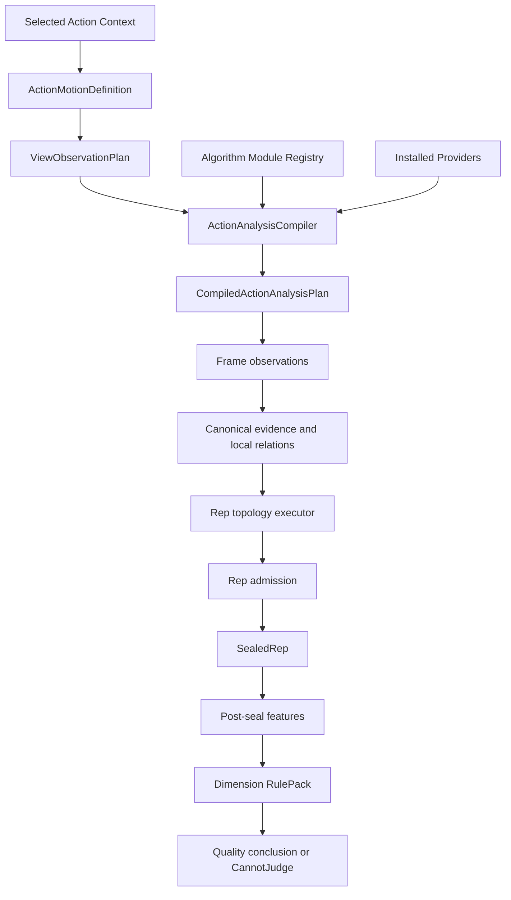

# 视觉识别 v0.1：动作驱动算法组合修复方案

> 日期：2026-08-16  
> 状态：算法/资产基座已实现；2026-08-16 数值验收失败，待独立校准数据恢复召回  
> 运行目标：Web、Android、iOS 纯本地实时  
> 最新评测证据：受治理 local-private output digest `40716392ff2421c8e7695ba059bc8c75a9e4300eabb22c193907902499edd903`；逐 capture 内容不提交产品仓库  
> 产品约束：[Rust motion understanding product contract](../agents/rust-motion-trace-explainer-product-contract.md)

## 1. 决策

v0.1 不再尝试让所有动作共享同一套信号、状态机和阈值。新的执行模型是：

> 根据 exact action context 编译一张算法依赖图；运行时只执行对该动作适用、且当前证据满足依赖的模块。

`exact action context` 至少包括：

```text
action
+ variation
+ equipment topology
+ laterality
+ camera view
+ pose contract
```

动作定义“需要理解什么”，机位定义“能够观察什么”，Provider 提供“实际观测到什么”，算法模块计算事实，RulePack 决定这些事实允许支持什么结论。Rust 继续拥有唯一的 canonical evidence、Rep、phase、quality 和 trace 权威。

该方案不把新算法全局加入，也不按动作名称在 Rust 中堆条件分支。算法只有在满足以下条件时才能进入某个 action×view：

1. 解决该 context 已测量的失败；
2. 输入依赖可以被当前机位和 Provider 满足；
3. 缺失和冲突行为明确；
4. 可以通过 Rust 统一 interface 测试；
5. 同一冻结回放证明收益大于回归；
6. 端上延迟、内存和热稳态满足预算。

## 2. 当前证据与修复目标

最新冻结诊断覆盖 53 组已知参与者视频、455 个人工 Rep 和 237 个已复核负窗口。它是已知视频回归，不支持新用户泛化声明。

| 指标 | 当前结果 |
| --- | ---: |
| Admitted-prediction Precision（Confirmed + NeedsReview） | 51.61% |
| Admitted-prediction Recall（Confirmed + NeedsReview） | 3.52% |
| Admitted-prediction 匹配 Rep | 16 / 455 |
| 非拒绝预测 Rep（Confirmed + NeedsReview） | 31 |
| 已封存 raw candidate | 194 |
| 被拒绝候选 | 163 / 194，84.02% |
| 完全正确的组 | 0 / 53 |
| 严格边界对齐 | 1 / 455 |
| 起点 MAE | 700.6 ms |
| 终点 MAE | 834.1 ms |
| 平均区间 IoU | 0.330 |

主要拒绝原因：

| 原因 | 数量 | 占全部拒绝 |
| --- | ---: | ---: |
| `ActionPrimaryDirectionMismatch` | 97 | 59.51% |
| `RequiredJointLoss` | 34 | 20.86% |
| `EquipmentConsensusUnavailable` | 22 | 13.50% |
| 其他 | 10 | 6.13% |

上述 51.61% / 3.52% 是 admission 后、将 `Confirmed` 与 `NeedsReview` 合并计算的预测指标，不是 raw proposal 指标；不能用它判断 proposal 层的真实 Precision/Recall，也不能把 `NeedsReview` 的增长当作正式可计数 Rep 的增长。只修 admission 仍不足以达到可用水平：现有 194 个 raw candidate 面对 455 个真 Rep，即使全部候选都正确，同一候选集合的 Recall 上限也只有 42.64%。因此必须分别修复：

```text
Candidate Proposal
→ Rep Admission
→ Boundary Refinement
→ Post-seal Quality
```

质量能力当前也不能视为可用：PhaseControl、SupportStability、BilateralCoordination、TrajectoryControl 和 StandardVariantCompatibility 在 53/53 组中全部为 `CannotJudge`，并且没有合格人工质量真值。

### 2.1 2026-08-16 实施后固定结果

受治理的 action-driven runtime 已按同一 53 组、455 Rep、237 个负窗口完成回放。结果不是识别修复成功：raw candidate 从旧诊断的 194 降到 51；raw 流匹配 23 个真值（Precision 45.10%、Recall 5.05%）；Confirmed 为 10、NeedsReview 为 7，合并 Precision 64.71%、Recall 2.42%，exact-set 仍为 0%。

这说明模块选择、动作资产、独立器械证据、Rep/质量隔离和因果 Trace 已经成为可运行基座，但 action×view 的 local-coordinate 与 topology 数值尚未用独立校准集拟合。下一阶段必须使用与最终 evaluation 隔离的训练/校准视频交付参数资产；不能继续在这 53 组视频上调参后把结果称为无偏改善。

## 3. 核心架构：一张编译后的算法依赖图



### 3.1 外部 seam 保持小而深

宿主只需要知道两个动作：

```text
compile(selected_context, installed_assets)
  -> CompiledActionAnalysisPlan | TypedPlanRefusal

process(frame_observations)
  -> CanonicalMotionOutput
```

动作选择、模块依赖、算法版本、阈值、降级、证据传播和 trace 都隐藏在 Rust 模块内部。Web、Kotlin 和 Swift 不分别拼装算法，不创建第二个 Rep 或质量解释。

### 3.2 计划在组开始时冻结

`CompiledActionAnalysisPlan` 在 `begin_set` 前完成并冻结。它至少包含：

```text
CompiledActionAnalysisPlan {
  context_key
  observation_plan
  provider_requirements
  local_coordinate_plan
  rep_topology_plan
  admission_plan
  relation_program
  post_seal_feature_program
  rule_pack
  set_aggregation_policy
  plan_hash
}
```

动作、机位、变式、侧别、Provider 或计划哈希发生变化时，活动 Rep 不得继续；运行时返回 typed refusal 或要求开始新 set。

## 4. 算法模块合同

每个模块注册为可复用能力，不直接绑定动作名称：

```text
AlgorithmModuleDescriptor {
  algorithm_id
  version
  category

  applicable_topologies
  supported_views
  required_inputs
  optional_inputs
  produced_facts

  activation_policy
  missing_evidence_policy
  conflict_policy

  parameter_schema
  causal_latency_contract
  performance_budget_class
  allowed_claims
}
```

模块类别：

| 类别 | 职责 | 示例 |
| --- | --- | --- |
| Observation Provider | 产生 frame-local 观测 | person、pose、barbell、dumbbell、machine handle |
| Local Coordinate | 建立动作局部投影坐标 | pose-primary、rigid-bar、independent-bilateral |
| Rep Topology | 产生候选周期或保持区间 | bilateral cycle、unilateral cycle、alternating、hold |
| Relation Operator | 计算动作语义事实 | displacement、joint angle、relative distance、path residual |
| Admission | 决定 Confirmed/NeedsReview/Rejected | identity、coverage、conflict、return completion |
| Post-seal Feature | 计算完整 Rep 特征 | phase duration、excursion、return error、bilateral timing |
| Quality Rule | 输出分维度结论 | task completion、phase、stability、substitution |

## 5. 静态适用性与动态可判定性分开

### 5.1 静态适用性

编译阶段根据动作合同决定模块是否适用：

```text
Applicable      可以进入计划
NotApplicable   不进入计划，并输出明确语义
Invalid         与动作身份或机位冲突，计划编译失败
```

示例：

| 模块 | 杠铃卧推 | 俯卧撑 | 单臂绳索侧平举 |
| --- | ---: | ---: | ---: |
| rigid-bar observation | Applicable | NotApplicable | NotApplicable |
| bilateral synchronous cycle | Applicable | 视变式/机位 | NotApplicable |
| unilateral cycle | NotApplicable | NotApplicable | Applicable |
| bilateral timing | 视机位 | 视机位 | NotApplicable |
| active-side resolver | NotApplicable | NotApplicable | Applicable |
| equipment path | Applicable | NotApplicable | 可选 handle path |

### 5.2 动态可判定性

模块已经适用，但当前 Rep 缺少所需证据时：

```text
Observed
CannotJudge
Conflict
```

例如卧推的 bar-path 模块静态适用，但杠铃在一个 Rep 中被遮挡，结果应是 `CannotJudge`；不能使用手腕生成伪杠铃，也不能把模块临时改成 `NotApplicable`。

## 6. 数据依赖决定算法是否运行

模块依赖分为四种：

```text
RequiredForPlan
RequiredForRep
RequiredForDimension
OptionalCorroboration
```

对应失败范围：

| 依赖类型 | 缺失结果 |
| --- | --- |
| RequiredForPlan | action×view 计划不能安装 |
| RequiredForRep | Rep 为 NeedsReview 或 Rejected，由 admission policy 决定 |
| RequiredForDimension | 仅对应质量维度 `CannotJudge` |
| OptionalCorroboration | 保留 Rep，降低该事实 confidence/coverage |

算法不能用一个加权总分隐藏缺失，也不能让可选质量关系反向否决 identity-complete Rep。

## 7. Rep 拓扑按动作选择

v0.1 注册多种通用拓扑执行器，由动作计划选择：

| topology | 适用示例 | 关键依赖 |
| --- | --- | --- |
| `bilateral_synchronous_cycle/v1` | 杠铃卧推、联动机器推胸 | shared/bilateral primary track |
| `independent_bilateral_cycle/v1` | 双哑铃侧平举 | 左右独立负载或肢体轨迹 |
| `unilateral_cycle/v1` | 单臂绳索侧平举 | active side 与单侧 primary track |
| `alternating_cycle/v1` | 交替弯举、交替抬膝 | 左右交替状态与侧别 |
| `pose_primary_cycle/v1` | 俯卧撑、部分自重动作 | 可观察的 identity-defining pose relation |
| `hold_interval/v1` | 平板支撑、等长保持 | 持续时间与稳定走廊 |
| `locomotion_step_cycle/v1` | 原地踏步、走路 | 足/骨盆相对周期 |
| `multi_stage_cycle/v1` | 多阶段复合动作 | 明确的阶段图，不压成两相 |

不存在适用于所有动作的全局“离开—换向—返回”状态机。该拓扑只在动作定义确实是往返周期时启用。

## 8. ViewObservationPlan 必须真正影响算法

当前 view projection 不能只验证 operator 是否存在。每个 exact view 需要声明：

```text
ViewObservationPlan {
  visible_relations
  occlusion_risks
  primary_signal_candidates
  prohibited_signals
  side_observability
  equipment_observability
  support_observability
  local_axis_policy
  dimension_availability
}
```

规则：

- 当前机位不可见的关系不能成为 `RequiredForRep`；
- 不能因为关系在 2D 中可以计算，就假设它在该机位有动作语义；
- 双侧动作不代表所有机位都能进行双侧质量判断；
- action×view 无法观察 identity-defining relation 时，不发布该 context；
- 机位只授权投影域结论，不产生真实 3D、力或肌肉声明。

## 9. v0.1 Rep 修复算法

### 9.1 Candidate Proposal

候选状态机由 `RepTopologyPlan` 配置，每个 action×view 提供：

```text
primary_relation
corroborating_relations
direction_policy
start_threshold
minimum_excursion
turnaround_hysteresis
return_tolerance
minimum_phase_dwell
maximum_gap
```

候选层目标是找全完整运动周期。只要动作拓扑完整，弱但有界的证据应保留为 candidate，交给 admission 分级，不能在 proposal 层静默丢失。

### 9.2 ActionPrimary 方向

往返周期默认验证：

```text
abs(turn - start) > minimum_excursion
(turn - start) * (end - turn) < 0
abs(end - start) < return_tolerance
```

如果动作需要固定起始方向，`direction_policy` 必须由动作资产或冻结局部坐标显式声明，不能让屏幕正负号隐式决定动作身份。

### 9.3 Admission 分层

废除过载的单一 `RequiredJointLoss` 语义，至少拆成：

```text
CoordinateNotFrozen
SignalTemporarilyUnavailable
TransitionEvidenceWeak
IdentityRelationMissing
```

前三类在周期完整、缺失时间有界时优先进入 `NeedsReview`。只有真正身份关系缺失、明确冲突或周期不完整才进入 `Rejected`。

每次改变 admission 必须同时报告：

- 新增 matched Rep；
- 新增 false positive；
- reviewed negative window false trigger；
- Confirmed 与 NeedsReview 的迁移；
- 每个 action×view 的净变化。

### 9.4 因果边界精修

使用固定上限环形缓冲：

1. 当前帧只用当前和过去证据；
2. 持续反向运动确认 turnaround；
3. 回看短缓冲中的局部极值或速度过零点作为 `peak_timestamp`；
4. 单独保留更晚的 `turnaround_confirmed_timestamp`；
5. start/end 使用准备基线走廊交叉点；
6. 缓冲不足或证据冲突时拒绝精修，不移动已发布的 `SealedRep`。

## 10. 器械模块按动作拓扑启用

当前 person YOLOX 不包含器械类别。器械动作不能因为已有 YOLOX 基础设施就被视为已支持器械识别。

推荐 Provider：

```text
free_rigid_barbell       → RigidBarObservationProvider
independent_dumbbell     → IndependentDumbbellObservationProvider
constrained_machine     → MachineHandleObservationProvider
bodyweight              → no equipment provider
fixed support           → future SupportObservationProvider
```

移动端扩展使用独立小型 equipment detector，不修改现有 person 模型：

```text
low-frequency detector
→ bounded ROI/full-frame reacquisition
→ causal optical-flow/geometry tracking with TTL
→ frame-local EquipmentObservation
→ Rust EquipmentFusionEngine
```

要求：

- detector、optical flow、geometry 和 predicted 来源可区分；
- predicted 不得成为 judgeable equipment；
- 手腕只约束器械归属，不能替代器械；
- 稳定 track、subject association、hand association 和 grip stage 仍由 Rust 拥有；
- 没有训练权重和真机评测前，不把 equipment detector 写成已完成能力。

## 11. Post-seal Quality 按维度组合

动作质量只在 `SealedRep` 后运行，不能反向创建或移动 Rep：

```text
SealedRep
→ effort/return 或动作自定义阶段注册
→ relation facts
→ per-dimension rules
→ set aggregation
```

角色到维度的默认映射：

| relation role | 可支持维度 |
| --- | --- |
| TaskPrimary | TaskCompletion、RangeOfMotion |
| CoordinatedMotion | PhaseControl、BilateralCoordination |
| StabilityRelation | SupportStability、TrajectoryControl |
| SubstitutionGuard | StandardVariantCompatibility |
| ContextAnchor | ObservationConfidence、局部坐标解释 |

每个事实必须携带：

```text
value/category
status
coverage
confidence
uncertainty
provenance
source_range
```

RulePack 逐维度输出 `ObservedAcceptable`、`ObservedDeviation`、`CannotJudge` 或 `NotApplicable`。不得把所有维度压成一个隐藏缺失证据的总分。

## 12. 本轮外部算法的采用边界

| 算法思想 | v0.1 决策 | 适用条件 |
| --- | --- | --- |
| 相对坐标、事件迟滞、周期状态 | 采用并重写为因果 Rust 算子 | 对应 Rep topology 显式启用 |
| phase-aligned comparison | Rep 稳定后采用 | 只消费 `SealedRep`，不能决定边界 |
| 符号微程序 | 采用为 RulePack 结构 | exact action×view、有审阅阈值和 typed refusal |
| 可观察残差分解 | 采用 | 只输出 2D 投影域事实 |
| equipment YOLOX | 条件采用 | 有训练权重、类别真值、端上预算和 Provider lineage |
| MIA / MuscleMap | v0.1 不采用 | 不解决当前 Rep/边界；只能是未来估计旁路 |
| OpenCap runtime | 不采用 | 非实时大优化器；只借鉴残差结构 |
| OpenSim / Nimble | 不采用 | 只作为离线验证，不进客户端实时核心 |

## 13. 实施阶段

### P0：建立 action×view 漏斗评测与不混淆口径

- 最新诊断增加 `byActionView` 输出，禁止只看 aggregate。
- 每个 context 报告 raw proposal、admission disposition、matched、FP、FN 和拒绝原因；raw proposal 必须能与人工 Rep 做一对一时间重叠匹配。
- 给 rejected candidate 与人工 Rep 做时间重叠，区分真拒绝和假拒绝。
- 分开报告 `rawProposalPrecision/Recall`、`confirmedOnlyPrecision/Recall`、`confirmedPlusReviewPrecision/Recall` 与 Boundary Accuracy；任何正式计数、训练量和发布门槛只使用 `Confirmed`。
- 对方向、坐标、信号、连续性和 equipment consensus 记录可聚合的子原因；在逐 candidate 证据没有完成归因前，不把某一个拒绝原因表述为已证实根因。
- 冻结协议、输入哈希、评测脚本和负窗口。

完成条件：能明确指出每个 action×view 的损失发生在哪一层。

### P1a：先安装 ViewObservationPlan 与 action×view 发布门

- 为每个可发布 context 持久化完整 `context_key`：action、variation、equipment topology、laterality、camera view、pose contract 和资产/Provider 版本。
- 对每个机位声明可观察、不可观察和禁止使用的 relation，并在编译期将不可观察的 identity relation 变为 typed refusal，而不是 `RequiredForRep`。
- `compile(selected_context, installed_assets)` 必须实际校验 Provider、pose contract、view-observability asset 和 module version；不得只因 operator 已注册就将 relation 标为 observable。
- 冻结每个发布 context 的 plan hash、view plan hash 与 allowed claims；未通过该门的 context 不进入 Rep topology 或 admission 迁移。

完成条件：所有进入后续实验的 context 都有依赖闭合、可审计的 view-observability 声明；不可观察 context 被原子拒绝且不开始 set。

### P1b：动作约束的 Rep topology 与 admission 消融

- 引入 `RepTopologySpec` 和 `AlgorithmModuleDescriptor`。
- 只迁移已通过 P1a 的 exact context；没有明确拓扑或机位可观察性的 context 不迁移。
- 对每个 context 显式选择互斥的 direction policy：固定 expected sign，或 sign-invariant 的 departure-turnaround-return topology；前者不得由屏幕符号隐式推断，后者不得放行真实反向动作。
- 拆分 `RequiredJointLoss`。
- 为缺失证据定义 Confirmed/NeedsReview/Rejected 转移。
- 保持 `SealedRep` 唯一权威。
- 每次只改变一个 admission 或 direction 因子，并报告 P0 的三套指标、负窗口误触发和 disposition 迁移。

完成条件：`confirmedOnly` 指标在同一冻结回放中达到预先声明的改善，且 `confirmedPlusReview` 的提升不能以 `confirmedOnly` 下降、Precision 下降或负窗口误触发增加换取。

### P2：action×view Candidate profile 与扩展

- 通用阈值迁移为版本化 action×view profile。
- 用训练集校准、验证集选择，held-out 用户只做最终评价。
- 不允许通过评测集反复调参后报告同一评测集结果。

完成条件：每个发布 context 都有非零 `confirmedOnly` Recall，并通过 context-specific gate。

### P3：Boundary Refinement

- 增加固定上限缓冲和事件时间/确认时间分离。
- 分别评测 start、turnaround、end MAE/P95 和 interval IoU。
- 截断未来帧验证因果性。

完成条件：边界达到质量 RulePack 预先声明的最小精度。

### P4：器械 Provider

- 先完成 barbell shaft，再评估 dumbbell 和 machine handle。
- 建立 bbox/axis/track/grip/turnaround 人工真值。
- 评测全帧、ROI、低频 detector 和中间帧 tracker。
- Android/iOS/Web 单独做性能与热稳态验证。

完成条件：器械证据能够稳定进入 local channel，且消融证明它提高对应动作结果。

### P5：动作质量

- 为每个 action×view 定义可评价维度和 `NotApplicable` 维度。
- 建立逐 Rep、逐维度人工标签和审阅一致率。
- 先启用 TaskCompletion、RangeOfMotion 和 ObservationConfidence。
- 再逐项启用 Phase、Trajectory、Stability、Bilateral 和 Substitution。
- 质量规则不得反向影响 Rep 边界。

完成条件：每个启用维度有独立准确率、覆盖率和 `CannotJudge` 率。

## 14. 验收门槛

| 层 | 必须报告 | 发布阻塞条件 |
| --- | --- | --- |
| Context compile | 安装成功、依赖闭合、plan hash | 不兼容模块、缺 RequiredForPlan 依赖 |
| Proposal | per-action×view raw proposal Precision/Recall、真值重叠 | 任何发布 context 的 raw proposal Recall 为 0 |
| Admission | Confirmed-only 与 Confirmed+NeedsReview 的 Precision/Recall、disposition、reason | 以 NeedsReview 迁移伪造正式改善；aggregate 改善但 context 回归；误报/负窗口超限 |
| Rep count | Confirmed-only 每动作计数误差、exact-set rate；NeedsReview 单独报告 | 每动作计数误差超过冻结门槛 |
| Boundary | start/turn/end MAE、P95、IoU | 未达到使用该边界的质量模块最低要求 |
| Quality | per-dimension agreement/F1、coverage、CannotJudge | 无人工真值；隐藏缺失的总分 |
| Causality | future truncation、唯一 SealedRep | 过去 live 输出依赖未来帧；第二计数器 |
| Performance | p50/p95/p99 age、FPS、drop、memory、thermal | 第二模型挤占 pose/Rep deadline |
| Generalization | held-out users/videos/devices | 只在已知参与者视频上通过 |

最低产品方向保持：每动作计数误差不超过 10%、起停延迟不超过 1 秒、每 30 秒休息误报不超过 1、有效帧至少 90%、处理至少 15 FPS，并在至少 5 名 held-out 用户上验证。具体 action×view 门槛必须在评测协议中冻结。

## 15. 必须具备的合同测试

### 编译测试

- rigid-bar topology 不能绑定到 bodyweight action；
- unilateral action 不能启用 bilateral Rep consensus；
- 不可观察的 identity relation 不能发布该 view；
- RulePack 不能引用未生产的 fact；
- Provider、module、parameter schema 和 allowed claims 必须闭合；
- 安装失败必须原子回滚，保留旧计划。

### 运行时测试

- 计划在 set 内冻结；
- 缺失 RequiredForDimension 只影响对应维度；
- OptionalCorroboration 缺失不能否决完整 Rep；
- Predicted/Unknown 不能创建 start、turnaround 或 end；
- 模块冲突产生 typed conflict，不做加权掩盖；
- `SealedRep` 不能被质量模块移动或删除。

### 评测测试

- 每个 action×view 独立输出漏斗；
- raw proposal、Confirmed-only 和 Confirmed+NeedsReview 使用独立且固定的匹配输出；
- 同一冻结输入重复运行结果一致；
- 每次算法变更只改变预期层；
- admission 消融、Provider 消融和 module 消融可复现；
- aggregate 提升不能掩盖任何 context 的严重回归。

## 16. v0.1 非目标

- 开放集动作分类；用户已经选择 exact action context。
- 从普通单目 RGB 输出真实 3D、力、关节力矩或肌肉激活。
- 将 OpenCap、OpenSim、Nimble、MuscleMap 或 MIA 直接链接进实时核心。
- 运行时静默学习阈值或自动晋升规则。
- 用手腕替代杠铃、哑铃、绳索或机器把手。
- 用一个不透明总分隐藏 `CannotJudge`。
- 为了目录覆盖而发布没有非零 Recall 和人工验证的 action×view。

## 17. 完成定义

v0.1 修复完成不是“所有模块都能编译”，而是：

1. 每个发布的 action×view 都编译出依赖闭合的 `CompiledActionAnalysisPlan`；
2. 每个启用模块都有明确输入、输出、缺失、冲突、延迟和声明合同；
3. Rep Proposal、Admission、Boundary 在 held-out 数据上分别通过门槛；
4. `SealedRep` 是唯一 Rep 完成事实；
5. 每个启用的质量维度都有人工真值、准确率和覆盖率；
6. 客户端纯本地运行满足时延、内存和热稳态预算；
7. 无法支持的 action×view 或质量维度明确拒绝，不用通用 fallback 伪造能力。

最终交付形态是一个由动作资产驱动、由 Rust 编译和执行、按证据依赖启用模块、按维度拒绝结论的本地实时分析系统。
