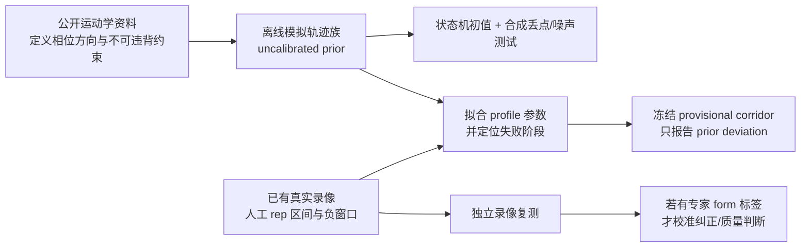

# 用模拟运动轨迹作为 provisional prior：可行性与安全边界

日期：2026-08-04  
范围：高位下拉和坐姿推肩的分段、计数、轨迹比对。本文不修改产品代码，也不把模拟输出称作人体“正确姿势”。

## 结论

**可以，而且现在就值得做；但要把它定义为“可审计的模拟轨迹先验（provisional prior）”，不能定义为“标准动作轨迹”。**

它能在真实资料不足或尚未覆盖某个动作时，先提供一个完整的 `top → bottom → top`（或 `bottom → top → bottom`）轨迹族，用于：

- 验证/补全状态机和计数器的相位顺序；
- 做骨架丢点、镜像、速度、相机距离和轻度噪声的合成回归测试；
- 为新的动作 profile 提供初始特征、方向约束和可解释的失败原因；
- 作为真实轨迹的**初始化/正则化对象**，随后由现有人工标注的真实 rep 校准。

它不能单独提供：

- “标准/正确/安全”的数值走廊；
- 肩胛三维运动、盂肱轴向旋转、关节力矩、疼痛或受伤风险；
- 对未知器械、握法、座椅设置、负重、机位或用户直接给合格/不合格结论。

原因很直接：优化模拟器会输出**满足写入它的模型、目标函数与约束**的运动，不会自行发现尚未编码的教练知识。OpenSim Moco 确实可做 motion prediction、tracking 和自定义 optimal-control 问题，但其目标、约束、人体模型和参数本身均由使用者提供。[Dembia et al., 2020](https://doi.org/10.1371/journal.pcbi.1008493)；[OpenSim Moco 官方文档](https://opensim-org.github.io/opensim-moco-site/docs/1.3.0/)。所以它是很好的 *prior generator*，不是独立的 form-quality 真值来源。

## 推荐对象：模拟“轨迹族”，不要模拟一条唯一标准曲线

不要生成：

```text
lat_pulldown_standard_curve.json
```

应生成（每个精确 profile 一份）：

```text
ProvisionalMotionPrior {
  identity: exact exercise / variation / equipment / capturePosition / side / coordinate schema,
  source: simulated_kinematic_prior,
  evidenceStatus: uncalibrated,
  phaseModel: [pull(0..1), return(0..1)],
  generatorVersion,
  assumptions,
  parameterRanges,
  featureCurves: median-like nominal curve + feasible envelope,
  observabilityContract,
  prohibitedClaims
}
```

这里的 envelope 是“在我们写入的约束下可行”，不是人群分位数，也不是动作质量阈值。所有显示和导出的状态应一直保留 `source=simulated` 与 `calibrationStatus=uncalibrated`。

## 可以参数化的最小模型

先做轻量、确定性的运动学轨迹发生器；不建议把 OpenSim/MuJoCo 放进 Web 或移动端实时链路。离线生成后把 `32` 个固定相位节点的模板参数随 SDK 发布即可。它在移动端运行只是几条 spline 与向量运算；物理仿真只作为离线研究工具。

| 参数组 | 参数示例 | 用途 | 初始证据状态 |
|---|---|---|---|
| 身体比例 | 肩宽、躯干长度、上臂/前臂比；全部以肩宽或躯干长度归一化 | 消除身高与拍摄距离的一阶影响 | 可实现；数值分布待真实数据校准 |
| 相位 | `start / extremum / end`、pull/press 与 return 的独立时间尺度、底部/顶部停顿 | 让“完整 rep”有明确顺序，避免把准备动作计入 | 可实现；时长范围待校准 |
| 主要关节 | 每相位的肘角、上臂相对躯干投影角、双腕相对肩的高度/横向位置 | 为状态机、轨迹距离和错误归因提供共同语言 | 方向约束有证据；数值带待校准 |
| 对称与控制 | 左右相位差、杆/双手高度差、躯干横移、躯干倾斜代理 | 检测明显非目标行为与合成噪声压力测试 | 可做，不等于姿势合格 |
| 观测模型 | 摄像机方位、镜像、透视尺度、遮挡 mask、MediaPipe visibility/dropout、随机抖动 | 测试骨架丢点与机位鲁棒性 | 只能测试算法，不创造生物力学真值 |

模型使用固定局部坐标、身体尺度归一化、再投影到对应机位。ISB 对肩、肘、腕三维 joint coordinate system 有明确报告标准；但本项目的单目二维夹角只能叫**图像投影代理**，不能冒充 ISB 三维关节角。[ISB recommendation, Wu et al., 2005](https://doi.org/10.1016/j.jbiomech.2004.05.042)

### 动作级初始方向约束

这些约束只用于产生候选轨迹和排除明显反向/不完整的序列；不产生数值“正确范围”。

| 精确 profile | 一个 rep 的最小状态顺序 | 模拟应保持的可观测方向 | 不可由此断言 |
|---|---|---|---|
| 高位下拉（同一器械/握法/机位） | 顶部伸展 → pull 底部 → 受控 return 顶部 | 在当前 source-image 坐标里，pull 中相对肩的 wrist height 总体向下；肘角总体趋向屈曲；return 反向；左右同步是可测候选 | 肩胛、真实肩关节三维角、最佳躯干角、医学安全性 |
| 坐姿推肩（同一哑铃/杠铃/机器及机位） | bottom → press 顶部 → return bottom | press 中双腕总体上移、肘总体趋向伸展；return 反向；左右相位是可测候选 | 不同握宽/靠背角/器械可共享的数值轨迹 |

高位下拉的可观察上肢/脊柱运动随阻力方向和负重变化；该研究的高位下拉试验就使用了不同外载条件，不能把任一条件的观测轨迹当作全局模板。[Lorenzetti et al., 2017](https://doi.org/10.3390/jfmk2030033) 坐姿肩推的握宽会改变肩、肘 ROM，且影响在整个或部分向心阶段均可见，因此握宽、器械、靠背角必须属于 profile identity，不能被一个“肩推模板”吞掉。[Gundersen et al., 2025](https://doi.org/10.1080/14763141.2025.2590028)；[McKean & Burkett, 2015](https://doi.org/10.1016/j.jshs.2013.11.007)

还有一条对状态机特别有价值的高位下拉证据：在比较不同机器自由度的运动学实验中，肩部运动速度峰值早于肘、肘又早于腕；但机器自由度同时改变手腕、肩与肘的运动。因此它可作为“近端到远端相对时序”的软约束，不能升级成固定角度或固定毫秒阈值。[Koyama et al., 2010，PMID 20225080](https://pubmed.ncbi.nlm.nih.gov/20225080/)

## 与现有真实标注如何组合

现有标注已经是关键的校准数据：它告诉系统哪些时间段是完整 rep、哪些是准备/走动/休息；它不要求你先额外拍新视频。



具体做法：

1. **只用已有人工批准的完整 rep** 做拟合；非动作窗口只用于反例/误触发测试，绝不混入轨迹中心。
2. 先按精确 identity 切桶；例如后视直杆高位下拉与正面哑铃肩推完全分开。
3. 每个完整 rep 按人工 `start / bottom(or top) / end` 分两段注册到固定节点；保留真实持续时间和停顿。不可用的关节特征保持 `unknown`，不插值成真值。
4. 以模拟轨迹作为初始值或弱正则项，估计真实数据的中心曲线、幅度、时长与允许的左右相位差；真实数据量足够时，应让真实观测逐渐主导模拟 prior。
5. 用**整段录像留出**验证，而不是同一视频随机抽 rep；报告 segmentation/计数的 precision、recall、F1、边界误差、`unknown` 覆盖率以及分机位结果。
6. 如无专家的“该 rep 形式可接受/不可接受”标签，输出只能叫 `segmentation confidence`、`prior deviation` 或 `incompatible/unknown`；不能叫姿势评分。

现有项目的同一原则已经适用于当前临时 reference：分段标注不等于动作质量真值，且 `provisional` 不得自动映射成 0–100 动作质量分。[现有参考轨迹交接文档](/Users/Ruihan/Documents/power/maxpower/docs/reports/rust-sdk-reference-trajectory-integration-handoff.md)

## 计数、纠正与模拟数据的边界

| 用途 | 可否以模拟 prior 为起点 | 何时可上线/使用 | 不能做的跳跃 |
|---|---|---|---|
| 状态机单元测试、丢点/镜像/速度压力测试 | 可以 | 立即；结果标为 synthetic | 宣称真实精度 |
| 新 profile 的 rep 分段与计数初值 | 可以 | 必须用已有人工边界做 held-out 验证后，作为 provisional | 用模拟数据替代真实 precision/recall |
| 轨迹偏离说明 | 可以 | 显示 `distance-to-prior`、各特征方向和 coverage | 显示“正确率/标准度” |
| 自动姿势纠正 | 仅作为候选提示来源 | 需要该 profile、机位下的专家审阅标签与独立验证 | 从模拟曲线推断安全、损伤风险或唯一正确姿势 |
| 关节力矩/肌肉负荷/疼痛风险 | 不可以（当前单目 MediaPipe 输入） | 需要外力、已验证的肌骨模型、个体化参数，且仍是研究级估计 | 从二维关键点或 simulated pose 直接输出 |

MediaPipe Pose Landmarker 输出的是图像 landmark 和估计的 world landmark；其 visibility/presence 描述观测层，不是标记式三维真值或质量概率。[MediaPipe Pose Landmarker 官方文档](https://developers.google.com/edge/mediapipe/solutions/vision/pose_landmarker) 因此，模拟出来的缺失模式可测试“系统在腕/肘遮挡时是否返回 unknown”，但不能证明真实遮挡条件下的误差已被解决。

这不是理论上可忽略的小误差：已有单目 markerless 验证报告肩/肘角存在系统性低估，另一个验证中单相机肩角与三维参考的相关性很低。[PMID 37981256](https://pubmed.ncbi.nlm.nih.gov/37981256/)；[PMID 39053292](https://pubmed.ncbi.nlm.nih.gov/39053292/) 因此对肩部只应比较明确的、同机位的二维或相对特征；不应把模拟 prior 当作缺失三维肩部运动的补偿器。

## 这个项目的最小实施实验（不需要新采集）

单一变量：对现有高位下拉和坐姿推肩分别加入/不加入 simulated prior 初始化，其他 profile、观测门、人工边界和评测分割固定。

| 假设 | 成功信号 | 失败信号 | 后续动作 |
|---|---|---|---|
| prior 能改善计数初值 | 留出 capture 上的 sealed-rep F1、exact count 不下降，且负窗口 FP 不增加 | 只在拟合视频变好、留出视频变差；或把准备动作牵引成 rep | 降低 prior 权重，回到数据驱动状态机 |
| 方向约束能减少丢点误计数 | 合成 dropouts 和已有负窗口中 FP 降低，同时真实完整 rep recall 不明显下降 | `unknown` 被强行补成动作，或 recall 下降 | 让 missing 导向 `unknown`，不要做位置补全 |
| 模拟轨迹可给肩推合理初始化 | 现有 6 组肩推的失败原因从“阶段不明”变为可归因的 peak/return/coverage 问题，独立留出表现改善 | 模拟模板压制真实动作差异 | 分离器械/握宽，缩窄 prior 的权重和适用范围 |

验收基线应是当前现有报告，而不是“看起来更像标准曲线”：截至 2026-08-03，高位下拉 sealed F1 为 96.4%，坐姿肩推为 44.8%，总体为 68.3%；这说明高位下拉更适合先验证 prior 是否只带来工程鲁棒性，而肩推更适合用来检验 prior 是否真的帮助阶段识别。[当前评估报告](/Users/Ruihan/Documents/power/maxpower/docs/reports/rust-motion-evaluation-2026-08-03.md)

## 建议的产品命名与硬性规则

- 名称使用 `simulated_kinematic_prior` / “临时运动学先验”；不要使用“标准轨迹”“专家轨迹”“正确动作”。
- `source`, `generatorVersion`, `assumptions`, `identity`, `calibrationStatus` 和可比较 coverage 是每次输出的必带字段。
- profile identity 任一项不匹配，输出 `incompatible_profile`；核心 landmark 不足，输出 `unknown`；禁止用模拟值填充真实测量缺口。
- 不使用无限制 DTW 把用户轨迹扭到模板上。若做离线敏感性分析，限定在既有阶段内、保留真实时长和 warp 审计。动态时间规整本质是对齐算法，不赋予动作正确性语义。[Sakoe & Chiba, 1978](https://doi.org/10.1109/TASSP.1978.1163055)
- 真实数据校准只能改变自身 profile，且版本化、可回滚；模拟 prior 永远保留为一个独立来源，不覆盖原始观测。

## 决策

**建议采用“先模拟、后校准”的路线，但限定为：离线生成 + SDK 内轻量参数化模板 + 真实标注校准/验证。**

它能让未覆盖动作先拥有可测试的状态机和轨迹语义，也能立刻帮助定位肩推为何漏计；但在没有逐 rep 专家 form 标签之前，系统的可信交付仍是“是否完成一个 rep、是否可比较、与 provisional prior 的偏离”，而不是“动作是否标准”。
