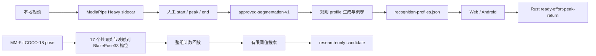
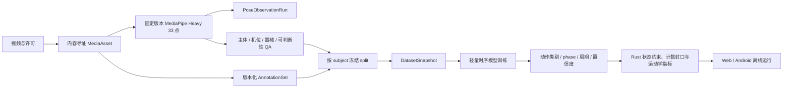

# 动作识别与训练数据体系 Handoff

日期：2026-08-09  
目标读者：接手 MaxPower 动作识别数据、训练、评估和 Rust 运行时接入的工程人员或 Agent  
目标：保全当前可用资产，明确哪些结论成立、哪些不成立，并为一套新的训练数据体系提供迁移基线。

## 1. 结论先行

当前项目已经具备三类有价值的资产：

1. **本地原始视频与 MediaPipe Heavy 骨架**：53 段视频、50 份 pose sidecar，其中 41 段有逐 rep 标签，共 325 个已标注 rep。
2. **胸部动作的强监督子集**：11 段视频、89 个 `start / peak / end` 周期，包含卧推、固定器械推胸和俯卧撑。这是当前最适合迁移到新数据体系的本地黄金数据。
3. **MM-Fit 的大规模弱监督数据**：21 个受试者、616 个动作组、6,160 次整组计数，以及官方 2D/3D pose 和 set 标签。它适合训练动作分类、周期表征和整组计数，但当前尚未通过原始 RGB 视频重新生成与 Android 相同的 MediaPipe Heavy 33 点。

当前项目**没有**一套已经训练好的时序神经网络，也没有任何可直接部署的动作分类、phase 或周期模型权重。现有“训练”主要是对 Rust 规则型计数 profile 做有限参数搜索：选择关节信号、方向、行程阈值和最短时长。

当前识别能力的真实状态是：

- 用户或课程先指定动作，系统再加载该动作与机位的 profile；它不是任意动作自动分类器。
- Rust 使用单个或一对运动学信号，通过 `ready → effort → peak → return` 状态机计数。
- 统一语料门当前只有 **69.7% 整组次数完全一致率**；MM-Fit unseen-test 是 **56.83%**。
- 本地 11 段胸部视频达到 9/11 整组完全一致、84/89 rep 匹配，但参数在同一批数据上调过，属于 in-sample 诊断，不是泛化证明。
- 当前不应宣称已达到 95% 或 100% 泛化准确率，也不应把规则阈值拟合称为 MediaPipe33 时序模型训练。

新体系最重要的改造不是继续堆 profile JSON，而是建立：

> 不可变原始视频 → 可复现的同版本 pose extraction → 版本化人工标注 → subject-disjoint 数据集快照 → 轻量时序模型 → 冻结评估集 → Rust 运行时约束与封存

### 1.1 迁移决策矩阵

| 资产 | 新体系中的处理 | 原因 |
| --- | --- | --- |
| `public/archives/confirmed-captures/` 视频 | **原样保留并按内容哈希导入** | 唯一的本地原始事实 |
| `.labels.json` 与人工 note | **原样保留，再生成版本化 AnnotationSet** | 当前最有价值的人工监督 |
| `.metadata.json`、approval export | **保留为 provenance event，不直接作为资格真值** | 当前 approval/draft/归档状态不一致 |
| 现有 MediaPipe sidecar | **作为 legacy observation 保留，同时全部重提取** | 缺少精确模型 hash 和 runtime/tracker 配置 |
| `approved-segmentation-v1.json` | **保留作迁移校验，迁移后从新索引重新生成** | 它是派生快照，不是原始标注 |
| `recognition-profiles*.json` | **只保留作规则 baseline** | 是阈值 artifact，不是 learned model |
| MM-Fit 官方 pose/labels | **保留，使用独立 COCO schema 和 research policy** | 可复现旧 baseline，但不等于 MediaPipe33 |
| MM-Fit `normalized/`、candidate、benchmark report | **可再生成，不作为训练真值迁移** | 都是旧 adapter/profile pipeline 的派生物 |
| MM-Fit RGB `.part` | **校验后断点续传** | 当前没有任何完整 RGB session |
| RepCount metadata | **保留作获取与 taxonomy 参考** | 本地没有真正视频/pose 数据 |
| `dist/archives/...` 与 build output | **不迁移** | 是重复构建产物 |

## 2. 当前数据流与目标数据流

### 2.1 当前实际流程



### 2.2 新体系建议流程



## 3. 本地资产盘点

### 3.1 原始归档总览

唯一应视为本地原始归档根目录的是：

```text
public/archives/confirmed-captures/
```

`dist/archives/confirmed-captures/` 是构建副本，不是数据源，不应进入新体系的索引或去重统计。

| 分组 | 视频 | Pose sidecar | 逐 rep 标签 | Metadata | 已标注 rep | 主要动作 |
| --- | ---: | ---: | ---: | ---: | ---: | --- |
| 根目录 / 背部 | 21 | 18 | 17 | 0 | 143 | 杠铃划船、高位下拉、引体向上、坐姿划船、直臂下压 |
| `shoulders/` | 21 | 21 | 13 | 21 | 93 | 坐姿推肩、侧平举；另有未标注反向飞鸟和单臂绳索侧平举 |
| `chest/` | 11 | 11 | 11 | 11 | 89 | 杠铃卧推、固定器械推胸、俯卧撑 |
| **合计** | **53** | **50** | **41** | **32** | **325** | — |

说明：

- 背部分组清单只声明 18 段已确认 capture，物理目录有 21 个视频；其中 3 个没有完整 pose/label 配对，应作为 orphan/incomplete 处理，不能按文件存在就自动入库。
- `groups.json` 中肩部有 21 段；其中 13 段有逐 rep 标签：坐姿推肩 6 段、37 rep，侧平举 7 段、56 rep。
- 肩部另有反向飞鸟 4 段和单臂绳索侧平举 4 段，具备视频、pose 和 metadata，但尚无逐 rep 标签。
- `manifest.json`、`groups.json` 和后加入的 `chest/` 并不完全同步。新体系不得继续依赖某一个历史 manifest 推断全部事实，应从文件配对、内容哈希和版本化索引重新建账。

### 3.2 Pose sidecar

本地 sidecar 通常是一个长度为 1 的数组，元素包含：

```text
video
durationSec
stepMs
model
poses[]
```

每个 pose frame 通常包含：

```text
timestampMs
landmarks[]
worldLandmarks[]
image
```

较完整的历史 sidecar 还记录：

```text
schemaVersion = canonical-pose-frame/v1
algorithmVersion = pose-continuity-reference/v1
landmarkSchema = blazepose33
coordinateSpace = image_normalized
worldCoordinateSpace = meters
rotation / mirrored
```

当前三个分组的 pose 覆盖：

| 分组 | 抽样帧 | 非空 33 点帧 | 非空比例 |
| --- | ---: | ---: | ---: |
| 背部 | 6,429 | 5,748 | 89.41% |
| 肩部 | 9,834 | 9,596 | 97.58% |
| 胸部 | 8,662 | 8,097 | 93.48% |

这些覆盖率只表示抽样帧中存在完整 landmark 数组，不等同于每个关键关节都准确，也不等同于动作可判断。胸部数据按 `stepMs=50` 抽样，约 20 Hz；视频开头允许出现空 pose。

当前 model 字段类似：

```text
mediapipe:/models/pose_landmarker_heavy.task;subject=rep-motion-candidate-0
```

它没有记录模型文件哈希、MediaPipe Tasks 版本、delegate、detector/crop/tracker 参数和运行设备。新体系必须补齐这些字段，否则无法保证 Android 与离线重放生成同一分布的骨架。

### 3.3 人工标签

标签 schema：

```text
maxpower-reviewed-rep-labels/v1
```

核心字段：

```text
videoId
keypointsFile
exerciseId
cameraView
capturePosition
expectedCount
labels[] = { repIndex, startMs, extremeMs, endMs, note? }
```

派生训练数据把 `extremeMs` 改名为 `peakMs`。迁移时必须显式记录字段映射，不能同时保留两个名字后依赖调用方猜测。

标签中的 note 很有价值，已经包含：

- 力竭、半程动作；
- 左右力量或端点不对称；
- 可能的动作质量问题；
- 极点定义和特殊 rep 的人工判断。

但这些 note 目前只是自然语言，不是结构化监督。新体系应保留原文，同时拆出可选标签，例如：

```text
partial_rom
fatigue
left_right_endpoint_asymmetry
left_right_timing_asymmetry
uncertain_form_issue
exclude_from_standard_form_reference
```

### 3.4 胸部强监督数据集

派生产物：

```text
data/training/approved-segmentation-v1.json
```

内容：

| 动作 | 视频 | rep | 机位 |
| --- | ---: | ---: | --- |
| `barbell_bench_press` | 6 | 46 | front ×3、frontLeft45 ×1、frontRight45 ×2 |
| `machine_chest_press` | 4 | 29 | front ×3、frontRight45 ×1 |
| `push_up` | 1 | 14 | rearRight45 ×1 |
| **合计** | **11** | **89** | — |

每个 record 还包含：

- `captureId / exerciseId / capturePosition / analysisView`；
- `segments[startMs, peakMs, endMs]`；
- `reviewedNegativeWindows`；
- 源视频、pose、模型、时长、帧数；
- pose/torso/逐 rep 信号覆盖；
- evaluation/tuning/antiInterference/challenge eligibility。

这是当前最强的逐 rep 监督，但存在明显边界：

- 人数、会话和设备没有结构化记录；从现有素材判断高度可能集中于同一录制者，不能把不同视频随机拆成独立 train/test 后宣称跨用户泛化。
- 11 段都被用于当前评估，其中部分还用于调参，存在数据泄漏。
- 它支持计数与 phase 监督，不支持“正确姿势”监督。带问题的 rep 仍可能是有效计数 rep。
- 没有完整的背景动作、走入走出、器械调整、多人干扰等 hard-negative 分类。

### 3.5 Approval export 的状态陷阱

来源文件：

```text
/Users/Ruihan/Documents/power/field-capture-approvals-2026-08-08.json
```

SHA-256：

```text
3a5c1baecbed8e813f2f5d0166ab999dfb4b902073fe78b701759fa6789afdf4
```

该 export 中：

- `approvals = 1`；
- `drafts = 10`；
- 用户已经声明 11 段均完成审核；
- 归档后的 11 个 `.metadata.json` 都写为 `human_approved`；
- 派生数据仍把 10 段记作 `user_confirmed_complete_draft`。

因此新体系**不能用 export 中处于 approvals 还是 drafts 集合来决定训练资格**。迁移时应以归档视频、pose、labels、metadata 的哈希配对为事实，并把下面几项分别保存：

```text
annotation_status
reviewer_decision
source_collection_at_export
source_export_hash
archive_normalization_event
```

## 4. 外部数据资产

### 4.1 MM-Fit pose 与标签

本地目录：

```text
data/external/mm-fit/pose-labels/
data/external/mm-fit/normalized/
```

已验证资产：

- 21 个 session；
- 每个 session 有 2D pose、3D pose、labels，共 63 个文件；
- 解压后 1,074,852,017 bytes；
- 616 个 set clip；
- 6,160 个 set-level rep；
- 10 个动作。

| MM-Fit 动作 | set | rep | 当前映射 |
| --- | ---: | ---: | --- |
| squats | 64 | 639 | `bodyweight_squat` |
| pushups | 65 | 649 | `push_up` |
| dumbbell shoulder press | 60 | 598 | `dumbbell_shoulder_press` |
| lunges | 62 | 624 | `alternating_lunge` |
| dumbbell rows | 64 | 644 | `standing_dumbbell_row` |
| situps | 65 | 640 | `sit_up` |
| tricep extensions | 64 | 645 | `overhead_triceps_extension` |
| bicep curls | 59 | 599 | `alternating_dumbbell_biceps_curl` |
| lateral shoulder raises | 56 | 559 | `lateral_raise` |
| jumping jacks | 57 | 563 | `jumping_jack` |

当前 `prepare_mmfit.py` 的真实行为：

1. 读取 `*_pose_2d.npy`，不读取 RGB 视频；
2. 输入是 COCO-18 2D pose；
3. 只把 17 个共同关节映射到 BlazePose33 槽位；
4. 其余点 visibility=0，所有 z=0；
5. 映射点 visibility=1 只表示源数据提供该点，不是 MediaPipe 置信度；
6. 若无覆盖参数，使用假定的 1280×720、30 FPS；
7. 标签只有 set 的 start/end 和总次数，`repBounds=[]`。

官方 subject split 已保存在当前准备脚本中：

| Split | Subject |
| --- | --- |
| train | 01, 02, 03, 04, 06, 07, 08, 16, 17, 18 |
| validation | 14, 15, 19 |
| test | 09, 10, 11 |
| unseen_test | 00, 05, 12, 13, 20 |

新体系必须继承 subject split，不能把 clip 随机打散。

### 4.2 MM-Fit RGB 下载状态

目录：

```text
data/external/mm-fit/rgb/
```

截至本 handoff：

- 没有完整 RGB session；
- 只有 `w00`–`w04` 的 5 个 `.part` 文件；
- partial 合计约 106 MB；
- 没有正在运行的下载任务；
- 下载器支持断点续传、长度与 MD5 校验。

恢复命令：

```bash
tools/external-datasets/fetch-mmfit-rgb.sh --split train
tools/external-datasets/fetch-mmfit-rgb.sh --split train --execute
```

脚本默认 dry-run，并保留至少 8 GiB 磁盘安全空间。完整 RGB 约 39.11 GB；当前 train split 也需要十几个 GB，必须先确认磁盘。

许可边界：Zenodo RGB record 的元数据是 CC-BY-4.0；当前 S3 multimodal pose/label archive 的页面没有明确写出相同许可。源代码 MIT 不自动覆盖数据。正式商业训练前应逐数据源完成许可审查、署名要求和可再分发边界记录。

### 4.3 RepCount-A / RepCount pose

本地只有：

```text
data/external/repcount-pose/metadata/
```

状态：

- 只有 README、action metadata、仓库信息和校验摘要，约 24 KB；
- 9,517,369,897 bytes 的 pose archive 未下载；
- 没有视频或 pose 可用于训练；
- 官方 annotation 可提供 per-rep cycle bounds，当前 adapter 能保留这些边界；
- `bench_pressing` 映射到 MaxPower 卧推前仍需要代表视频人工复核；
- 数据许可未明确，当前只能视作 metadata-only / research-only。

动作候选包括 front raise、pull-up、squat、bench press、jumping jack、sit-up、push-up；pommel horse 当前不在产品范围。

## 5. 当前所谓“训练”到底做了什么

### 5.1 本地 observed profile 生成

入口：

```text
tools/recognition-profile/generate.ts
```

它按 `exerciseId × capturePosition` 分桶，从人工 rep 的起点、极点和终点计算单一运动学信号的幅度分布，再生成：

```text
startAmplitude
minPrimaryAmplitude
minSecondaryAmplitude
returnHysteresis
readyTolerance
minRepDurationMs
maxRepDurationMs
```

它不是神经网络训练。没有学习模型权重，没有联合学习 33 点时序，也没有动作类别输出。

当前正式 observed artifact：

```text
public/archives/confirmed-captures/recognition-profiles.json
```

只有 5 个 profile：

| 动作 / 机位 | Capture | 标注 rep | 可用 rep | Challenge | 排除 |
| --- | ---: | ---: | ---: | ---: | ---: |
| 杠铃卧推 frontLeft45 | 1 | 5 | 5 | 0 | 0 |
| 杠铃卧推 frontRight45 | 2 | 25 | 23 | 10 | 2 |
| 固定器械推胸 front | 3 | 21 | 21 | 21 | 0 |
| 固定器械推胸 frontRight45 | 1 | 8 | 8 | 0 | 0 |
| 俯卧撑 rearRight45 | 1 | 14 | 14 | 0 | 0 |

杠铃卧推 front 有 3 段、16 rep，但由于可用关节信号覆盖不足，没有进入正式 observed artifact。candidate 文件中存在尝试，但不得当作已发布能力。

### 5.2 MM-Fit rolling profile search

入口：

```text
tools/external-fitness-data/rollingProfileTrainer.ts
```

它按 `exercise × bodyOrientationProxy` 滚动加载一个 bucket，并从有限候选中搜索：

- 行程阈值比例：85%、70%、55%；
- 更短的最小时长；
- 方向翻转；
- 少量 torso-normalized distance 信号。

它使用 train split 选择候选、validation gate 接受候选，test/unseen_test 保持未触碰。结果：

| 指标 | Baseline | 选择后 |
| --- | ---: | ---: |
| 进入评估 clip | 532 | 532 |
| 整组完全一致率 | 68.42% | 74.06% |
| MAE | 1.4474 | 0.9680 |
| 真值 rep | 5,328 | 5,328 |
| 预测 rep | 4,570 | 4,833 |

616 个 clip 中有 11 个动作×方向 bucket 被搜索，只有 3 个 candidate 通过内部 validation gate：

- `dumbbell_shoulder_press / front`：`torso-distance-18`；
- `sit_up / side`：`direction-flip`；
- `standing_dumbbell_row / front`：`range-70-fast`。

这些 candidate 仍是 research-only，没有安装进正式 Rust/Android。某些 bucket 在映射后的 COCO 骨架上恰好达到 100%，也不能证明 RGB → MediaPipe Heavy → Android 链路达到 100%。

### 5.3 当前统一评估

报告：

```text
docs/reports/unified-recognition-corpus-gate-2026-08-09.json
```

| 数据 | Sample | 真值 rep | 预测 rep | 整组完全一致 |
| --- | ---: | ---: | ---: | ---: |
| MM-Fit | 616 | 6,160 | 5,563 | 428 / 616 |
| 本地胸部 | 11 | 89 | 84 | 9 / 11 |
| **合计** | **627** | **6,249** | **5,647** | **437 / 627 = 69.7%** |

MM-Fit split：

| Split | Clip | Exact | MAE | Off-by-one |
| --- | ---: | ---: | ---: | ---: |
| train | 301 | 70.76% | 0.9701 | 86.05% |
| validation | 86 | 72.09% | 0.9535 | 82.56% |
| test | 90 | 82.22% | 0.3667 | 93.33% |
| unseen_test | 139 | 56.83% | 1.5683 | 78.42% |

本地胸部 11 段的 tuned 结果为：

- 9/11 整组计数完全一致；
- 84/89 rep matched，recall 94.38%，precision 100%；
- 5 个漏计全部来自 `barbell_bench_press / front`；
- 这批参数在同一批视频上调过，`promotionPassed=false`。

## 6. 当前运行时识别与三端接入

### 6.1 动作身份不是模型预测出来的

当前动作由课程或用户选择，运行时根据以下 context 精确查 profile：

```text
exerciseId
capturePosition
trainingSide = bilateral
variation
```

如果用户显式选择了器械、握法或变式，历史 `variation=unrecorded` profile 不会被静默复用。这一约束应保留。

### 6.2 Profile 解析优先级

Android/fixture 当前大致是：

1. exact built-in Rust profile；
2. exact observed profile；
3. simulated initializer；
4. 无匹配则 unavailable。

`lat_pulldown` 仍优先保留 built-in reference 绑定。iOS 当前没有同一条 Rust packet bridge，不应宣称已对齐。

### 6.3 Artifact 装载

- Web loader：`src/motion/observedRecognitionProfiles.ts` 从 `/archives/confirmed-captures/recognition-profiles.json` 加载；
- Android：`src/mobile/exerciseRecognition.ts` 直接 bundle 同一份 JSON，支持离线；
- 数据 profile 被编码为 `maxpower-native-recognition-profile/v1`；
- Kotlin/JNI 将 ABI 参数交给 Rust `motion_sdk_install_profile`；
- Rust 根据 landmark Y、两点距离或三点关节角等 scalar signal 运行状态机。

当前 Runtime 具备 canonical skeleton、phase、rep 和运动学输出，但这些输出不代表存在一个学习到的动作分类器。新时序模型应作为新的 observation source 接入，不应把 learned weights 塞进 `recognition-profiles.json` 假装仍是阈值 profile。

## 7. 新数据体系必须解决的问题

### 7.1 当前不可继续继承的错误假设

1. **文件在目录里就等于可训练**：错误。必须通过视频、pose、标签、metadata、哈希和许可的完整性门。
2. **approval/draft 集合就是审核真值**：错误。当前 export 与归档状态已经不一致。
3. **COCO-18 填进 BlazePose33 槽位就是 MediaPipe33 数据**：错误。拓扑、置信度、z、缺失模式和 detector/tracker 行为都不同。
4. **整组 count 标签等于逐 rep phase 标签**：错误。MM-Fit 不能直接监督 start/peak/end。
5. **同数据调参后 100% 就是泛化能力**：错误。它只能作为 golden regression。
6. **bodyOrientationProxy 等于 cameraView**：错误。它只是从人体投影估计朝向，不是物理相机机位。
7. **pose 数组非空等于动作可判断**：错误。关键关节可能低置信、遮挡或轨迹不连续。
8. **源码 MIT 等于数据可商用**：错误。每个数据资产必须独立记录许可。
9. **`dist/` 是另一个数据集**：错误。它只是构建副本。
10. **规则 profile 是模型权重**：错误。两者要分开版本、分开评估、分开部署。

### 7.2 当前缺失的关键字段

新体系至少需要补齐：

- `subject_id`、`session_id`、年龄段等最小去标识化 cohort 信息；
- 设备、镜头、分辨率、FPS、旋转、镜像、相机距离与高度；
- 机位的受控枚举和允许误差；
- 器械、握法、单双侧、动作变式；
- pose 模型文件 SHA-256、Tasks runtime 版本、delegate 和 tracker 配置；
- 人物 detector/crop/lock 的版本；
- 每帧 presence、visibility、source confidence、插值/预测状态；
- rep 边界、partial rep、无效 rep、负样本区间和不可判断原因；
- 数据许可、来源、署名要求、允许用途和删除策略；
- split、dataset snapshot 和 experiment lineage。

## 8. 推荐的数据模型

建议把当前混在一起的文件拆成八类不可变实体。

### 8.1 `MediaAsset`

```text
asset_id = sha256(bytes)
relative_path
mime_type
byte_length
duration_ms
width / height / fps
rotation / mirrored
source_dataset / source_url
license_id / attribution / allowed_uses
ingested_at
```

### 8.2 `CaptureContext`

```text
capture_id
subject_id
session_id
exercise_variant_id
equipment / grip / training_side
camera_view
camera_height / distance / yaw / pitch
device / lens / resolution
environment_tags
```

### 8.3 `PoseObservationRun`

```text
observation_run_id
media_asset_id
pose_schema = blazepose33
model_asset_sha256
mediapipe_runtime_version
delegate
detector / crop / tracker config
frame_sampling_policy
image_transform
generated_at
generator_commit
```

每帧保留：

```text
timestamp_ms
33 × image x/y/z
33 × world x/y/z
33 × visibility/presence
subject_track_id
observed / predicted / interpolated mask
frame judgeability
```

### 8.4 `AnnotationSet`

```text
annotation_set_id
media_asset_id
schema_version
parent_annotation_set_id
review_status
reviewer_id
reviewed_at
exercise_id / variant / view
set_bounds
rep_cycles[] = start / turning_point / end
rep_tags[]
negative_windows[]
judgeability_windows[]
free_text_notes
source_export_hash
```

标注不可原地覆盖。每次修改创建新版本，并能追溯旧版本。

### 8.5 `DatasetSnapshot`

```text
dataset_snapshot_id
query / inclusion_policy
asset + observation + annotation hashes
taxonomy_version
split_policy
split_assignments
license_policy
created_at
```

训练必须引用 snapshot ID，不能直接扫描一个会变化的文件夹。

### 8.6 `FeatureSet`

```text
feature_schema_id
normalization_version
landmark / angle / velocity / visibility features
window_length / stride
missing-data policy
source dataset snapshot
```

### 8.7 `ModelArtifact`

```text
model_id
architecture
input_feature_schema_id
dataset_snapshot_id
training_config
weights_sha256
quantization
runtime requirements
metrics by action / view / subject split
promotion decision
```

### 8.8 `RuntimeProfileArtifact`

继续保存 Rust 状态约束和可解释运动学参数，但和 learned model 分开：

```text
profile_id
exercise / view / variation identity
phase constraints
minimum ROM / duration / hysteresis
judgeability rules
compatible model_id / feature_schema_id
evidence and promotion status
```

## 9. 推荐训练架构

### 9.1 不训练 MediaPipe 本体

MM-Fit 的动作名和整组次数不能监督人体关键点真值，因此第一阶段应冻结 MediaPipe Pose Landmarker Heavy，只训练 33 点之上的轻量时序模型。

输入建议：

- 身体中心与 torso scale 归一化后的 33 点 x/y/z；
- visibility/presence 和缺失 mask；
- 关键关节角；
- 一阶速度、二阶变化和左右差；
- torso 角度、人体朝向 proxy；
- 可选器械轨迹与人物关联特征。

模型首版可以是小型 TCN、GRU 或轻量 temporal transformer，量化后在移动端离线运行。输出建议统一为：

```text
action_class probabilities
is_active / is_current_action
phase probabilities
periodicity / cycle event probability
judgeable probability + reason codes
```

Rust 继续负责：

- 主体锁定后的 canonical frame；
- 状态约束与反抖；
- rep 封口；
- ROM、左右端点差、峰值时间差、躯干变化、去程/回程时长；
- evidence confidence 和完成度状态。

### 9.2 监督分层

不要把所有数据硬转成同一种标签：

| 监督层 | 可用数据 | 可训练目标 |
| --- | --- | --- |
| 动作类别 | MM-Fit set + 本地动作标签 | action classification |
| 是否在做动作 | set bounds + negative windows | active / inactive / wrong-action |
| 周期弱监督 | MM-Fit set count | periodicity、整组 count consistency |
| 精确 phase | 本地 89 rep；未来 RepCount bounds/人工标注 | start / turning point / end |
| 可判断性 | pose dropout、遮挡人工标签 | judgeable / unknown |
| 动作质量 | 当前基本没有 | 不得从“动作名称+次数”伪造 |

### 9.3 MM-Fit RGB 的正确使用方式

完整流程应是：

```text
MM-Fit RGB
  → 与 Android 完全相同的 Heavy model + runtime + tracker 参数
  → 真实 BlazePose33 + visibility/presence/world landmarks
  → 用官方 subject split 建 DatasetSnapshot
  → set-level action/count 弱监督训练
  → 生成 rep 候选边界
  → 人工校验一个按 subject/action 分层的小子集
  → phase 微调
```

COCO 映射数据仍可保留为旧 baseline，但不得与重新提取的 MediaPipe33 混为一个 observation schema。

## 10. Split 与评估协议

### 10.1 数据划分

- **先按 subject 分组，再划分 train/validation/test/unseen_test**。
- 同一原始视频的不同裁剪、不同 pose extraction、不同 annotation version 必须处于同一 split。
- 同一 session 或连续录制片段必须处于同一 split。
- 当前本地视频如果无法证明有多个 subject，应全部视为同一个 subject group。
- MM-Fit 保留官方 subject split。
- 新采集数据在标注前就写入 split policy，避免看过结果后调整测试集。

### 10.2 两种 100% 的含义必须分开

1. **Golden replay regression**：对冻结的、人工逐 rep 标注视频，版本升级后可以要求 100% count exact，确保没有回归。
2. **Unseen generalization**：对未见用户、未见会话和允许机位变化，不能用训练集 100% 代替。目标可以设为 ≥95% exact-set，但必须在独立 subject test 上测量并给出置信区间。

建议同时报告：

```text
exact-set accuracy
count MAE / absolute count error
per-rep precision / recall / F1
start / turning-point / end timing error
false reps per inactive minute
wrong-action acceptance rate
judgeable coverage and false-judgeable rate
pose dropout / recovery latency
metrics by action / view / subject / device
mobile latency, FPS, memory and energy
```

只有 set-count 标签的数据只能进入 exact-set/MAE 评估，不能伪造 phase F1。

## 11. 迁移执行顺序

### Phase 0：冻结现状

1. 对 53 个视频、50 个 pose、41 个 labels、32 个 metadata 建 SHA-256 manifest。
2. 把 `public/archives/confirmed-captures/` 标记为 read-only legacy source。
3. 排除 `dist/` 和所有 build output。
4. 保存本 handoff 所列 report 和当前 profile artifact 的 hash。

### Phase 1：建立新索引

1. 创建 `MediaAsset / CaptureContext / AnnotationSet`。
2. 显式登记 3 个背部 orphan 视频和历史 manifest 差异。
3. 把 `extremeMs → turning_point_ms`、`peakMs → turning_point_ms` 统一。
4. 保留原始 note，并增量结构化 rep tag。
5. 把审批集合、人工确认、归档 normalization 分别建事件，不覆盖历史。

### Phase 2：重新生成本地骨架

1. 冻结 Android 当前 Heavy model 文件和 SHA-256。
2. 固定 MediaPipe runtime、delegate、detector/tracker 和图像变换。
3. 对全部 53 个视频重新提取 timestamped BlazePose33。
4. 同时保留旧 sidecar，做 landmark、dropout 和周期差异对比。
5. 任何 predicted/interpolated joint 必须有 mask，不能冒充 observed ground truth。

### Phase 3：完成 MM-Fit RGB 训练准备

1. 先下载 train split 并逐文件 MD5 验证。
2. 用与 Android 完全相同的提取器生成 33 点。
3. 验证动作标签、时间轴、视频 FPS 与 set bounds。
4. 保留官方 subject split 和 CC-BY attribution。
5. 在许可审查完成前只进入 research snapshot。

### Phase 4：训练轻量时序模型

1. 先做 action/active/periodicity 多任务 baseline。
2. 使用 set count 做弱监督，不假装有逐 rep boundary。
3. 用本地 89 rep 和新人工校验子集训练 phase head。
4. 加入 inactive、wrong-action、setup、器械调整、多人等负样本。
5. 导出量化移动端 artifact，同时保留 float reference。

### Phase 5：冻结评估与接入 Rust

1. Golden replay 作为 100% 回归门。
2. 使用 subject-disjoint test/unseen_test 证明泛化。
3. Learned model 先 shadow 输出，不直接改变正式计数。
4. 对齐后由 Rust 消费 action/phase/cycle/judgeable 概率，并保留状态约束。
5. 每次发布把 DatasetSnapshot、ModelArtifact、RuntimeProfileArtifact 三者一起锁定。

## 12. 可复现命令

### 外部数据

```bash
# MM-Fit pose/label 下载脚本默认 dry-run
tools/external-datasets/fetch.sh --dataset mm-fit-pose-labels

# 恢复 RGB train split
tools/external-datasets/fetch-mmfit-rgb.sh --split train
tools/external-datasets/fetch-mmfit-rgb.sh --split train --execute

# 旧 COCO 映射 baseline
npm run prepare:mmfit
npm run analyze:mmfit-orientation
npm run train:mmfit-profiles
npm run benchmark:mmfit:candidates
npm run report:recognition-corpus
npm run test:external-fitness-data
```

### 本地 profile 与 Rust

```bash
npm run generate:observed-recognition-profiles
npm run tune:existing-recognition-profiles
npm run evaluate:observed-recognition-profiles
npm run build:motion-wasm
npm run test:rust
npm run test:motion-parity
npm run evaluate:rust-motion
```

这些命令用于复现旧 baseline，不代表新体系应继续沿用旧 artifact 格式。

## 13. 交接文件索引

### 原始与强监督

- `public/archives/confirmed-captures/`
- `public/archives/confirmed-captures/groups.json`
- `public/archives/confirmed-captures/manifest.json`
- `data/training/approved-segmentation-v1.json`
- `/Users/Ruihan/Documents/power/field-capture-approvals-2026-08-08.json`

### 当前 profile 与运行时

- `public/archives/confirmed-captures/recognition-profiles.json`
- `public/archives/confirmed-captures/recognition-profiles.candidate.json`
- `tools/recognition-profile/generate.ts`
- `src/motion/observedRecognitionProfiles.ts`
- `src/mobile/exerciseRecognition.ts`
- `src/motion/rustProfileResolver.ts`
- `rust/motion-sdk/src/lib.rs`
- `rust/motion-sdk/src/web_abi.rs`

### MM-Fit / RepCount

- `tools/external-datasets/README.md`
- `tools/external-datasets/datasets.json`
- `tools/external-datasets/mm-fit-validation-summary.json`
- `tools/external-datasets/repcount-pose-validation-summary.json`
- `tools/external-datasets/fetch-mmfit-rgb.sh`
- `tools/external-fitness-data/prepare_mmfit.py`
- `tools/external-fitness-data/model.ts`
- `tools/external-fitness-data/actionMap.ts`
- `tools/external-fitness-data/rollingProfileTrainer.ts`
- `tools/external-fitness-data/repCountAdapter.ts`

### 评估报告

- `docs/reports/existing-video-profile-tuning-2026-08-09.json`
- `docs/reports/mmfit-rolling-profile-training-2026-08-09.json`
- `docs/reports/unified-recognition-corpus-gate-2026-08-09.json`
- `docs/reports/2d-pose-observability-and-phase-alignment-2026-08-05.md`

## 14. 新体系完成迁移的验收清单

- [ ] 每个训练样本都能追溯到不可变视频 hash。
- [ ] 每个 pose sequence 都能追溯到模型 hash、runtime 和 tracker config。
- [ ] 每个 annotation 都有版本、父版本、审核状态和来源事件。
- [ ] `subject/session/capture` 不会跨 split 泄漏。
- [ ] MM-Fit COCO 映射与 MediaPipe33 重新提取数据使用不同 schema ID。
- [ ] set-count、per-rep phase、质量标签不会混为同一种监督。
- [ ] license policy 在 DatasetSnapshot 创建时执行，不依赖口头约定。
- [ ] learned ModelArtifact 与 Rust RuntimeProfileArtifact 分开管理。
- [ ] Golden replay 达到预设的 100% 回归门。
- [ ] 未见 subject 的泛化指标独立报告，并达到产品门槛后才 promotion。
- [ ] Web 与 Android 消费同一版本的模型、feature schema 和 Rust protocol。
- [ ] 任何不可判断帧或 rep 都能输出明确原因，而不是静默漏计。

## 15. 最终交接判断

当前资产值得保留，而且足以启动新的数据体系：本地数据提供精确 phase 和真实 MediaPipe 缺失模式，MM-Fit 提供跨 subject 的动作与周期规模。但它们目前处在不同 skeleton、不同监督粒度和不同许可状态下，不能直接拼接成一个“训练集”。

新体系应把现有 Rust profile 当作可解释 baseline，把本地 89 rep 当作黄金回放，把 MM-Fit 6,160 rep 当作 subject-disjoint 弱监督；等 RGB 全量完成并用同版本 Heavy 重新提取后，再训练真正的轻量时序识别模型。这样才能同时获得移动端可运行、可解释计数和可验证泛化，而不是继续在同一批视频上反复调阈值得到表面上的 100%。
