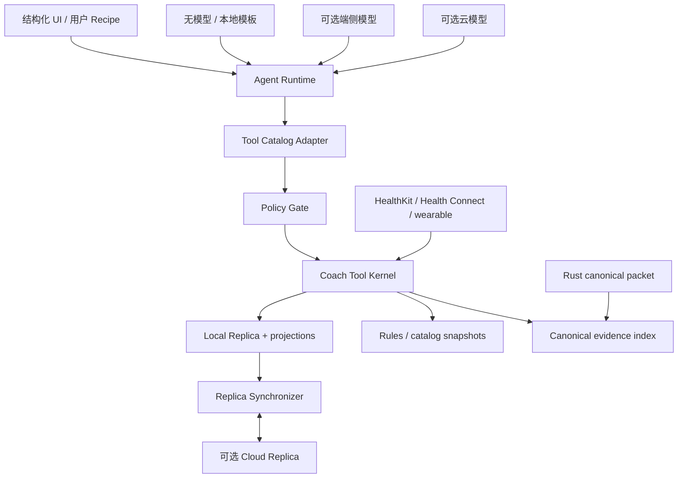

# Local-first Agent Harness 与自适应训练计划架构

日期：2026-08-08  
范围：Agent tool call、完全离线使用、可选云同步、增肌周期进阶、下一次训练生成、恢复解释与计划纳管。  
状态：研究与架构建议，不代表已经实现；本轮未构建客户端或修改产品代码。

## 结论

MaxPower 应当把“Agent”和“健身领域能力”拆成两层：

- **Agent Runtime** 负责理解自然语言、选择工具、串联步骤和解释结果；它可以是无模型的结构化 UI、端侧模型或云模型。
- **Coach Tool Kernel** 负责训练事实、确定性规则、权限、计划版本、审计与撤销；它必须完全离线可运行，也是唯一能形成计划变更的模块。

本地与云端不是两套产品。每台设备都持有一个可独立写入的 **Local Replica**；云端是可选的 **Cloud Replica**，提供备份、跨设备协调、内容分发和可选云模型。业务真相来自同一种版本化事件与计划语义，而不是来自“本地数据库”或“云数据库”其中某一个位置。

推荐的组合公式是：

> RP 式版本化增肌规则 + Fitbod 式训练生成与器材替代 + WHOOP 式恢复解释与风险降级，统一隐藏在离线 Coach Tool Kernel 后，由 Coaching Mandate 决定自动执行、通知、确认或阻断。

## 当前实现差距

当前项目已经有：

- Rust canonical packet、rep disposition 和少量已校准动作。
- Android 动作选择、设置、实时识别、报告、回放和本地 capture 文件。
- `pi-agent-core` 与远程模型调用依赖。

当前尚没有：

- 结构化 Plan Revision、Session Prescription、Session Outcome 和训练历史。
- 组级 load/reps/RIR、肌群反馈、恢复证据和器材 profile。
- Agent tool registry、tool policy gate、计划提交与撤销。
- SQLite 领域存储、outbox、云副本和同步冲突协议。
- 无网络时的 Agent Runtime 降级策略。

现有 `src/agent/coach.ts` 是远程 LLM 直调，不应继续扩张为计划事实源；`src/motion/captureStore.ts` 是 capture JSON 文件存储，也不能承担训练计划数据库职责。

## 三种 Harness 方案比较

### 方案 A：最小 tool-first

```ts
interface CoachKernel {
  read(query: CoachQuery, context: ToolContext): Promise<CoachProjection>;
  execute(command: CoachCommand, context: ToolContext): Promise<CoachOutcome>;
}
```

优点：外部 Interface 最小；规则、权限、事务、审计、幂等和错误处理都集中在一个深 Module 中；UI、Agent 和测试共享同一 seam。  
代价：命令 tagged union 较大；同步不应硬塞进 `execute`。

### 方案 B：event-first

```ts
interface WorkoutPlanningHarness {
  execute(command: WorkoutCommand): Promise<CommandResult>;
  read(query: WorkoutQuery): Promise<WorkoutProjection>;
  synchronize(request: SyncRequest): Promise<SyncResult>;
}
```

优点：事件重放、projection、离线分支、云同步和冲突处理最清晰。  
代价：把运行健身规则和复制数据放在同一 Interface，普通调用方需要知道一个与业务意图无关的同步入口。

### 方案 C：policy-first

```ts
interface RecoveryInterpreterHarness {
  assess(request: RecoveryAssessmentRequest): Promise<RecoveryAssessment>;
  decide(request: RecoveryDecisionRequest): Promise<RecoveryDecisionResult>;
  read(query: RecoveryQuery): Promise<RecoveryProjection>;
}
```

优点：最适合普通用户；先产生“照常、收一点、恢复优先、暂停”等状态，再决定是否影响计划。  
代价：如果把它当成整个 Harness，会让训练生成、增肌进阶和训练记录出现更多并列入口。

### 推荐混合

采用方案 A 作为领域核心；采用方案 B 的事件账本与同步协议，但把同步拆成独立 Module；采用方案 C 的恢复决策顺序，作为 Coach Kernel 内部策略。

```ts
interface CoachKernel {
  read(query: CoachQuery, context: ToolContext): Promise<CoachProjection>;
  execute(command: CoachCommand, context: ToolContext): Promise<CoachOutcome>;
}

interface ReplicaSynchronizer {
  synchronize(request: SyncRequest): Promise<SyncSummary>;
}
```

这样删除 `CoachKernel` 后，训练生成、增肌规则、恢复约束、权限、计划版本和审计会重新散落到所有调用方；它具有足够 Depth。同步具有 SQLite、disabled、in-memory peer 和 cloud 等多个 Adapter，是独立且真实的 seam。

## 总体结构



### Agent Runtime

负责：

- 将自然语言转成已注册工具的结构化参数。
- 根据工具结果追问缺失信息。
- 串联只读与 proposal 工具。
- 用本地模板或模型解释 reason codes。

不负责：

- 计算训练重量、次数、组数和减量周。
- 读取任意数据库表。
- 生成任意 JSON Patch。
- 解码或重新计算 canonical packet。
- 绕过权限提交计划。

### Coach Tool Kernel

内部隐藏：

- Evidence normalization 与 provenance。
- Exercise Variant、Equipment Profile 和动作替代。
- 增肌 progression、volume 和 mesocycle 状态机。
- Recovery Constraint 与安全降级。
- Goal Contract、Coaching Mandate 和 Plan Revision。
- proposal、risk、commit、undo、audit、idempotency。
- Local Replica transaction、projection 与 outbox。

### Policy Gate

当前依赖的 `pi-agent-core` 已支持参数校验后的 `beforeToolCall`、执行后的 `afterToolCall` 和 per-tool 顺序策略。可以把：

- schema、权限、敏感数据 scope、expected revision、idempotency 和 risk 检查放在 `beforeToolCall`；
- audit、最小化模型返回、通知与运行指标放在 `afterToolCall`；
- 所有写工具标记为 sequential；只读且互不依赖的工具才允许并行。

Policy Gate 只是拦截和路由；训练决策仍属于 Coach Kernel，不能散落到 hooks 中。

## Agent 可见的工具

Coach Kernel 外部保持 `read/execute` 两个入口，但 Agent 看到语义明确的命名工具。Tool Catalog Adapter 将命名工具映射成封闭的 Query/Command union。

| Tool | 作用 | 副作用 |
| --- | --- | --- |
| `training.get_context` | 读取目标、计划、器材、历史、恢复与缺失项摘要 | 无 |
| `training.record_outcome` | 记录实际 set、load、reps、RIR、主观反馈和 packet refs | 追加事实 |
| `planning.compose_next_session` | 综合计划、历史、器材和恢复生成下一次处方 proposal | 只生成 proposal |
| `planning.evaluate_progression` | 评估下一次 load/reps/sets 与 mesocycle 状态 | 只生成 proposal |
| `planning.find_substitutions` | 为 Stimulus Slot 生成满足器材与限制的动作候选 | 无 |
| `recovery.assess` | 形成带时效的 Recovery Constraint 和解释 | 可生成 proposal，不提交 |
| `planning.apply_proposal` | 按 mandate、risk 和 expected revision 提交现有 proposal | 新 Plan Revision |
| `planning.undo_change` | 生成补偿性 Plan Revision | 新 Plan Revision |
| `planning.explain_change` | 渲染依据、限制和不确定性 | 无 |
| `profile.change_mandate` | 修改用户授权范围 | 必须是认证 UI 行为 |

禁止提供：

- `execute_sql`
- `patch_plan`
- `set_weight_directly`
- `commit_arbitrary_plan`
- `decode_pose_packet`
- 原始 HealthKit/Health Connect 全库查询工具

每个 Tool Manifest 至少声明：

```ts
interface CoachToolManifest {
  name: string;
  schemaVersion: string;
  access: "read" | "append_fact" | "propose" | "commit";
  executionMode: "parallel" | "sequential";
  availability: "offline" | "offline_degraded" | "cloud_required";
  permissionScopes: readonly string[];
  riskCeiling: "S0" | "S1" | "S2" | "S3" | "S4";
  evidenceRequirements: readonly string[];
}
```

所有写调用必须带：`actor`、`deviceId`、`idempotencyKey`、`expectedPlanRevision`、`mandateRevision` 和 `reason`。

## 用户编排：Coach Recipe

用户不应编排数据库调用，而应启用或修改受限的 `CoachRecipe`：

```ts
interface CoachRecipe {
  trigger:
    | "session_completed"
    | "morning_recovery_ready"
    | "equipment_changed"
    | "weekly_review_due";
  steps: readonly RegisteredToolRef[];
  authorization: CoachingMandateRef;
  failurePolicy: "stop" | "continue_read_only";
}
```

建议首批内置 Recipe：

1. **训后调整**：记录结果 → 评估 progression → 生成下一次 proposal → 授权范围内自动提交。
2. **晨间恢复**：读取昨夜数据 → 生成 Recovery Constraint → 只在需要时生成当天调整。
3. **器材变化**：更新临时器材 → 找替代 → 保持 Stimulus Contract → 生成 diff。
4. **周度复盘**：汇总完成率、RIR、肌群反馈和恢复 → 调整下周周量或安排 deload。

Recipe 必须：

- 只能引用注册工具和有限控制流；首版不支持任意循环或用户脚本。
- 每一步保存输入摘要、结果引用、规则版本和 audit ID。
- 写步骤失败后停止，不允许 LLM“尽力补写”。
- 离线事件触发可立即运行；受移动系统限制的后台定时任务在下次 App 唤醒时补跑。
- 云端 Recipe 只在 Cloud Coach 模式运行，最终计划仍通过相同 policy 与 revision 规则。

## 三类能力如何纳入同一计划

### 1. 增肌 progression 与 deload

分成两个独立状态机，不能压成一个 AI 分数：

- `PerformanceProgression`：根据精确 Exercise Variant 的 load、reps、target/actual RIR、完成情况和器材档位决定保持、加次数、加一个负重档位或降级。
- `VolumeProgression`：根据肌群级 pump、soreness recovery、workload、时间预算和优先级决定 `increase / hold / reduce`。

Mesocycle 固定积累周、deload 位置、RIR progression 和 rule-pack digest。单次异常只影响下一次局部处方；重复 underperformance 或多个肌群未恢复才允许生成 early-deload proposal。

RP 官方公开的是方向性行为，不包含精确百分比、量表权重或冲突优先级。因此具体阈值必须是 MaxPower 自有、经专家审核的签名规则包，不能声称复刻 RP。

### 2. 下一次训练和动作替代

先决定 `Stimulus Slot`，再选择 `Exercise Variant`：

```text
计划意图：水平推 / 胸主导 / 稳定 / 8–12 reps / 2 RIR
      ↓
器材、禁忌、地点、时间和 prescription mode 硬过滤
      ↓
历史连续性、偏好、恢复、转换成本和 novelty 软排序
      ↓
为选中的精确 Exercise Variant 计算 load/reps/sets
```

`Equipment Profile` 必须描述地点、数量、重量范围/档位、附件和临时状态，而不是字符串数组。不同器材、变式或 set context 之间不能复制绝对重量；历史不可比时采用保守 cold start。

Fitbod 的 0–100 肌群恢复是产品估计，内部公式没有公开。MaxPower 应显示因素与不确定性，内部只用 `fresh / trainable / limited / unknown` 等可解释区间。

### 3. Sleep、Recovery 与 Strain

Recovery 不直接输出 sets/reps/load，而输出有时效的约束：

```ts
interface RecoveryConstraint {
  class:
    | "normal"
    | "cap_intensity"
    | "cap_volume"
    | "extend_rest"
    | "reschedule"
    | "avoid_region"
    | "stop_session";
  magnitude: "small" | "moderate" | "full_hold";
  reasonCodes: readonly string[];
  evidenceRefs: readonly string[];
  expiresAt: string;
}
```

规则：

- 单日绿色只支持执行原计划，不自动加重量或组数。
- 单日红色或单一低 HRV 不自动取消训练。
- 连续睡眠不足、HRV/RHR 同向偏离、主观疲劳和近期负荷一致时，才升级为当天降量/顺延 proposal。
- Strain 适合表达当日总体负荷，不代替力量训练的 sets × reps × load × RIR。
- 疼痛和异常症状优先于任何 Recovery 分数。
- 无 wearable 时使用主观 check-in 与训练历史，核心 Coach 仍可工作。

默认用户只看：`照常`、`稍微收一点`、`恢复优先`、`先暂停`。指标、来源和不确定性放在“为什么”里。

## 计划合成顺序与时间尺度

所有规则按照稳定优先级组合：

1. 疼痛、安全与明确不可违反约束。
2. Goal Contract、Coaching Mandate、用户锁和真人教练锁。
3. 器材、地点、日程与时间可行性。
4. Recovery Constraint。
5. 当前 mesocycle、训练拆分与周刺激目标。
6. Exercise-specific performance progression。
7. 用户偏好、动作连续性与 novelty。

调整必须声明 `Adaptation Scope`：

- `next_set`
- `next_session`
- `microcycle`
- `mesocycle`

低可信或短时证据不能越级影响更长时间尺度。例如昨夜睡眠差可以 cap 今天的 volume，但不能直接重写整个 mesocycle。

## 本地与云端数据模式

数据位置与模型位置必须是两个独立选择。

### 数据模式

1. **Local only**
   - 不登录、不隐式联网、不上传遥测。
   - 本地规则、计划、记录、解释模板、catalog snapshot 完整可用。
2. **Private sync**
   - 云端保存端到端加密事件块和附件。
   - 服务器不能读取明文，因此不能直接运行基于全量历史的 Cloud Coach。
3. **Cloud coach**
   - 用户按 scope 授权服务器处理选定的结构化数据。
   - 原始视频、完整 canonical packet、日历正文和精确位置默认不发送。

### 智能模式

- **Deterministic only**：无语言模型；结构化 UI + 本地 reason templates。
- **On-device language**：可选下载端侧模型，用于意图解析和表达，不改变规则输出。
- **Cloud language**：云模型处理最小化摘要；失败时回退到本地模板。

因此用户可以选择“云同步但不用云 AI”，也可以选择“临时使用云解释但不做长期云存储”。产品不能把登录、同步和模型授权绑成一个总开关。

## 本地存储

建议使用与当前 Expo SDK 匹配的 SQLite Adapter；官方 `expo-sqlite` 提供跨 Android/iOS 的持久化数据库，并支持通过配置启用 SQLCipher。当前项目尚未安装或实现该层。

结构化数据至少包括：

- `ledger_events`
- `goal_contract_revisions`
- `coaching_mandate_revisions`
- `plan_revisions`
- `session_prescriptions`
- `session_outcomes`
- `set_outcomes`
- `evidence_envelopes`
- `recovery_assessments`
- `workout_proposals`
- `tool_audit`
- `outbox`
- `sync_cursors`
- `blob_manifest`

原始视频、完整 packet 流和大附件进入 blob store，用 content hash 从 ledger 引用。默认只同步结构化训练与计划事件，媒体必须单独授权。

## 同步协议与冲突

本地写入流程：

```text
验证 command
  → SQLite transaction 写 domain event + projection + outbox
  → 立即返回本地结果
  → 恢复网络后幂等 push
  → pull 远端事件
  → 重建或增量更新 projection
```

事件应携带 device-generated event ID、actor、causal parents、Hybrid Logical Clock、schema/rule/catalog version、provenance、replication scope 和 payload hash。

| 类型 | 合并策略 |
| --- | --- |
| completed set/session、主观反馈 | append + event ID/source 去重 |
| HealthKit/Health Connect 导入 | external ID、origin 和 version 去重 |
| user correction 与 canonical observation | 两条事实共存；projection 显示用户修正，证据保留 |
| 同一 Plan Revision 上的两个修改 | 形成分支；重新生成 proposal，禁止 LWW |
| Goal Contract / Coaching Mandate 冲突 | 不自动合并；安全权限采用更严格状态直到用户处理 |
| 规则/catalog 版本不同 | 保留生成版本；活动周期不静默迁移 |
| 删除或撤销 | tombstone/补偿事件，不物理改写历史 |

正在执行的 `Session Prescription` 必须冻结；同步到的新 revision 只能在下一个安全切点生效。

## Canonical packet 边界

- Rust canonical packet 仍是相机观察的唯一来源。
- 只有 Confirmed rep 能进入 camera-confirmed formal volume。
- Needs-review 在用户批准前不进入正式观察量；Rejected 永不进入。
- Tier 2/profile code 0 不能生成 rep、phase、form 或 correctness。
- 用户可以手工记录实际 reps，但 provenance 必须是 `user_reported`。
- 骨架不能推导实际重量、RIR、肌肉激活、疼痛或真实三维关节状态。
- 姿态证据不能单独触发加重。

## 离线能力承诺

完全无网络时必须可用：

- onboarding、目标、器材和 Coaching Mandate。
- 创建/读取活动计划与今日训练。
- 记录 sets/reps/load/RIR、主观反馈和 canonical evidence refs。
- 生成下一次训练、动作替代、progression 和 deload proposal。
- 本地权限判断、提交、审计与撤销。
- 本地恢复卡与 reason-code 解释。
- 导出/导入加密备份。

若没有端侧语言模型，离线自然语言理解会降级为结构化快捷入口和有限意图语法；健身计划能力本身不能降级。若产品承诺完整离线自由对话，则必须单独交付可下载的端侧模型包，并验证包体、内存、速度、多语言和 tool-call 正确率。

## 实施顺序

### H0：领域与本地事实

1. 定义 Goal Contract、Coaching Mandate、Plan Revision、Session Prescription/Outcome、Set Outcome、Evidence Envelope、Exercise Variant、Stimulus Slot、Equipment Profile、Recovery Constraint。
2. 建立本地 SQLite ledger、projection、migration、idempotency 和 outbox。
3. 把现有 capture/report 通过不可变 packet ref 关联到 Session Outcome。

### H1：确定性 Coach Kernel

1. 实现 `CoachKernel.read/execute`。
2. 实现保守 hypertrophy rule pack v1：RIR/档位进阶、肌群 ±1 set、结构化末周 deload。
3. 实现动作 eligibility、器材 hard filter、Stimulus Slot 替代和 cold start。
4. 实现 Recovery Constraint v1：主观 check-in、训练历史和四状态本地卡。
5. 实现 proposal、mandate、risk、commit、undo 和 audit。

### H2：Agent Harness

1. 建立 Tool Catalog Adapter 与严格 JSON schema。
2. 用 `beforeToolCall` 做 policy preflight，用 `afterToolCall` 做 audit/minimization。
3. 接入无模型 Recipe 和本地解释模板，再接云模型。
4. 建立 prompt injection、越权、重复调用、stale revision 和 schema fuzz 测试。

### H3：同步与健康数据

1. 先用 in-memory peer 做多设备、分区、重试和冲突测试。
2. 实现 Cloud Replica；Local only 使用 Disabled Adapter。
3. 接入 Health Connect/HealthKit，保留 origin、freshness、changes token/anchor 和用户修正。
4. 分别交付 Private Sync 与 Cloud Coach consent。

### H4：端侧语言与效果验证

1. 评估端侧模型，不让其成为核心计划依赖。
2. 做 Android/iOS/cloud deterministic replay parity。
3. 做专家 shadow plan、4/8/12 周效果与安全评估。

## 需要避免的首版范围

- 让 LLM 直接生成或覆盖完整计划。
- 把 Fitbod/WHOOP 的百分比分数当作生理真值。
- 从公开文档猜测 RP 的私有阈值。
- 不同器材之间迁移绝对重量。
- 依靠单日 sleep/HRV/strain 自动加重或取消整个训练周期。
- 完全开放的用户脚本、任意循环和数据库工具。
- 默认上传原始视频或完整 canonical packet。
- 在同步冲突中使用 last-write-wins 覆盖计划、目标或权限。

## 验证基线

- 相同 event frontier + rule/catalog versions + command 在 Android、iOS、cloud 得到同一 proposal hash。
- Local only 模式运行时网络 Adapter 调用次数为 0。
- 任意写命令重复执行只产生一个事实事件。
- 所有 committed Plan Revision 都能回答：改了什么、为什么、用了什么证据、谁/什么授权、如何撤销。
- safety hold 不能被绿色 Recovery、LLM 或 managed mode 绕过。
- 生成动作全部满足器材硬约束，动作替代不继承不可比负荷。
- 同步分区、乱序、重复和旧 schema 不丢失 completed session，也不静默覆盖计划。

## 研究来源

子报告：

- [增肌周期规则与 Agent Harness 深模块设计](./2026-08-08-hypertrophy-rules-agent-harness.md)
- [Fitbod 式下一次训练生成与 Agent Harness 设计](./2026-08-08-workout-generation-agent-harness.md)
- [Recovery Interpreter Agent Harness](./2026-08-08-recovery-interpreter-agent-harness.md)

主要一手来源：

- [RP：重量、次数和组数](https://help.rpstrength.com/hc/en-us/articles/32600173777815-How-does-the-app-determine-when-to-add-weight-reps-and-sets)
- [RP：自动安排 deload](https://help.rpstrength.com/hc/en-us/articles/33510413024279-Does-the-app-automatically-place-deloads)
- [Fitbod：How Fitbod Creates Your Workout](https://help.fitbod.me/hc/en-us/articles/360004429814-How-Fitbod-Creates-Your-Workout)
- [Fitbod：Muscle Recovery](https://help.fitbod.me/hc/en-us/articles/360006269014-Muscle-Recovery)
- [WHOOP Recovery](https://support.whoop.com/s/article/WHOOP-Recovery)
- [WHOOP Strain](https://support.whoop.com/s/article/WHOOP-Strain)
- [WHOOP Coach](https://support.whoop.com/s/article/How-to-Use-the-AI-Powered-WHOOP-Coach)
- [Expo SQLite](https://docs.expo.dev/versions/latest/sdk/sqlite/)
- [Android Health Connect synchronization](https://developer.android.com/health-and-fitness/health-connect/sync-data)
- [Apple HKAnchoredObjectQuery](https://developer.apple.com/documentation/healthkit/hkanchoredobjectquery)

