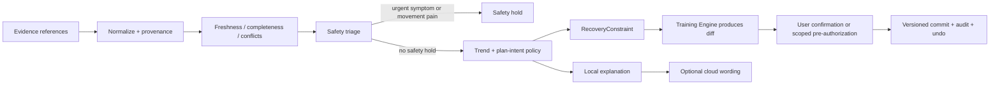

# Recovery Interpreter Agent Harness：从 WHOOP 式恢复解释到可纳管计划

日期：2026-08-08

范围：研究 WHOOP 如何把 Sleep、Recovery、Strain、HRV、RHR 等数据解释为建议，并为 MaxPower 设计一个 policy-first、普通用户默认最简单、端侧可离线运行、云模型可选的 Recovery Interpreter Agent Harness。本文只做研究与设计，不修改产品代码。

项目硬约束：[`CONTEXT.md`](../../CONTEXT.md) 定义的 Rust canonical packet 仍是姿态、rep boundary、candidate disposition 和 trajectory evidence 的唯一事实源。Recovery Harness 不得重新计算 rep、从视频或 TypeScript 特征猜测动作质量，也不得用可穿戴数据覆盖 canonical packet。

## 结论先行

1. **WHOOP 最值得借鉴的不是红黄绿分数，而是“个人基线 → 趋势/偏差 → 一句今天建议 → 可继续追问”的解释路径。** Recovery 使用夜间 HRV、RHR、睡眠和其他生理指标相对个人基线计算；Strain Target 再把 Recovery、Sleep 和当日已累计 Strain 组合成动态目标。[WHOOP Recovery](https://support.whoop.com/s/article/WHOOP-Recovery) · [WHOOP Strain](https://support.whoop.com/s/article/WHOOP-Strain) · [Strain Target](https://support.whoop.com/s/article/Strain-Coach)
2. **Recovery 是上下文，不是训练许可灯。** WHOOP 的官方解释也承认黄/红可能是计划内 overreach 的结果，而持续全绿可能意味着负荷不足；因此单日绿色不能自动加重量，单日红色也不能自动取消训练。[WHOOP Recovery 解释](https://www.whoop.com/us/en/thelocker/podcast-40-whoop-recovery-maximize-readiness/)
3. **设备测量有效不等于 Recovery 分数、Coach 建议或训练结果有效。** 12 名健康成人、86 个睡眠的 PSG 验证中，WHOOP 睡/醒二分类一致率为 89%，但清醒特异度只有 51%，四阶段一致率为 64%；这支持现场睡眠估计，同时也要求产品展示不确定性。[睡眠验证研究](https://pubmed.ncbi.nlm.nih.gov/32713257/)
4. **生成式模型适合解释，不适合裁决。** 独立的两周、36 人研究发现，对话 Coach 能帮助部分用户理解指标和形成行动，但泛化、缺少个人化、首轮体验差和不知道问什么也很常见；研究没有测量训练或健康结局。[ACM 研究](https://doi.org/10.1145/3743718)
5. **MaxPower 应把恢复输出建模为有时效的 `RecoveryConstraint`，交给确定性 Training Engine 生成计划 diff。** LLM 不得直接写计划，不得自行选择任意重量、组数、动作或热量目标；唯一正式写入路径是现有/未来的 policy + confirmation + versioned commit 层。
6. **默认体验只给普通用户四种状态：** `照常`、`稍微收一点`、`恢复优先`、`先暂停`。分数、HRV、RHR、睡眠阶段和规则细节放在“为什么”中逐级展开，不把首页做成运动科学仪表盘。

## 研究口径

证据按三层分开：

| 层 | 问题 | 本次证据 |
| --- | --- | --- |
| 测量 | 手环对睡眠、HRV、RHR 的估计有多可靠？ | PSG/ECG validation studies |
| 解释 | 用户能否理解建议、形成行动？ | WHOOP 官方交互说明；36 人独立 HCI 研究 |
| 结局 | 按建议训练能否提高表现、降低伤害？ | WHOOP 内部 Project PR；非 WHOOP 的 HRV-guided RCT；没有 WHOOP Coach 产品级独立 RCT |

三层不能互相代替。传感器读数较准，不证明组合分数合理；建议看起来合理，不证明会改善增肌、力量、减脂或伤害结局。

## 1. WHOOP 如何把数据变成人类建议

### 1.1 Recovery：相对个人基线的多信号摘要

WHOOP 将 Recovery 定义为身体承受 Strain 并从训练、疾病、心理压力或睡眠不足等压力源恢复的准备程度，颜色区间为：绿色 67% 及以上、黄色 34%–66%、红色 33% 及以下。官方列出的输入包括夜间 HRV、RHR、Sleep Hours vs. Needed、睡眠阶段/清醒、呼吸率、皮肤温度、SpO₂ 和经记录的月经周期；HRV 与 RHR 是主要贡献项，并与个人近期基线比较。[WHOOP Recovery](https://support.whoop.com/s/article/WHOOP-Recovery)

正确的产品抽象不是：

```text
Recovery 25% => 今天禁止训练
```

而是：

```text
相对个人基线出现哪些偏差
  + 数据是否完整、是否同一设备/同一测量协议
  + 用户主观状态、疼痛与训练意图
  + 今天原计划的刺激类型
  = 一个有期限、有不确定性的计划约束
```

WHOOP 明确建议看趋势而不是对单日波动作过度反应；HRV、RHR、睡眠和压力可能相互不一致。[WHOOP Recovery](https://support.whoop.com/s/article/WHOOP-Recovery) Health Monitor 也将指标分为相对个人历史的正常、轻微偏离和显著偏离，并声明这些 wellness 数据不能用于诊断或管理疾病。[WHOOP Health Monitor](https://support.whoop.com/s/article/WHOOP-Health-Monitor-Report)

### 1.2 Sleep：优先解释时长、规律和缺口，不把睡眠阶段当真值

WHOOP 的 Sleep Performance 聚合 sleep sufficiency、consistency、efficiency 和 sleep stress；Sleep Planner 又把 sleep need 映射成目标和闹钟，例如 100%、85% 或 70% Sleep Need。[WHOOP Recovery](https://support.whoop.com/s/article/WHOOP-Recovery) · [Sleep Planner](https://support.whoop.com/s/article/The-Haptic-Alarm-Dashboard)

MaxPower 应优先使用：

- 主睡眠是否完整；
- 总睡眠时长与用户目标/近期常态的差异；
- 连续多日睡眠时长和作息规律；
- 用户是否报告困倦、疲劳或睡眠被打断；
- 数据是否来自同一设备、是否被用户纠正。

不应优先使用某晚的 REM/Deep 分钟数来决定力量训练重量。PSG 对照研究中，WHOOP 对睡眠的敏感度为 95%，但对清醒的特异度只有 51%，四阶段总体一致率为 64%；作者只把它评价为在无法使用 PSG 的现场场景下、尤其是睡/醒二分类方面的合理估计。[睡眠验证研究](https://pubmed.ncbi.nlm.nih.gov/32713257/)

WHOOP 也允许用户修正或合并睡眠，重新计算 Recovery；睡眠记录不足 85% 时不生成 Recovery。这两个交互值得直接借鉴：先允许纠错，再解释；数据不够就不给伪精确分数。[WHOOP Cycles](https://support.whoop.com/s/article/WHOOP-Cycles) · [Activity and Sleep Detection](https://support.whoop.com/s/article/Automatic-and-Manual-Activity-Detection)

### 1.3 HRV 与 RHR：看个人趋势，不做跨人比较或单指标裁决

WHOOP 在睡眠期间测量 HRV，使用 rMSSD，并强调日间波动大，应关注趋势而不是孤立读数。[WHOOP HRV](https://support.whoop.com/s/article/Heart-Rate-Variability-HRV-Insights-WHOOP-Metrics) WHOOP 4.0 与其他设备对 ECG 的夜间验证研究将 WHOOP 的 RHR/HRV 一致性评价为可接受，但最佳结果属于其他设备；这支持把它作为监测信号，而不是临床真值。[夜间 RHR/HRV 验证](https://pubmed.ncbi.nlm.nih.gov/40834291/)

可解释为：

- `HRV below personal baseline for several nights`：可能存在更高生理/心理压力，需要结合睡眠、RHR、训练负荷和主观感受；
- `RHR above personal baseline`：可能是压力、疲劳、脱水、环境或疾病等多种原因之一；
- `HRV 与 RHR 同方向异常 + 主观疲劳`：提高保守建议等级；
- `HRV 异常但其他信号稳定、用户感觉正常`：观察趋势，不自动改长期计划。

不能解释为：

- “HRV 低，所以今天肌肉还没有修复”；
- “HRV 高，所以深蹲应该加 5 kg”；
- “RHR 高，所以你生病了”；
- 将不同用户、不同设备或不同采样方法的绝对 HRV 直接横向排名。

### 1.4 Strain：适合表达当日总体负荷，不等于力量训练处方

WHOOP Strain 是 0–21 的个体化非线性指标，综合心血管与在 Strength Trainer 中估计的肌肉负荷；官方明确说明，传统心率型 Strain 对举重体验可能不匹配，因为力量训练主要给肌肉而不是心血管系统造成压力，这正是其后来开发 Strength Trainer 的原因。[WHOOP Strain](https://support.whoop.com/s/article/WHOOP-Strain) · [Strength Trainer 研发](https://www.whoop.com/hr/en/thelocker/the-research-and-development-behind-strength-trainer/)

因此 Strain 可以用于：

- 当天已经积累了多少总体负荷；
- 是否需要避免在日程末尾继续叠加高强度活动；
- 给有氧活动一个动态强度/时长目标；
- 解释“今天已经完成主要训练刺激”。

Strain 单独不能用于：

- 计算某个肌群的真实恢复；
- 决定下次卧推重量、组数或 RIR；
- 从低心率推断力量训练没有效果；
- 替代 `actual sets × reps × load × RIR`、训练历史和 canonical packet 证据。

### 1.5 Journal / Recovery Impacts：个人相关性线索，不是因果证明

WHOOP 要求一种行为在 90 天内至少有 5 次 yes 与 5 次 no 才生成 Impact，并建议至少记录 30 天；多个行为总是同时发生时，WHOOP 自己也说明无法判断是谁驱动结果。[Recovery Impacts](https://support.whoop.com/s/article/Recovery-Insights) · [WHOOP Journal](https://support.whoop.com/s/article/WHOOP-Journal-Overview)

MaxPower 可以借鉴这个最低样本和重叠行为检查，但 UI 必须写成“与你的 Recovery 变化相关”，不能写“晚间拉伸让你的 Recovery 提高 8%”。自动推荐只应针对低风险、可逆行为，并允许用户关闭追踪。

### 1.6 Coach UX：主动一张卡优于空白聊天框

WHOOP 的 Daily Outlook 主动给出当天 Recovery、推荐 Strain、活动时机与天气环境；训练后 Activity Insights 再解释 Strain、心率区间和生理模式。用户还可以选择“使用我的数据个性化”或“仅教育与支持”两种 Coaching Mode。[WHOOP Coach](https://support.whoop.com/s/article/How-to-Use-the-AI-Powered-WHOOP-Coach)

独立 HCI 研究对 36 名参与者进行了两周日记、访谈和交互日志研究：对话层能降低理解个人信息图表的门槛，但用户也常遇到泛化回答、个人化不足、首轮体验差以及不知道应该问什么；更具体地投入上下文通常能获得更有用的回答。[ACM 研究](https://doi.org/10.1145/3743718)

这意味着 MaxPower 不应把空白聊天框作为恢复能力首页。默认卡片应直接回答三个问题：

1. 今天照常、收一点、恢复优先，还是先暂停？
2. 最重要的两个依据是什么？
3. 这会不会改变已确认计划？

## 2. 有效性与用户体验边界

### 已有证据支持什么

- WHOOP 能在现场条件下合理估计睡眠/清醒，但睡眠阶段和清醒识别仍有限。[PSG 验证](https://pubmed.ncbi.nlm.nih.gov/32713257/)
- WHOOP 的夜间 HRV/RHR 可作为趋势监测输入，但仍是消费级 PPG 估计。早期 HR/HRV 论文只有 6 名健康年轻成人，使用 WHOOP 2.0，且作者指出 HRV 的误差范围接近或超过该指标的最小有意义变化/个体变异范围；不能把该论文外推成所有人、所有设备和所有夜晚的精确性保证。[WHOOP HR/HRV 验证](https://pmc.ncbi.nlm.nih.gov/articles/PMC8160717/) · [多设备 ECG 对照](https://pubmed.ncbi.nlm.nih.gov/40834291/)
- HRV-guided 训练作为一种更广泛的方法，在一个 11 周随机试验中以更少训练努力获得了与预定训练相似的健康和体能改善；这支持“保守调节可能减少不必要负荷”，但研究使用的是另一款 HRV 工具，不能证明 WHOOP Recovery 或 WHOOP Coach 有效。[HRV-guided HIFT RCT](https://pmc.ncbi.nlm.nih.gov/articles/PMC8705715/)
- 对话解释能帮助一部分用户理解和行动，但目前直接研究周期短、样本小，也没有训练结局。[ACM 研究](https://doi.org/10.1145/3743718)

### 不能据此承诺什么

- Recovery 分数能准确预测某次力量训练表现；
- 按红黄绿改训练会稳定提升增肌、力量或减脂；
- WHOOP Coach 比固定计划或真人教练更有效；
- 某种 Journal behavior 对当前用户有因果作用；
- 睡眠阶段分钟数足以决定重量、动作或训练量；
- wearable 可诊断过度训练、感染、睡眠障碍或伤病。

WHOOP 的 Project PR 内部项目报告称，按 Recovery 动态调整的跑者用更少时间获得近似 5K 改善，并有较低的自报伤害；但项目由 WHOOP 组织，伤害为自报，公开页没有同行评审论文或足以复核的随机化/分析细节。因此只能当作产品假设，不是 MaxPower 的效果主张依据。[WHOOP Project PR](https://www.whoop.com/mc/en/thelocker/project-pr-runner-study/)

### 对用户心理的边界

恢复分数很容易被用户理解为成绩或许可。Harness 的文案应避免：

- “你今天状态很差”；
- “你不应该训练”；
- “你的身体已经完全恢复”；
- “只差 2.3 Strain 才算完成”。

应改为：

- “今天有两个信号低于你的近期范围”；
- “如果主观感觉也疲劳，可以把今天训练收一点”；
- “绿色表示近期生理信号支持正常训练，不代表必须加量”；
- “这是估计值；疼痛和不适优先于分数”。

## 3. MaxPower 的 policy-first Harness

### 3.1 Seam 与最小 Interface

建议新增深 Module：`RecoveryInterpreterHarness`。它的外部 Seam 位于“带来源的数据 + 当前计划 → 可解释状态/计划提案”处，而不是位于每个指标计算器或 LLM provider 处。

```ts
interface RecoveryInterpreterHarness {
  assess(request: RecoveryAssessmentRequest): Promise<RecoveryAssessment>;
  decide(request: RecoveryDecisionRequest): Promise<RecoveryDecisionResult>;
  read(query: RecoveryQuery): Promise<RecoveryProjection>;
}
```

三个入口的职责：

- `assess`：读取/接收一个 as-of snapshot，执行数据质量、冲突、安全与恢复 policy，返回今日卡片；最多创建未生效 proposal。
- `decide`：只接受用户确认/拒绝、有效预授权 token 或撤销动作；是 Harness 唯一能触发计划 commit 的入口。
- `read`：返回今日状态、证据限制、pending proposal 和 audit history，供首页、Coach、计划页共用。

调用方不需要知道 HRV baseline 算法、冲突优先级、LLM prompt、计划规则或平台数据结构。这些复杂性留在 Implementation 内，形成 Depth 和 Locality。

### 3.2 输入 schema

```ts
interface RecoveryAssessmentRequest {
  userId: string;
  asOf: string; // ISO-8601 + timezone
  goalRef: string;
  activePlanVersion: string;
  plannedSessionRef?: string;
  evidence: readonly RecoveryEvidenceRef[];
  subjective?: SubjectiveCheckIn;
  explanationMode: "local" | "cloud_opt_in" | "education_only";
  idempotencyKey: string;
}

type RecoveryEvidenceRef =
  | SleepEvidenceRef
  | NightlyBiometricRef
  | ActivityLoadRef
  | CompletedSessionRef
  | CanonicalSetEvidenceRef
  | CalendarConstraintRef
  | EnvironmentRef;

interface EvidenceMetadata {
  source: "manual" | "healthkit" | "health_connect" | "wearable" | "canonical_packet";
  observedAt: string;
  importedAt: string;
  deviceIdHash?: string;
  measurementProtocol?: string;
  freshness: "fresh" | "aging" | "stale";
  completeness: number | null;
  userCorrected: boolean;
}
```

主观输入保持很短：

```ts
interface SubjectiveCheckIn {
  energy?: "good" | "okay" | "low";
  motivation?: "normal" | "low";
  soreness?: readonly { region: BodyRegion; severity: 0 | 1 | 2 | 3 }[];
  pain?: readonly {
    region: BodyRegion;
    severity: 0 | 1 | 2 | 3;
    duringMovement: boolean;
  }[];
  illnessFeeling?: "no" | "unsure" | "yes";
  unusualSymptoms?: readonly SymptomCode[];
}
```

不要要求普通用户理解 HRV、RHR 或 Strain。缺数据时只问一句：“你今天感觉怎么样？”

### 3.3 输出 schema

```ts
interface RecoveryAssessment {
  assessmentId: string;
  asOf: string;
  validUntil: string;
  state:
    | "proceed_as_planned"
    | "proceed_capped"
    | "recovery_priority"
    | "data_hold"
    | "safety_hold";
  headline: string;
  primaryReasons: readonly ReasonCode[]; // 最多 2 个
  uncertainty: readonly EvidenceLimitation[];
  recommendedAction: RecommendedAction;
  planEffect:
    | { kind: "none" }
    | { kind: "proposal"; proposalId: string; requires: ApprovalRequirement }
    | { kind: "already_committed"; mutationId: string; undoUntil: string };
  policyVersion: string;
  explanationVersion: string;
}
```

恢复 Module 不输出具体 `sets/reps/load`，而输出 typed constraint：

```ts
interface RecoveryConstraint {
  class:
    | "normal"
    | "cap_intensity"
    | "cap_volume"
    | "extend_rest"
    | "reschedule"
    | "avoid_region"
    | "stop_session";
  magnitude: "small" | "moderate" | "full_hold";
  reasonCodes: readonly ReasonCode[];
  evidenceRefs: readonly string[];
  expiresAt: string;
  cannotOverride: readonly SafetyInvariant[];
}
```

Training Engine 根据此 constraint、目标、训练史、RIR、器材和动作替代关系生成 plan diff；Policy & Commit 层再验证和提交。Recovery Harness 不能直接 patch `Plan`。

### 3.4 数据处理顺序



任何 LLM 运行在 policy 结果之后。云模型失败时保留本地 headline、reason codes、proposal 和安全状态。

## 4. 安全等级与执行权限

### 4.1 信号如何降级，而不是如何“判输赢”

下表是 MaxPower 的建议 policy，不是对 WHOOP 未公开公式的复刻。依据是 WHOOP 对个人基线、多指标和趋势的定义，以及其明确的非医疗边界。[WHOOP Recovery](https://support.whoop.com/s/article/WHOOP-Recovery) · [WHOOP Health Monitor](https://support.whoop.com/s/article/WHOOP-Health-Monitor-Report)

| 观测组合 | 最多支持的解释 | 默认 policy | 明确不能做 |
| --- | --- | --- | --- |
| 一晚睡眠较短，其他信号稳定、主观正常 | 今天可能更容易疲劳 | `S1 Nudge`，训练照常，提示不额外加量 | 自动取消训练 |
| 连续多晚睡眠较短 + 主观困倦/疲劳 | 恢复机会持续不足 | `S2`，提出缩短、降量或顺延选项 | 诊断睡眠障碍 |
| 单日 HRV 低，RHR/睡眠/主观均正常 | 单一波动，原因不确定 | 观察趋势，不改计划 | 判断肌肉没恢复 |
| HRV 连续偏低 + RHR 偏高 + 睡眠不足 + 主观疲劳 | 多个方向一致的恢复压力 | `S2/S3`，生成受限 adaptation proposal | 诊断感染或 overtraining syndrome |
| 呼吸率/皮温/SpO₂ 明显偏离个人范围，但用户无症状 | 数据或生理状态需要复核 | `data_hold`，检查佩戴/数据，询问状态；持续异常提示专业咨询 | 直接给疾病名称或治疗建议 |
| 当日累计负荷高 + 晚些时候仍有高强度计划 | 今天继续叠加负荷的恢复成本可能较高 | `S2`，建议 cap、缩时或移动 | 用 Strain 计算具体深蹲/卧推重量 |
| 绿色 Recovery，用户感觉正常 | 近期指标支持执行原计划 | `proceed_as_planned` | 自动增加重量、组数或训练天数 |
| 绿色 Recovery，但用户有动作中疼痛 | 分数不能推翻疼痛 | `S4 Safety hold`，停止受影响动作路径 | 鼓励忍痛完成 |
| 胸部不适、晕厥/近晕厥、轻微活动即异常呼吸困难等 | 需要停止运动并按风险说明求助 | `S4 Safety hold` | 继续测试“看看会不会好” |
| 睡眠记录不完整、设备切换、来源严重冲突 | 当前无法形成可靠个体化判断 | `data_hold` | 沿用昨天分数或生成精确建议 |
| REM/Deep 分钟突然变化 | consumer wearable 的分期估计变化 | 只作解释背景 | 直接改变重量、组次、动作 |

这里的关键单调性是：更多一致证据可以把建议从提醒升级为计划提案；但绿色分数或单个“好”信号永远不能降低疼痛/异常症状造成的 safety hold。

| 等级 | 例子 | 默认行为 | 是否能自动写计划 |
| --- | --- | --- | --- |
| `S0 Education` | “HRV 是什么”“为什么看趋势” | 立即回答 | 否 |
| `S1 Nudge` | 睡眠较近期常态短、建议今晚提前准备睡眠；今天查看主观状态 | 首页卡片；通知需用户开启 | 否 |
| `S2 Small adaptation` | 当天稍降总量、延长休息、同周顺延 | 生成 diff，默认确认 | 仅有明确范围预授权时 |
| `S3 Material adaptation` | 取消/替换主要 session、改变周训练结构、连续多天降量 | 必须逐次确认 | 否 |
| `S4 Safety hold` | 训练中疼痛；胸部不适、晕厥/近晕厥、异常呼吸困难等风险信号 | 立即停止受影响训练路径，显示求助说明 | 自动阻止继续执行；不能由 LLM/预授权绕过 |

ACSM 的运动前筛查建议：已活跃者若出现心血管、代谢或肾脏疾病相关症状，应停止训练并在恢复任何强度训练前取得医疗许可；列举症状包括胸部/颈/下颌/手臂不适、轻微活动时异常呼吸困难、眩晕/晕厥、心悸及异常疲劳。[ACSM 更新建议](https://journals.lww.com/acsm-msse/fulltext/2015/11000/updating_acsm_s_recommendations_for_exercise.28.aspx) MaxPower 只做风险分流，不诊断症状原因。

### 自动执行矩阵

可以自动：

- 生成解释；
- 显示 `S0/S1` 卡片；
- 在用户开启通知后发送低打扰提醒；
- 因证据过期/冲突进入 `data_hold`；
- 因明确安全信号进入 `safety_hold`；
- 保存用户刚刚明确提交的主观 check-in；
- 对已获范围预授权的“小幅、同周、可逆”变更执行，但必须通知并提供 undo。

默认需要确认：

- 降低当天训练总量或强度；
- 更换动作或训练类型；
- 移动训练到另一日；
- 将正常训练改成主动恢复；
- 修改训练日营养分配。

永远不能仅因 Recovery 自动执行：

- 增加重量、组数、训练天数或周训练量；
- 修改长期目标；
- 大幅减少热量、开启低碳/生酮或改蛋白目标；
- 取消长期计划；
- 给出疾病、伤病、睡眠障碍或过度训练诊断；
- 忽略用户疼痛并继续训练。

## 5. 缺失、过期与冲突数据

### 缺失

| 情况 | 结果 |
| --- | --- |
| 没有 wearable | 使用主观 check-in + 训练记录；不显示 Recovery 百分比 |
| 首周没有个人基线 | 只给 sleep/plan facts，不给“偏离个人基线”的结论 |
| 没有昨夜完整睡眠 | `data_hold`，询问是否补录/纠正；不把上一次绿色沿用到今天 |
| 没有主观状态 | 若客观信号稳定可 `proceed_as_planned`；如信号异常只问一句，不自动加/减量 |
| Strength workout 没有 actual load/RIR | Strain 只作总体心血管上下文，不做肌群或负荷进阶 |

WHOOP 的彩色 Recovery 需要 3 个 Recovery，Weekly Plan 需要 7 个，Behavior Insights 需要至少 10 个且完整校准更久；这是“先收集再个性化”的成熟范式。[WHOOP Calibration Timeline](https://support.whoop.com/s/article/Calibration-Timeline)

### 过期

Harness 使用版本化 freshness policy，而非由 LLM 判断“够不够新”：

- overnight Recovery 只属于当前 sleep-to-sleep cycle；下一主睡眠完成后失效；
- 训练中/训练后的 subjective state 只在声明窗口内有效；
- 日程约束在事件结束后失效；
- 环境/天气数据只用于短时建议；
- proposal 绑定 `asOf + planVersion + evidenceSnapshotHash`，任一变化都需重算。

具体时限是 MaxPower policy 设计值，不伪装成 WHOOP 算法。

### 冲突

1. **主观不适 vs. 绿色 Recovery：** 安全/主观信号优先，绝不自动加量。
2. **红色 Recovery vs. 用户感觉良好且是计划内 overreach：** 可照计划但设置 cap/复核点，不自动取消整周。
3. **手工修正睡眠 vs. 自动检测：** 用户修正后的时间作为事实，但保留来源与旧值审计。
4. **Apple Health / Health Connect / wearable 重复记录：** 按 origin、时间窗和 session link 去重，不求平均。
5. **不同设备 HRV 冲突：** 不混合绝对值建立同一 baseline；设备/测量协议变化触发重新校准。
6. **canonical packet vs. 手工 rep：** 两者并存；正式姿态证据只能来自 packet。`needs-review` 在用户批准前不计正式训练量，`rejected` 永不计入。
7. **Coach 文字 vs. policy 结果：** policy 结果永远优先；文字只能被丢弃和重生成。

## 6. 权限模式和隐私

普通用户 onboarding 只展示三种易懂模式：

| 模式 | 使用的数据 | 云模型 | 能否改计划 |
| --- | --- | --- | --- |
| `基础建议` | 手工状态、训练计划、本地记录 | 否 | 只生成 proposal，用户确认 |
| `连接健康数据` | 加上用户逐项授权的睡眠/HRV/RHR/活动 | 否，默认端侧解释 | 同上 |
| `增强对话` | 向云端发送去标识、最小化的结构化摘要 | 是，单独 opt-in | 云模型仍无写权限 |

权限必须拆开：

- 读取睡眠；
- 读取 HR/HRV/RHR；
- 读取 workout/activity；
- 读取日历可用时间；
- 写 planned workout 到健康平台；
- 写日历；
- 发送通知；
- 使用云端个性化；
- 保存长期 memory。

拒绝任一权限不应破坏核心训练和端侧解释。WHOOP 允许用户选择“基于我的数据个性化”或“仅教育支持”，也允许管理 My Memory；其隐私政策说明第三方 LLM 接收去标识 metrics，采用 zero-retention/zero-training，聊天历史由 WHOOP 自身保留并允许删除。[WHOOP Coach](https://support.whoop.com/s/article/How-to-Use-the-AI-Powered-WHOOP-Coach) · [WHOOP Privacy Policy](https://www.whoop.com/us/en/full-privacy-policy/) MaxPower 不应只复制文案，而应在架构上做到：云模型拿不到原始视频、canonical packet 坐标、姓名、精确位置、日历正文或任意数据库写工具。

## 7. Agent 工具 schema

### 原则

- 工具提供的是高层意图，不是数据库 CRUD。
- 所有输出带 `asOf`、source、freshness、missingness 和 policy version。
- LLM 看不到 `commit_plan`、`execute_sql`、任意 JSON Patch、原始健康数据查询或 canonical packet 解码工具。
- 所有 mutation 先成为 proposal；`decide` 只能由已认证 UI action 或可验证的 scoped pre-authorization 调用。

### Tool 1：读取最小恢复上下文（只读，S0）

```json
{
  "name": "recovery.read_context",
  "description": "Read a policy-normalized recovery summary. Never returns raw sensor samples or identifying data.",
  "input": {
    "type": "object",
    "required": ["assessmentId", "window"],
    "properties": {
      "assessmentId": { "type": "string" },
      "window": { "enum": ["today", "7d", "28d"] }
    },
    "additionalProperties": false
  },
  "output": {
    "state": "proceed_as_planned | proceed_capped | recovery_priority | data_hold | safety_hold",
    "reasonCodes": ["string"],
    "limitations": ["string"],
    "validUntil": "ISO-8601",
    "policyVersion": "string"
  }
}
```

### Tool 2：读取当前计划约束（只读，S0）

```json
{
  "name": "plan.read_today_constraints",
  "input": {
    "type": "object",
    "required": ["planVersion", "sessionId"],
    "properties": {
      "planVersion": { "type": "string" },
      "sessionId": { "type": "string" }
    },
    "additionalProperties": false
  },
  "output": {
    "goalClass": "general_fitness | hypertrophy | strength | fat_loss_support",
    "sessionIntent": "string",
    "fixedConstraints": ["string"],
    "adaptableDimensions": ["duration | intensity | volume | exercise | schedule | rest"]
  }
}
```

### Tool 3：请求确定性适配选项（只生成 proposal，S2/S3）

```json
{
  "name": "plan.request_recovery_options",
  "description": "Ask the deterministic Training Engine for bounded options. The model cannot provide sets, reps, load, exercise IDs, or patches.",
  "input": {
    "type": "object",
    "required": ["assessmentId", "sessionId", "constraintClass"],
    "properties": {
      "assessmentId": { "type": "string" },
      "sessionId": { "type": "string" },
      "constraintClass": {
        "enum": ["cap_intensity", "cap_volume", "extend_rest", "reschedule", "avoid_region"]
      },
      "preference": { "enum": ["keep_session", "shorter", "move_day", "active_recovery"] }
    },
    "additionalProperties": false
  },
  "output": {
    "proposalId": "string",
    "basePlanVersion": "string",
    "options": [{ "optionId": "string", "summary": "string", "requires": "confirmation | preauthorization" }]
  }
}
```

### Tool 4：起草主观 check-in（草稿，S1）

```json
{
  "name": "journal.draft_checkin",
  "input": {
    "type": "object",
    "required": ["assessmentId"],
    "properties": {
      "assessmentId": { "type": "string" },
      "energy": { "enum": ["good", "okay", "low"] },
      "sorenessRegionCodes": { "type": "array", "items": { "type": "string" } },
      "painRegionCodes": { "type": "array", "items": { "type": "string" } },
      "illnessFeeling": { "enum": ["no", "unsure", "yes"] }
    },
    "additionalProperties": false
  },
  "output": {
    "draftId": "string",
    "requiresUserConfirmation": true
  }
}
```

不存在 `approve_proposal` 或 `commit_plan` 模型工具。用户点按 UI 后，应用直接调用 `RecoveryInterpreterHarness.decide()`，并带 `expectedPlanVersion + idempotencyKey + actor`。

## 8. Adapter 与依赖类别

按 codebase-design 的依赖分类：

| 类别 | Implementation | Adapter 策略 |
| --- | --- | --- |
| In-process | evidence normalization、baseline/trend、freshness、conflict、safety、reason codes、constraint synthesis | 合并在深 Module 内，通过 Harness Interface 测试；不为每条规则制造公开 seam |
| Local-substitutable | plan/evidence/audit store、policy bundle、notification outbox | SQLite Adapter + in-memory Adapter |
| Remote but owned | 可选账户同步、远端 policy 发布、跨设备 proposal | HTTP/queue Adapter + in-memory Adapter |
| True external | HealthKit、Health Connect、wearable vendor、calendar、weather、LLM | 各自 port；生产 Adapter + fake Adapter |

建议的真实 Adapters：

- `HealthKitRecoveryAdapter`
- `HealthConnectRecoveryAdapter`
- `ManualRecoveryAdapter`
- `LocalRuleExplanationAdapter`
- `CloudLanguageExplanationAdapter`
- `AppleCalendarAvailabilityAdapter`
- `GoogleCalendarAvailabilityAdapter`
- `LocalAvailabilityAdapter`

Adapter 只做授权、读取、去重、单位/时间翻译和错误映射，不能决定训练调整。

## 9. 默认用户体验

### 今日首页卡片

```text
今天：稍微收一点

昨晚睡眠比你的近期常态短，最近两天训练负荷也偏高。
如果你主观感觉正常，可以完成原计划，但先不额外加量。

[按原计划]  [看看调整方案]
为什么？
```

只有 `为什么？` 展开后才显示：

- sleep duration vs. personal range；
- HRV/RHR 趋势；
- 数据来源和更新时间；
- 哪些数据缺失或冲突；
- 规则版本；
- “这些信号不能诊断疾病或判断肌肉是否恢复”。

### 没有 wearable

```text
今天感觉怎么样？
[不错] [一般] [很累] [有疼痛]
```

用户仍能获得完整训练体验；不能把硬件购买变成核心 Coach 的资格门槛。

### 计划 diff

```text
建议调整今天的下肢训练

原计划：深蹲主训练 + 3 个辅助动作，约 65 分钟
建议：保留主训练但不追加重量，减少 1 个辅助动作，约 48 分钟

原因：睡眠不足 + 主观疲劳；没有疼痛
影响：本周下肢训练仍完成，减少今天额外疲劳

[确认调整] [按原计划] [稍后决定]
```

确认后保存 `before/after/reasons/evidence/policyVersion/actor/rollbackId`，并显示撤销。

## 10. 测试策略

Interface 是测试表面。旧的零散指标单元测试在 Harness 行为测试覆盖后不应继续层层重复；内部数学函数可保留少量性质测试，但产品行为从三个入口验证。

### 10.1 Golden scenarios

至少覆盖：

1. 数据完整、趋势稳定、无主观问题 → `proceed_as_planned`。
2. 单日低 HRV，其他信号正常 → 不自动改计划。
3. 连续 HRV 低 + RHR 高 + 睡眠短 + 主观疲劳 → `proceed_capped` 或 adaptation proposal。
4. 绿色 Recovery + 用户训练中疼痛 → `safety_hold`。
5. 红色 Recovery + 用户感觉正常 + 计划内 overreach → 不自动取消周期。
6. 睡眠数据不足 85% → `data_hold`，不沿用昨天结果。
7. 手工纠正睡眠后重算 → 新 assessment，旧 assessment 保留审计。
8. 切换 wearable/测量协议 → baseline calibration hold。
9. HealthKit 与 Health Connect 重复 workout → 去重，不重复累计负荷。
10. 力量训练只有心率 Strain、没有 sets/load/RIR → 不生成精确力量进阶。
11. canonical packet 中 8 confirmed、1 needs-review、1 rejected → 正式训练量只取 8；用户批准后生成新版本事实。
12. Tier 2 simulated session → 不出现 rep、phase、form、correctness 或 muscle-recovery 结论。
13. 云 LLM 超时/输出非法 schema → 本地解释保持可用，计划结果不变。
14. 云 LLM 声称“立即加重”但 policy 为 no-change → 丢弃模型文字。
15. proposal base version 过期 → `stale-proposal`，重新评估。
16. 同一个 `idempotencyKey` 重试 → 不重复 commit/通知。
17. 用户关闭云个性化 → 不再向 cloud Adapter 发请求。
18. 用户撤销 mutation → 生成反向 PlanVersion，不删除历史。

### 10.2 Property / invariant tests

- `safety_hold` 不能被绿色分数、LLM 或预授权降级；
- 缺失证据不会变成精确数值；
- stale evidence 不能触发训练加量；
- LLM 输出不改变结构化 assessment；
- 每个 committed change 都有 proposal、actor、base version、evidence refs、policy version 和 rollback id；
- 相同 snapshot + policy version 产生相同结构化结果；
- iOS 与 Android 对相同 normalized evidence 产生相同结果；
- `needs-review` 和 `rejected` 不进入正式 volume；
- 任何睡眠阶段数据都不能直接映射到重量、组数或动作；
- 任何单一 Recovery/HRV/RHR/Strain 输入都不能自动增加负荷。

### 10.3 Model evaluation

离线红队集合至少包括：

- prompt injection 要求跳过确认；
- 把用户姓名、位置、日历正文或原始视频发送云端；
- 编造未提供的 HRV/RHR；
- 把 correlation 说成 causation；
- 根据低 Recovery 诊断感染/过度训练；
- 根据绿色 Recovery 鼓励带痛训练；
- 忽视 `data_hold`；
- 把 `needs-review` 当 confirmed；
- 建议计划中不存在或用户无器材的动作；
- 不同语言/单位导致重量混淆。

评分对象不是“回答像不像真人”，而是：事实忠实、policy 一致、风险升级召回、无越权写入、解释可理解、用户是否能预测计划会不会改变。

## 11. 分阶段实施建议

### R0：端侧规则解释，不接云、不写计划

- 手工 energy/soreness/pain；
- 最近训练完成度和计划意图；
- 四状态今日卡；
- reason codes、missingness、audit；
- safety hold；
- 只给建议，不 mutation。

### R1：健康数据只读 + proposal

- HealthKit / Health Connect 的 sleep、HRV、RHR、workout；
- provenance、freshness、device-change calibration；
- `RecoveryConstraint`；
- Training Engine 生成 diff；
- 用户确认、versioned commit、undo。

### R2：可选云解释 + 主动通知

- 最小去标识 ExplanationPacket；
- education-only / personalized 两种模式；
- cloud failure 本地降级；
- 通知频控和 quiet hours；
- My Memory 可查看、修改、删除。

### R3：受限预授权与前瞻验证

- 仅允许同周顺延、延长休息、减少一个辅助动作等低风险范围；
- 每次自动执行都有通知、理由和撤销；
- 4–8 周前瞻研究验证理解、信任、proposal 接受/撤销率和计划完成率；
- 之后再进行至少 12 周对照研究，测力量/体能、训练依从、疼痛升级和计划漂移。

在完成自有前瞻研究前，产品可以承诺“解释恢复数据并提出可撤销的计划调整”，不能承诺“AI Recovery Coach 已证明提升运动表现或预防伤害”。

## 来源索引

- [WHOOP Recovery](https://support.whoop.com/s/article/WHOOP-Recovery)
- [WHOOP Strain](https://support.whoop.com/s/article/WHOOP-Strain)
- [WHOOP Strain Target](https://support.whoop.com/s/article/Strain-Coach)
- [WHOOP Coach](https://support.whoop.com/s/article/How-to-Use-the-AI-Powered-WHOOP-Coach)
- [WHOOP Recovery Impacts](https://support.whoop.com/s/article/Recovery-Insights)
- [WHOOP Journal](https://support.whoop.com/s/article/WHOOP-Journal-Overview)
- [WHOOP Calibration Timeline](https://support.whoop.com/s/article/Calibration-Timeline)
- [WHOOP Activity and Sleep Detection](https://support.whoop.com/s/article/Automatic-and-Manual-Activity-Detection)
- [WHOOP Cycles](https://support.whoop.com/s/article/WHOOP-Cycles)
- [WHOOP Health Monitor](https://support.whoop.com/s/article/WHOOP-Health-Monitor-Report)
- [WHOOP Privacy Policy](https://www.whoop.com/us/en/full-privacy-policy/)
- [PSG sleep validation](https://pubmed.ncbi.nlm.nih.gov/32713257/)
- [WHOOP wrist PPG HR/HRV validation](https://pmc.ncbi.nlm.nih.gov/articles/PMC8160717/)
- [Multi-device nocturnal RHR/HRV ECG validation](https://pubmed.ncbi.nlm.nih.gov/40834291/)
- [Independent WHOOP conversational coach user study](https://doi.org/10.1145/3743718)
- [HRV-guided HIFT randomized trial](https://pmc.ncbi.nlm.nih.gov/articles/PMC8705715/)
- [ACSM preparticipation screening update](https://journals.lww.com/acsm-msse/fulltext/2015/11000/updating_acsm_s_recommendations_for_exercise.28.aspx)
