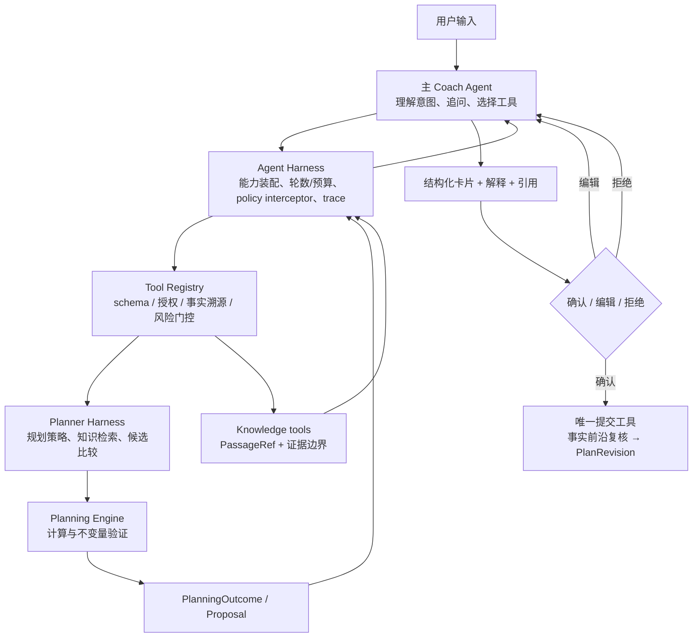

# MaxPower Agent Harness 架构审阅：从“正则路由”到受约束的 Planner 工作模式

> 调研日期：2026-08-13
> 审阅范围：`src/coach/executionHarness.ts`、`agentRuntime.ts`、`toolRegistry.ts`、`adapters/remoteCoachContext.ts`、`playbook.ts` 及 `src/observability/`；外部资料仅采用框架官方文档或官方源码/示例。
> 结论先行：当前系统已经具备良好的**执行安全底座**（封闭工具目录、严格输入校验、提案确认、账本审计、计划 trace）。但它尚不是合理的 LLM Agent Harness：`CoachExecutionHarness.route()` 与 `selectedRemoteTools()` 用正则替 LLM 进行了意图识别和工具选择；`AgentRuntime` 执行工具后不把工具结果回送模型继续推理。这会使 Planner 固化成规则工具，无法成为主 Agent 按需加载的专业规划模式。

## 1. 以“四象限”明确本次设计问题

### 共同已知

- 产品目标不是“自动开处方”，而是：主 Agent 与用户保持一条连续对话；首次规划、长期重估和局部重排都必须能解释取舍、引用依据、形成预览，并经用户确认才改变未来计划。
- 计划计算（肌群联动、恢复、能量、有氧、动作替代）需要确定性、可验证的 Planning Engine；自然语言理解、是否追问、选择何种规划策略则需要 Agent 判断。
- 交付标准：任何写入可追溯；任何会改未来计划的动作可暂停、可编辑、可确认/拒绝；知识性结论可回链到本次检索到的来源；线上问题可回放和评估。
- 边界：不让 LLM 直接写 Ledger/PlanRevision，不把模型推断伪装成用户事实，不诊断或虚构训练/医学数值。

### 用户已知、系统未知（会实质影响实施的三个问题）

本报告先按探索版本设计，不重复询问已有健身档案。落地前只需确认以下三个产品决策：

1. **Planner 的确认粒度**：首次完整计划、微周期重排、单次动作/当日强度调整，分别哪些必须确认？建议：改变 `PlanRevision` 或已确认能量策略的一律确认；仅记录事实、只读解释无需确认。
2. **知识库覆盖承诺**：知识库未命中时，是严格只答“不知道+可验证路径”，还是可清楚标记“通用模型知识、无本地引用”？建议：训练/营养数值与安全问题严格前者；一般对话可后者但不得伪造引用。
3. **Planner 允许的回合与时延预算**：首次规划可允许 2–4 次工具回合和最多 3 个关键问题；日常微调建议 1–2 回合。没有预算，循环、费用与体验无法被可验证地约束。

### 用户可能未考虑到、但架构必须补上的内容

- “提供工具给 Agent”仍不等于安全：模型选择工具后，Harness 必须验证 schema、授权、事实溯源、计划不变量和确认状态；工具说明是**选择指导**，不是权限本身。
- 不能只 trace 成功调用。还要记录“当轮有哪些工具可见/被屏蔽、为什么选择/拒绝、工具输入中的字段来自哪个事实、验证失败原因、引用是否来自本轮检索结果”。这才可定位漏调、误调和编造。
- 计划准确性不能用 LLM 自评替代。应把 schema、事实出处、Planning Engine 不变量、引用完整性、前后计划差异、确认前沿作为独立检查器；再用端到端场景集评估真实模型的工具选择与结果。

### 共同未知 → 可验证假设

| 假设 | 最小实验（只改一个变量） | 成功/失败信号 | 后续采集 |
| --- | --- | --- | --- |
| 移除 regex 直路由后，LLM 能稳定选择 `planner.propose`/记录工具 | 固定同一工具目录、上下文和模型，只替换 `executionHarness.route()` 为工具说明 + loop；每类 30 条自然表达 | 正确工具、schema 合格、无越权均 ≥ 目标阈值；否则保留为显式 guardrail 而非恢复正则 | intent、工具选择、无效字段、澄清率、模型/提示版本 |
| Tool-result loop 会提高解释与引用准确性 | 同一情景 A=执行后结束，B=将 typed result 回传模型 | B 的最终文本引用真实 artifact/来源、无“已调整但未确认”声明，并经人工盲评更好 | tool-result → final-answer 对齐率、引用验证失败率、额外回合/延时 |
| Planner 作为主 Agent 工具优于独立常驻对话 Agent | 同一复杂重排分别用 `planner.propose` 与独立会话 | 前者的事实前沿一致、确认链不分叉、用户少解释历史 | session/plan 关联失败、重复追问、用户纠错、确认转化 |

## 2. 当前实现：哪些合理，哪些不合理

### 已经合理，应保留并作为 Harness 的底座

| 当前 Module / Seam | 已有行为 | 评价 |
| --- | --- | --- |
| `CoachToolRegistry.manifest()/invoke()` | 关闭且版本化的工具目录；严格对象解析；根据 `knowledgeToolsEnabled`/`actionToolsEnabled` 暴露能力 | **正确的能力与执行 seam**。LLM 只能提出调用，Registry 才能解释和执行。 |
| Tool Manifest | 包含 schema、access class、execution mode、权限、风险、证据要求、输出上限 | 方向正确；下一步把“何时用/何时不用/缺什么应追问”补入 Agent 可见说明，并把运行时工具可见性按事实状态装配。 |
| `AgentRuntime.handleToolCall()` | 持久化 input/output 状态、审计、幂等 ID；`ui.request_choice` 可暂停；工具错误可结构化返回 | **正确的工具执行与 HITL 基座**。 |
| Local Product Kernel + Planning Engine | 生成预览而非直接改 `PlanRevision`；确认前重新核查 trace/事实前沿；持久化 `plan_trace` | **正确的计划变更不变量**；应继续由 Engine/确认工具拥有，不能下放给 Planner Agent。 |
| `TraceEnvelope` 与 `ToolAuditRecord` | run/session 关联、事件顺序、匿名化、outbox、规则/工件引用 | 已有很强的可观测性基础。需要补齐 LLM/检索/验证/Planner outcome span。 |
| `COACH_PLAYBOOK` | 已经表达“先检索后答、先提案后确认、证据不足则追问”等业务规则 | 内容方向对，但仅放在 prompt 是软约束；应拆为工具说明、验证器和 eval 规格。 |

### 当前 P0 架构问题

1. **`CoachExecutionHarness.route()` 不是 Harness，而是关键词驱动的工具调用替身。** 它直接从文本提取热量、日期、恢复评分、活动和部位，并产出完整 `ProviderEvent.tool-call`。同一句话的意图、否定、条件、历史上下文、用户是否真的要求变更，都被硬编码。更严重的是它产生 `qualitativeAssessment` / `requestedTrainingFocus` 这类策略字段；即使不写账本，也已经替 Planner 做了判断。
2. **`selectedRemoteTools()` 仍用正则控制模型能力。** “训练 + 饮食”被文本匹配裁成单个 `plan.show_current`。这是一个产品场景规则，却放在 transport context 的实现中；它会漏掉同义表达，也会让未来 Planner/知识查询无法基于当前状态组合工具。
3. **没有闭合的 tool-result loop。** `AgentRuntime.consumeProviderStream()` 调用 `handleToolCall()` 后继续消费同一 provider stream；本次工具结果没有作为 `tool` message 重新送给模型。于是 LLM 无法读取真实 Planner 结果、引用的知识 passage、校验失败或确认状态，只能在调用前预先说话或让 UI 自己解释。
4. **工具目录不是按“可执行前提”动态装配。** 当前主要按全局开关暴露。`plan.adapt...` 等仍可见于没有已确认计划/授权/可恢复事实时；之后靠失败兜底，不利于正确选择和可解释性。
5. **知识引用没有强制闭环。** 已有 `knowledge.search` 与“仅引用检索原文”的 playbook，但没有看到“最终文本中的 citation 必须属于本 run 工具结果”的验证器，也没有面向模型的 typed PassageRef 回传协议。
6. **可观测性重执行、轻决策与评估。** Trace 有优秀隐私/顺序设计，但缺少标准化的 `intent/route`、`tool_visibility`、`tool_selection`、`fact_provenance`、`knowledge_citation_validation`、`planner_validation` span，也没有针对真实 LLM 的回归 eval gate。

## 3. 开源 Agent Harness 的可借鉴模式（全部一手资料）

| 参考 | 官方机制 | 对 MaxPower 的具体映射 |
| --- | --- | --- |
| [OpenAI Agents SDK：Agent loop（JS）](https://openai.github.io/openai-agents-js/guides/running-agents/) | `Runner` 在模型返回 tool call 后执行工具、把结果追加进对话、继续运行，直到 final output 或 `maxTurns`。 | 用一个 `CoachAgentHarness.run()` 拥有 loop；默认把每个成功/失败的 ToolResult 回传模型。只对纯结构化、无需解释的终端 tool 显式结束。 |
| [OpenAI Agents SDK：Tools（JS）](https://openai.github.io/openai-agents-js/guides/tools/) | 工具是显式目录，可使用 strict schema、`isEnabled`、approval/guardrail/timeout；专业 Agent 可作为 `Agent.asTool()`，不必交出顶层会话。 | `planner.propose` 是主 Agent 可见的工具；其 Implementation 内可以有 Planner Agent，但主 Agent、Ledger 与确认链仍唯一。工具可见性由 snapshot 装配，而不是由用户文本正则决定。 |
| [OpenAI Agents SDK：Human-in-the-loop（JS）](https://openai.github.io/openai-agents-js/guides/human-in-the-loop/) | 模型先发 tool call；runner 按 `needsApproval` 判断，暂停、持久化 RunState，由同一顶层 run approve/reject/resume；嵌套 Agent 的中断也上浮。 | 将“提案生成”和“提交 PlanRevision”拆成两个工具：前者可执行并产出 preview，后者强制 HITL；把审批绑定 `toolCallId + factFrontier + proposalId`，而非文本确认。 |
| [OpenAI Agents SDK：Tracing（JS）](https://openai.github.io/openai-agents-js/guides/tracing/) 与 [Evals（Python）](https://openai.github.io/openai-agents-python/evals/) | SDK 把 agent/LLM/tool/guardrail span 放入 trace，并提供 datasets、graders、trace grading。 | 保留现有 `TraceEnvelope`，增加同构 span；用 fixture 场景集评估“意图→工具、输入溯源、tool-result 后文本、引用、确认、最终账本”。 |
| [LangGraph：Interrupts](https://langchain-ai.github.io/langgraph/how-tos/human_in_the_loop/breakpoints/) | `interrupt()` 在任意动态节点暂停，持久化状态，由 `thread_id`/checkpointer 续跑；审批可查看、编辑或拒绝拟执行调用。 | 现有 `HumanActionCoordinator` 应升级为长期可恢复的 run state；preview 卡支持确认、拒绝、编辑后重算，而不只是一句文本。 |
| [LangGraph：Review tool calls](https://langchain-ai.github.io/langgraph/how-tos/human_in_the_loop/review-tool-calls/) | 将“模型决定 → 人审核/修改 → 工具执行/回模型”建成显式图，不把审批塞进 prompt。 | `PlannerProposal` 进入 review node；用户可修改频率/时长/偏好，修改被记为新的用户输入，再重新规划，不直接修改 Engine 输出。 |
| [AutoGen Core：ToolAgent](https://microsoft.github.io/autogen/stable/reference/python/autogen_core.tool_agent.html) 与 [Intervention Handler](https://microsoft.github.io/autogen/0.4.9/user-guide/core-user-guide/cookbook/tool-use-with-intervention.html) | LLM 工具调用和 ToolAgent 执行分离；运行时可拦截 FunctionCall、批准或拒绝，再将执行结果作为 function result 传回。 | 维持 Provider（选择）→ Registry（执行）的 adapter seam；把权限、事实溯源、确认检查放在 Registry 前的 policy interceptor，而不是 Provider regex。 |
| [Anthropic 官方 Cookbook](https://github.com/anthropics/anthropic-cookbook) | 官方示例把 tool use、RAG、sub-agent、automated evaluations 分开组织；sub-agent 用于子任务，而不是自动取得顶层写权限。 | Planner 可为 Harness 内的短生命周期分析 Agent；它只能调用 query/simulate/validate 工具并返回 `PlanningOutcome`，不能拥有写入工具或第二条用户会话。 |

> 这些框架的共同点不是“多 Agent”，而是：**模型选择受限能力；运行时执行/拦截；结果再喂回模型；高风险动作可中断且可恢复；每一步可追踪和评估。** 这与“正则预先替模型调用工具”相反。

## 4. 建议目标架构



### 4.1 三个深 Module 与各自小 Interface

1. **`AgentHarness.run(turn)`**：唯一对话 runtime。装配受当前事实约束的工具、运行有限 tool loop、将 ToolResult 回传模型、执行 output/citation validator、记录 trace；它**不根据文本选工具**，也不写计划。
2. **`PlannerHarness.propose(request)`**：主 Agent 调用的规划工作模式。内部 Planner Agent 可选择检索、模拟、比较、验证；输出 `needs_input | no_change | proposal | safety_hold`。它不能提交账本。
3. **`PlanningEngine.evaluate(candidate, snapshot)`**：纯确定性计算与不变量检查，输出 `VerifiedPlan | Violations`。当前 `GoalCyclePlanner`、肌群疲劳、恢复、能量、有氧等应落在此处。

这三个 Module 的 depth 在于：调用方不需知道肌群、能量、知识检索、确认、重试与审计的内部步骤；只需理解输入、输出、不变量和失败模式。

### 4.2 Agent 可见工具应如何装配

不是按照用户本轮文字裁剪，而是由当前 `PlanningSnapshot` 生成 `ToolAvailability`：

| 事实状态 | 可见/可执行工具 | 原因写入工具说明 |
| --- | --- | --- |
| 未有已确认计划 | `planner.propose`、intake/knowledge/read；隐藏 `plan.adapt...` | 先建立可确认基线，不能“调整不存在的计划”。 |
| 有计划 + 授权 + 事实足够 | `timeline.record...`、`planner.propose`、局部 `plan.adapt...` | 工具说明要求只传本轮明确事实；改动仍产 preview。 |
| 有计划但恢复/日期/活动缺关键字段 | `ui.request_choice` / 记录草稿 / `planner.propose` | 要求最多三项高价值澄清，不令模型编造评分/日期。 |
| 安全暂停/专业限制 | 只读安全说明、转介、记录；屏蔽计划推进/高强度有氧工具 | 这是硬 policy，不是 prompt。 |
| 知识问题 | `knowledge.search` | 返回 typed PassageRef（来源、片段、适用范围、证据等级、不支持的结论）。 |

工具描述至少包含：目的、使用条件、不要使用、字段可来自哪里、输出状态、是否需要确认。Registry 不信任描述，仍独立校验。

### 4.3 规划与确认状态机

```text
事实 / 用户请求
  → LLM 选 planner.propose
  → Planner Harness：检索 → 策略选择 → Engine 验证
  → PlanningOutcome
     ├─ needs_input：最多三个会改变结果的问题
     ├─ no_change：理由 + 监测信号
     ├─ safety_hold：原因 + 非诊断下一步
     └─ proposal：预览 + 取舍 + 假设 + 引用 + 验证报告
  → 用户确认/编辑/拒绝
  → commit_plan_revision（复核 proposalId、规则版本、factFrontier）
```

“睡不好，腿还酸，能否今天练肩”不应由 regex 直接变 `requestedTrainingFocus: shoulders`。主 Agent 可调用 `planner.propose`，Planner 判断需不需要追问、一次性换课还是重排，然后 Engine 校验联动与恢复；最后只产生待确认 proposal。

## 5. 准确性、知识引用、可观测性与 Eval 的硬检查

### 5.1 四类独立验证器

| 检查器 | 输入 | 阻止什么 |
| --- | --- | --- |
| `ToolInputProvenanceValidator` | tool input + 当前 turn 的用户声明 + confirmed fact refs | LLM 编造热量、日期、恢复/疼痛评分、重量或把推断当事实。 |
| `PlanInvariantValidator` | candidate plan + snapshot + rule pack version | 恢复/肌群联动/能量/安全/器械/时间与确认边界冲突。 |
| `CitationValidator` | final answer/card + 本 run 的 `PassageRef[]` | 模型使用未检索来源、虚构链接、把群体证据说成个人确定结论。 |
| `CommitValidator` | proposalId + factFrontier + revision + user decision | 在事实已变化、预览过期或未确认时写入 `PlanRevision`。 |

输出过滤器只能是最后一道防线，不能替代上述按数据结构验证。

### 5.2 Trace 最小事件集

在既有 `TraceEnvelope` 中增加（均只放 ID、版本、哈希、reason code，不放对话正文）：

```text
agent.turn.started
agent.tool_visibility.computed          # 可见/隐藏工具名及原因码
llm.response                             # model、usage、finish reason、prompt/playbook 版本
agent.tool_selected                      # tool、input hash、意图标签（可选）
guardrail.tool_input_provenance          # passed/rejected，fact refs
tool.executed                             # latency、artifact ref、error code
planner.outcome                          # needs_input/no_change/proposal/safety_hold
plan.invariants_checked                  # rule versions、violation codes
knowledge.retrieved / citation.validated
human.approval.requested / resolved
plan.commit.accepted / rejected
evaluator.case_scored
```

### 5.3 Eval 不是单元测试的替代品

- 单元/契约测试：Tool schema、溯源、Engine 不变量、确认/过期、trace 隐私。
- Provider contract：ToolResult 能回传、持续/暂停/恢复、超时/取消、最大轮数。
- 真实 LLM 情景集：每种用户目标用多种自然表达、否定、条件、歧义和多意图组合；判断正确工具、澄清、事实字段、引用、proposal、最终账本。
- 回放回归：固定 `PlanningSnapshot + model/prompt/tool/knowledge/rule` 版本，保存预期 outcome；模型或 playbook 改动必须比较误调/漏调/费用/时延。
- 人工盲评：教练/产品人员只评“理由是否反映输入、取舍是否清楚、何时需要复核”，不评隐藏思维链。

## 6. 推荐迁移顺序（避免大爆炸重写）

1. **P0：停止将 regex 作为工具选择者。** 废弃 `CoachExecutionHarness.route()` 与 `selectedRemoteTools()` 的文本路由职责；保留它们的场景知识，迁入版本化工具说明和 eval fixture。短期可留“安全硬拒绝/输入规范化”，但不能生成业务 tool call。
2. **P0：实现有限 Tool Loop。** `ProviderEvent.tool-call` → Registry → typed `ToolResult` → provider continuation；上限、取消、幂等和 HITL 暂停由 `AgentRuntime` 统一拥有。为完成工具但无最终文本定义 fallback card，不伪造解释。
3. **P0：动态能力装配与四类验证器。** 工具可见性来自 snapshot；schema 后加 provenance；提交前加事实前沿/不变量；知识回答加 citation validation。
4. **P1：把 Planner 设为主 Agent 工具。** 新增 `planner.propose`，输出 `PlanningOutcome`；把现有 Planning Engine 藏在其 Implementation 内。首页仍是唯一会话与写入主体。
5. **P1：扩大 trace/eval。** 先为上述迁移建立黄金场景集和 replay，再按漏调/误调数据迭代工具指南，不回退到 regex。

## 7. 设计决策

**建议采纳：主 Agent + 按需 Planner Harness + 确定性 Planning Engine。**

不建议：常驻独立 Planner subagent（会话、事实前沿、确认责任分裂）；也不建议让主 Agent 直接调用一堆底层肌群/能量工具（Interface 过大、浅、难以稳定评估）。

`PlannerHarness.propose()` 是合适的 seam：主 Agent 和测试都通过同一小 Interface 使用它；内部可随时替换模型、候选策略数、知识检索或 Engine 版本，而不把这种复杂度扩散到首页 Agent 与 UI。

## 来源

- [OpenAI Agents SDK — Agents](https://openai.github.io/openai-agents-python/agents/)
- [OpenAI Agents SDK — Agent loop（JS）](https://openai.github.io/openai-agents-js/guides/running-agents/)
- [OpenAI Agents SDK — Tools（JS）](https://openai.github.io/openai-agents-js/guides/tools/)
- [OpenAI Agents SDK — Human-in-the-loop（JS）](https://openai.github.io/openai-agents-js/guides/human-in-the-loop/)
- [OpenAI Agents SDK — Tracing（JS）](https://openai.github.io/openai-agents-js/guides/tracing/)
- [OpenAI Agents SDK — Tools](https://openai.github.io/openai-agents-python/tools/)
- [OpenAI Agents SDK — Human-in-the-loop](https://openai.github.io/openai-agents-python/human_in_the_loop/)
- [OpenAI Agents SDK — Tracing](https://openai.github.io/openai-agents-python/tracing/)
- [OpenAI Agents SDK — Evals](https://openai.github.io/openai-agents-python/evals/)
- [LangGraph — Interrupts](https://langchain-ai.github.io/langgraph/how-tos/human_in_the_loop/breakpoints/)
- [LangGraph — Review tool calls](https://langchain-ai.github.io/langgraph/how-tos/human_in_the_loop/review-tool-calls/)
- [AutoGen Core — ToolAgent](https://microsoft.github.io/autogen/stable/reference/python/autogen_core.tool_agent.html)
- [AutoGen — User approval via Intervention Handler](https://microsoft.github.io/autogen/0.4.9/user-guide/core-user-guide/cookbook/tool-use-with-intervention.html)
- [Anthropic 官方 Cookbook](https://github.com/anthropics/anthropic-cookbook)
