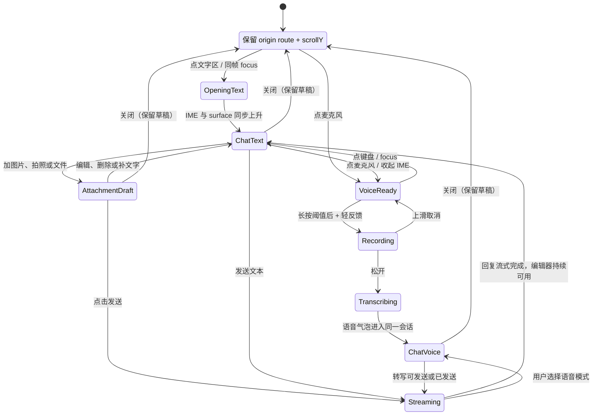

# 移动端 Agent 的上下文 IM 输入体验研究

**日期：** 2026-08-11  
**范围：** 从 MaxPower 的非聊天主页面（今日、日历、计划、我的）进入普通 Coach 会话时，如何让文本、按住说话、图片/相机/文件草稿、系统键盘和流式回复保持一个连续体验。  
**明确排除：** 训练中的 realtime 相机 Agent。它有持续音视频流、相机权限、前后摄切换和训练中视觉反馈，应该保留独立入口与独立界面；不能借用本研究的普通 IM 会话转场。

## 执行摘要

主流 Agent 的一手资料呈现出一致的产品事实：**同一对话线程可以容纳多种输入载体，附件先进入会话上下文，再由用户发起问题/发送；语音可与文本互相切换。** ChatGPT 同时保留“集成到主聊天”和“独立 Voice”两种形态；Claude 明确写出在同一会话内切换文字和语音，`+` 进入相机、照片或文件；Copilot 把文件先显示为聊天附件，之后要求用户输入并提交问题；Gemini 则把 Live 与普通提示区分开，上传后还需要显式选择“Talk Live about this”。[1][3][4][5]

这些资料并不直接证明某一个动画时长或底部栏样式。但与 Android/Apple 的输入法布局机制、以及关于动画维持空间心智模型的原始 HCI 研究合在一起，可以得出可验证的设计推断：**普通 Coach 应是附着在原页面上的、可扩展的会话表面，而不是一次页面跳转后再异步装载输入框。** 文本点击、长按语音、附件草稿只是该会话表面的不同输入状态；底部导航在会话获得焦点后让位；收起时必须回到启动页的同一滚动位置和同一草稿状态。[7][8][10]

对 MaxPower 的建议是使用一个持久的 `CoachComposer` 和一个保留页面状态的 `CoachConversationSurface`：展开时由底部输入栏的几何位置生长，输入法与消息面板同帧联动；语音消息在松开后原位进入消息流；相机/文件仅挂在编辑器上方，点击发送才构成一个 Agent turn。不要把普通语音录入做成 realtime 相机 Agent，也不要在音频完成后跳转到另一套聊天页。

## 问题框架

研究的问题不是“底部加一个 Agent 按钮”，而是如何保持以下五种连续性：

| 连续性 | 用户的隐性预期 | 失效时的可见症状 |
|---|---|---|
| 空间连续性 | 输入栏扩展后仍是刚才点击的那个对象 | 先出现空抽屉，再突然换成聊天页 |
| 上下文连续性 | Coach 知道自己是从哪张计划、哪一天或哪项记录被唤起的 | 用户需要复述当前日期/计划/页面意图 |
| 输入连续性 | 文本、语音、图片与文件可以组合成同一轮消息 | 选附件即发送、语音结束后丢到另一线程 |
| 系统连续性 | 键盘上升、消息列表和编辑器一起运动 | 对话层先开完，键盘再顶一次；内容跳动 |
| 返回连续性 | 关闭后仍在刚才的页面与滚动位置 | 返回首页或滚动位置重置，打断原任务 |

“普通 Coach 会话”在这里指可回看、可追问、可流式输出的异步/半同步聊天。它可以处理“把周三训练挪到周五”“这顿饭该怎么记”“解释当前训练计划”等页面上下文问题；它不承担实时动作纠错。

## 产品事实表（仅一手产品资料）

访问日期均为 **2026-08-11**。表中“事实”只复述官方资料已明确表述的内容；“边界”避免把未公开的实现细节当作事实。

| 样本 | 一手事实 | 与本题直接相关的事实 | 不应过度推断的部分 | 来源 |
|---|---|---|---|---|
| ChatGPT | 移动端 Voice 入口位于消息栏右下；Voice 可作为主聊天内体验或独立模式；官方允许用户在设置中切换独立模式。 | Voice 活跃时仍可在同一聊天里添加图片或输入文字，且不必新开聊天。 | 官方未公开其普通聊天从其他业务页进入时的转场、键盘时序或附件草稿 UI。 | [Voice FAQ][1]；[ChatGPT Voice][2] |
| Claude | Voice 模式位于文本输入字段旁；官方说明可在**同一会话**内无缝切换文字和语音；`+` 可进入相机、照片或文件。 | 同一个输入区同时承接语音、文字和附件，是“会话为主、媒介为辅”的明确产品事实。 | Claude 的 Voice 是完整 spoken conversation；这不等于 MaxPower 必须做实时连续语音。 | [Claude Mobile Voice][3] |
| Gemini | 普通 Gemini 可用文字、语音、图片或相机开始；Gemini Live 可以共享相机；给图片/文件进入 Live 需要先添加资源，再显式选择“Talk Live about this”。 | 官方流程把“选取资源”和“发起 Live”分成两步，证明资源选择可先形成上下文，不必自动开始 Agent 回合。 | Gemini Live 的相机共享是实时模式，不能照搬给 MaxPower 的普通饮食/计划聊天。 | [Gemini mobile][5]；[Gemini Live][6] |
| Microsoft Copilot | 通过 `+` 选择图片或文件后，文件会出现在当前 chat session；随后用户输入并提交针对文件的问题；可在同一会话继续追问。 | “上传/显示附件”与“提交本轮意图”是分离操作，直接支持附件草稿模式。 | 文档没有说明上传前是否可编辑缩略图、具体动效或移动端键盘策略。 | [Copilot file upload][4] |

## 设计动机与可验证推断

### 1. 用一个会话承接多种媒介，不等于把所有模式混成一页

**事实。** ChatGPT、Claude 都公开支持在一个聊天内混用语音、文字和视觉附件；Claude 将相机/照片/文件放入输入字段的 `+` 路径。[2][3]

**推断。** 这些产品优先维持的是会话身份（thread），而不是某种单一输入控件。对 MaxPower 而言，普通 Coach 应以 `conversationId + pageContext` 为稳定核心：

- 文本、按住说话音频、照片、相机拍摄结果、文件都是一条用户消息的载体或草稿；
- 语音转写完成后仍落到原会话，不能创建“语音页专属会话”；
- 从日历启动时携带当前完整日期，从计划启动时携带当前计划/周期；这些上下文可在会话元数据中保存，而不是把长提示词塞进 UI；
- realtime 相机 Agent 另设 `mode=realtime_camera`，不复用普通聊天的语音入口。

**可验证方式。** 从四个主页面分别打开 Coach，发送“这个怎么安排？”时，服务端收到的 `conversationId` 与 `originContext` 都可被记录；一次语音转写、文字追问和附件追问必须处于同一线程。

### 2. 附件应是“可组合草稿”，而不是隐式发送

**事实。** Copilot 的官方步骤是先通过 `+` 添加资源，资源显示在 chat session 中，随后“Type and submit a prompt”；Gemini Live 对图片/文件同样要求添加后显式点击“Talk Live about this”。[4][6]

**推断。** 显式提交将“我选择了一个资源”与“我要 Agent 现在对它做什么”分开，能让用户补充任务意图、继续加附件、删掉误选内容，也让一轮输入的边界明确。MaxPower 的餐食图片尤其需要这个边界：拍到照片后用户可能还想说明份量、是否吃完，或放弃该照片。

**可验证方式。** 选择图片/文件、相机拍照、取消选择、补文字、再点击发送的任何路径，在点击发送前不得请求 Coach 推理接口或写入饮食/训练记录。

### 3. 键盘不是第二段动画，而是会话布局的同步约束

**事实。** Android 官方将未同步的键盘过渡描述为内容“snap into place”、视觉上可能突兀；Android 11+ 可用 `WindowInsetsAnimationCompat` 在键盘每一帧的 inset 变化中同步界面。Compose 的内建 inset modifier 在布局阶段读取值，以避免一帧滞后。Apple 也提供 `UIKeyboardLayoutGuide`，用于让布局跟随键盘的展示、收起与移动。[7][8][9]

**推断。** “先展开 Coach 抽屉，290ms 后 mount/focus 一个新输入框”在结构上必然产生两段运动。正确实现不是更精细地调延时，而是：

1. 用户点文字区的同一交互帧，请求聚焦一个持久的文本输入控件；
2. 会话表面开始从该输入栏的 bounds 扩展；
3. 编辑器底边、消息列表可视区、遮罩都以系统 IME inset 为单一约束同步更新；
4. 绝不依据 `keyboardDidShow` 之后的 JS 状态再启动第二次布局动画。

这也是解决“页面先打开、键盘再顶上来”的唯一结构性方案。

**可验证方式。** 在 60fps 屏幕录制中，文本点击至首帧之间，输入栏必须已经进入扩展态且获得 focus 请求；IME 上升的每一帧，编辑器与列表底部不出现独立跳变。Android 中可从 WindowInsetsAnimation 进度与 frame timing 日志验证。

### 4. 共享容器转场的作用是保持定位，不是“为了显得高级”

**事实。** Bederson 与 Boltman 的原始研究发现：对固定空间数据的视点变化加入动画，能提高用户重建信息空间的能力，且没有任务时间惩罚。[10] Klein 与 Bederson 的实验也报告动画缩放条件在空间任务中更快、错误更少，并指出短动画可避免部分时间成本。[11]

**推断。** 这里不能把论文的空间信息视图结果直接外推成“任何弹窗都必须动画”。但它足以支持一种保守做法：当打开聊天是当前底部输入栏的直接后果时，保留输入栏的 anchor、圆角与方向，让用户能感知“它长成了聊天”，会比毫无来源的全屏跳转更容易定位。动画应只表达这个因果关系；不应做多层卡片、弹簧回弹或先遮罩再渲染内容的装饰性表演。

**可验证方式。** 让测试者在计划、日历各完成一次“问 Coach → 关闭 → 继续原任务”。记录是否能正确说出返回位置、是否误触返回、以及是否出现等待页面稳定后才开始输入的停顿。

### 5. 入口目标要大、语义要单一，语音开始与实时相机不能共用同一含义

**事实。** Fitts 定律研究将指向与选择时间和目标距离、目标宽度关联；它是 HCI 中用于评估指向/选择任务的经典模型。[12] Apple 对 sheet 的定义也强调：sheet 适合与当前上下文紧密相关、完成后回到父视图的限定任务。[13]

**推断。** MaxPower 底部的“问 Coach”应该是宽而可读的触点，文本区点击等同于“写一条消息”；麦克风是相邻、足够大的独立触点，点击进入语音准备态、长按开始录制。相机 realtime 不应被塞进这个麦克风动作或附件 `+` 中，因为其任务范围、权限与退出规则明显不同，应从明确的“训练中相机 Coach”入口打开。

**可验证方式。** 单手持机测试中，用户无需阅读帮助文案即可区分：点击文字=聊天，按住语音=语音消息，`+`/相机=添加草稿，训练相机=独立 realtime 模式。

## 建议的 MaxPower 交互模型

### 共享组件和状态所有权

不要让 Dock 和 Drawer 各自持有一个 `TextInput`。建议将其拆为：

- **`CoachComposer`（持久组件）**：唯一的文本焦点、草稿文字、附件队列、当前输入模式；收起时为底部迷你输入栏，展开时是会话编辑器。
- **`CoachConversationSurface`（覆盖层）**：消息列表、历史入口、流式输出、关闭手势；保留当前 `origin` 页在其下方，不能卸载页面。
- **`ConversationSession`（数据状态）**：`conversationId`、`originContext`、消息、流式运行状态、附件上传状态。
- **`InputRuntime`（瞬态状态）**：IME inset、文本/语音模式、录音生命周期、动画进度。它不得反向决定会话是否存在。

### 推荐状态流

### 推荐的视觉与手势规则

| 情况 | 应发生什么 | 不应发生什么 |
|---|---|---|
| 点“问 Coach”文字区 | 原底部 Composer 从自己的位置向上/两侧扩展；消息先轻量淡入；IME 同时推动布局。 | 先显示空白抽屉，延时挂载新输入框，再拉键盘。 |
| 点麦克风 | 同一 Composer 原位变成“按住说话”；不唤起键盘。 | 进入 realtime 相机或切换到无历史的单独语音页。 |
| 长按语音 | 到达长按阈值后才开始录音；显示波形/时长；上滑取消；松开后语音气泡从 Composer 上升到消息流。 | 点击即录、松开后把用户带到另一个页面、自动打开键盘。 |
| 点 `+` / 相机 | 选择器返回后，缩略图或文件 chip 只停在 Composer 上方；用户可删、可补文字。 | 选择即发送、选择即写入饮食或训练事实。 |
| Agent 流式输出 | 输入区始终可继续文本、语音和附件；用户手动向上看历史后不自动拉回底部。 | 用整屏 loading 阻断用户；回复时隐藏编辑器。 |
| 关闭会话 | 表面收回启动 Composer；显示原页面原 route、原 scrollY、原筛选/日期；保留未发送草稿。 | 销毁底层页面、回到默认首页、丢失草稿。 |
| Android 返回 | 若 IME 开启：先关闭 IME；否则：收起会话；草稿不丢。 | 第一次返回直接销毁会话或退到错误页面。 |

## 反模式

1. **二段式展开。** `openDrawer` 后以 timeout 才 `focus()`，然后依赖 `keyboardDidShow` 补 layout。它必然造成视觉断裂；应改为单一 composer 与同步 inset。
2. **对话页/语音页各自一套输入框。** 会导致焦点、草稿、附件、会话历史和无障碍焦点漂移；语音应是同一会话中的消息形态。
3. **选附件即调用 Agent。** 它剥夺用户补充“这是什么/吃了多少/想做什么”的机会，也会把误触变成业务写入。
4. **把 realtime camera 藏在普通麦克风或附件入口。** realtime 有不同的用户承诺与风险（相机、持续处理、训练中反馈），必须独立选择与独立退出。
5. **用教学文案代替可见状态。** “左右滑动”“还没有记录”“现在可以输入”等只是在补偿不清晰的结构。空状态可留白；只有首次长按语音等不可见手势才可给一次短提示。
6. **为了动效延迟可用性。** 动画可以协助定位，但焦点、关闭、发送、取消必须即时响应；不能要求用户等动画结束。

## 面向 MaxPower 的验收指标

以下不是行业基准，而是本方案在真机上应满足的可观测验收条件。

### 功能与状态

- 从今日、日历、计划、我的启动 Coach 后，关闭时 route、完整日期/筛选和 `scrollY` 与启动前一致。
- 文本、按住说话、图片、相机、文件进入同一个 `conversationId`；发送前附件只存在于草稿层。
- 同一消息可包含文字 + 多附件；语音消息可展示音频状态、转写和后续 Agent 输出。
- 流式回复期间，编辑器可用；新消息不会吞掉正在输入的草稿。
- 首次 Android 返回只关闭 IME；第二次才收起普通 Coach；realtime 相机的退出逻辑独立测试。

### 动画与键盘

- 文本点击发生的同一 JS/native interaction 内发出 `focus` 请求；禁止 `setTimeout` 等待 surface 展开后再聚焦。
- Android 的 Composer、消息列表 bottom padding 与遮罩以同一 IME inset 源更新；60fps 录屏中 IME 上升/下降期间没有“先到终点、再补跳”的二次位移。
- 消息内容在 surface 扩展的前半段已开始可见；不会出现全程空白、结束时再批量渲染。
- 所有状态切换的按压反馈应在 100ms 内出现；复杂消息渲染或网络请求不得阻塞手势反馈。

### 任务体验（5–8 名内部真机测试）

- 不提供操作说明，受试者能正确完成：从日历问“这天适合恢复吗”、长按发语音、拍一张餐食图后补充说明再发送、关闭并继续查看原日历。
- 记录误触：把普通语音误认为 realtime、把选择附件误认为已发送、关闭后找不到原页面；任一高频误解都应回到状态与入口语义重设计，而非继续加说明文案。
- 检查“等待感”：用户是否在点击输入后才意识到还要等键盘/抽屉；若存在，定位是否是 re-mount、主线程阻塞或未同步 Window Insets。

## 开放问题

1. **技术栈能力。** 当前 React Native/Expo 版本是否能将同一个视觉 Composer 与真正持久的 `TextInput` 对齐，并接入 Android IME 动画；若不能，应优先小型原生/JSI bridge，而不是 timeout 补偿。
2. **语音产品边界。** MVP 是保存音频、仅保存转写，还是两者都保存？这影响消息气泡、上传时机、失败重试和隐私提示。
3. **语音转写失败。** 网络慢、权限拒绝或低置信度时，用户是重录、手动编辑转写，还是把音频作为附件发送？需要产品与后端共同决定。
4. **附件限制与业务确认。** 哪些文件类型会进入普通 Coach、哪些（训练视频等）应转给独立分析任务？涉及饮食/训练事实写入时，Agent 是否必须给出可编辑的确认卡而非自动写入？
5. **多入口会话策略。** 从不同主页面开启时，是共用最近 Coach 历史，还是每个页面建立 context-bound conversation？建议“同一用户可见历史 + 每条消息带 originContext”，避免会话碎片化，但需验证隐私与上下文长度成本。
6. **无障碍与手势冲突。** 长按录音、上滑取消及底部手势导航需与 TalkBack、系统返回手势和单手操作共同真机验证。

## 来源与访问记录

所有产品结论仅引自厂商/平台一手资料；研究性结论只引自原始论文或作者/研究机构的原始发布页。访问日期：2026-08-11。

1. OpenAI Help Center, [Voice Mode FAQ](https://help.openai.com/en/articles/8400625-voice-mode), 更新于 2026 年 8 月访问时所示版本。
2. OpenAI Help Center, [Start a Voice conversation](https://help.openai.com/en/articles/20001274), “Use text and images with Live”。
3. Anthropic Help Center, [Using voice mode on Claude Mobile Apps](https://support.anthropic.com/en/articles/11101966-using-voice-mode-on-claude-mobile-apps).
4. Microsoft Support, [File upload in Microsoft Copilot](https://support.microsoft.com/en-US/microsoft-copilot/file-upload-in-microsoft-copilot).
5. Google Gemini Apps Help, [What you can do with your Gemini mobile app](https://support.google.com/gemini/answer/14579631).
6. Google Gemini Apps Help, [Talk naturally with Gemini Live](https://support.google.com/gemini/answer/15274899), “Talk Live about files, images & YouTube videos”。
7. Android Developers, [Control and animate the software keyboard](https://developer.android.com/develop/ui/views/layout/sw-keyboard). 官方将同步与非同步 IME 过渡并列展示，并说明 `WindowInsetsAnimationCompat` 的逐帧同步机制。
8. Android Developers, [Set up window insets — Jetpack Compose](https://developer.android.com/develop/ui/compose/system/insets-ui). 官方说明 inset 值在 layout phase 使用可避免一帧滞后。
9. Apple Developer Documentation, [UIKeyboardLayoutGuide](https://developer.apple.com/documentation/uikit/uikeyboardlayoutguide), keyboard presentation/dismissal/movement 的布局追踪。
10. Bederson, B. B., & Boltman, A. (1998). [Does Animation Help Users Build Mental Maps of Spatial Information?](https://drum.lib.umd.edu/items/3e73909e-a99d-4834-9f65-2869c47c8893). University of Maryland HCIL/UMIACS 原始技术报告。
11. Klein, C., & Bederson, B. B. (2005). [The Effect of Animated Transitions in Zooming Interfaces](https://hci.cs.umanitoba.ca/publications/details/the-effect-of-animated-transitions-in-zooming-interfaces). 原始研究发布页及下载项。
12. MacKenzie, I. S. (1992). [Fitts' Law as a Research and Design Tool in Human-Computer Interaction](https://www.yorku.ca/mack/HCI.html). *Human–Computer Interaction*, 7(1), 91–139, DOI: [10.1207/s15327051hci0701_3](https://doi.org/10.1207/s15327051hci0701_3).
13. Apple Human Interface Guidelines, [Sheets](https://developer.apple.com/design/human-interface-guidelines/sheets).

<!-- 文中 [1]、[Voice FAQ][1] 等引用统一跳至本节对应编号。 -->
[1]: #1
[2]: #2
[3]: #3
[4]: #4
[5]: #5
[6]: #6
[7]: #7
[8]: #8
[9]: #9
[10]: #10
[11]: #11
[12]: #12
[13]: #13
